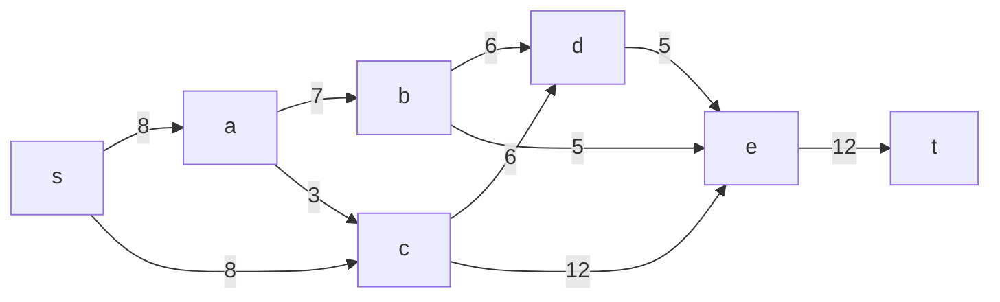
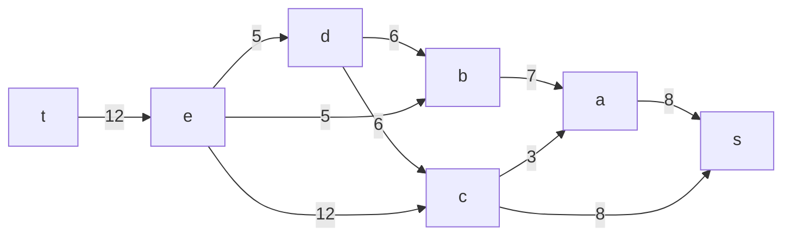
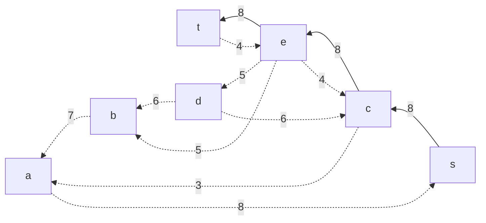
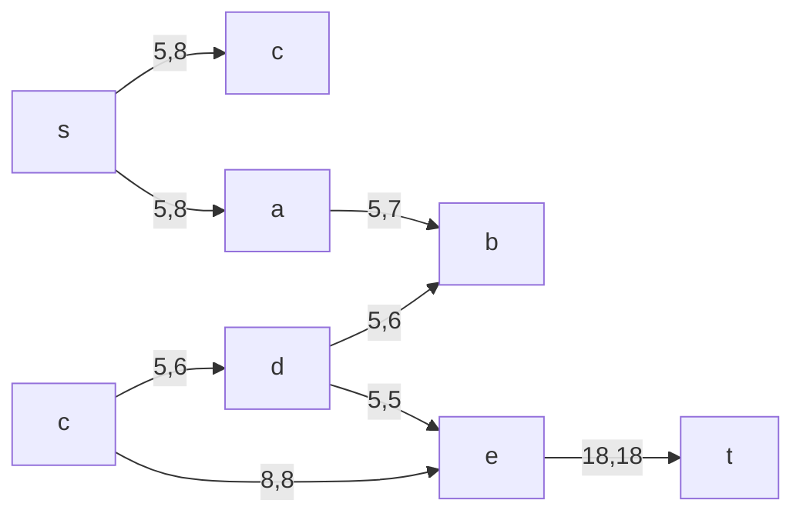
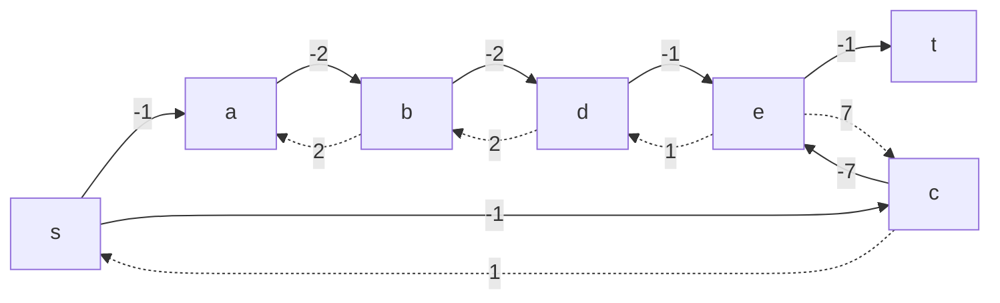
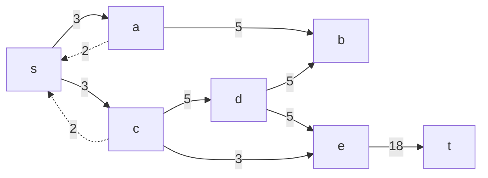

#### Вариант 6:
budapest

#### Пропускная способность дуг сети p(e) и стоимость транспортировки  единицы потока c(e):

| Дуги                      | sa | sc | ab | ac | cd | bd | de | be | ce | et |
|:--------------------------|:--:|:--:|:--:|:--:|:--:|:--:|:--:|:--:|:--:|:--:|
| Пропускная способность    | 8  | 8  | 7  | 3  | 6  | 6  | 5  | 5  | 12 | 12 |
| Стоимость транспортировки | 1  | 1  | 2  | 1  | 1  | 2  | 2  | 5  | 7  | 1  |

 ## Этап 1: Построим сеть с источником *s*, стоком *t* и указанными пропускными способностями дуг.



Построим остаточную сеть



Найти путь из t в s (увеличивающий путь).
 t --> e --> c --> s
 min = 8
Нужно уменьшить веса всех дуг этого пути на величину дельта, где дельта - минимальный из весов дуг, входящих в этот путь.
 

### Шаг 2
Найти увеличивающий путь
t --> e-->d-->b-->a-->s
min = 5
Нужно уменьшить веса всех дуг этого пути на величину дельта, где дельта - минимальный из весов дуг, входящих в этот путь.
 
 ```mermaid
graph RL
    s-->|8|c-->|8|e-->|13|t
    a-.->|3|s-->|5|a
    b-.->|2|a-->|5|b
    d-->|5|e
    b-.->|1|d-->|5|b
    e-.->|5|b
    e-.->|4|c
    d-.->|6|c-.->|3|a
```
### Шаг 3
Найти увеличивающий путь 
t-->e-->d-->c-->s
min = 5
Нужно уменьшить веса всех дуг этого пути на величину дельта, где дельта - минимальный из весов дуг, входящих в этот путь.
 ```mermaid
graph RL
    s-->|5|c-->|8|e-->|18|t
    c-.->|3|s
    d-.->|1|c-->|5|d
    a-.->|3|s-->|5|a
    b-.->|2|a-->|5|b
    d-->|5|e
    b-.->|1|d-->|5|b
    e-.->|5|b
```
Граф с максимальным потоком

### Шаг 4
Построить остаточную сеть, соответствующую текущему потоку и найти в ней цикл отрицательной стоимости.


Граф со стоимостями

### Шаг 5
Найден цикл отрицательной стоимости: t-->e-->c-->s-->a-->b-->d-->e
total cost = -1
min = 5





### Шаг 6
Текущий поток является максимальным и имеет минимальную стоимость

| Дуги                           | sa  | sс  | ab  | ac  | cd  | bd  | de  | be  | ce  | et  | Итого  |
| :----------------------------- | :-: | :-: | :-: | :-: | :-: | :-: | :-: | :-: | :-: | :-: | ------ |
| Пропускная способность p(e)    | 8   | 8   |  7  |  3  |  6  | 6   |  5  | 5   |  12 |  12 |        |
| Локальный поток f(e)           | 5   |  5  |  5  |  0  |  5  |  5  |  5  | 0   |  3  |  18 |        |
| Стоимость транспортировки c(e) |  1  |  1  |  2  |  1  |  1  |  2  |  2  |  5  |  7  |  1  |        |
| Суммарная стоимость f(e)*c(e)  | 5   |  5  |  10 | 0   |  5  | 10  |  10 | 0   |  21 |  18 | **84** |

