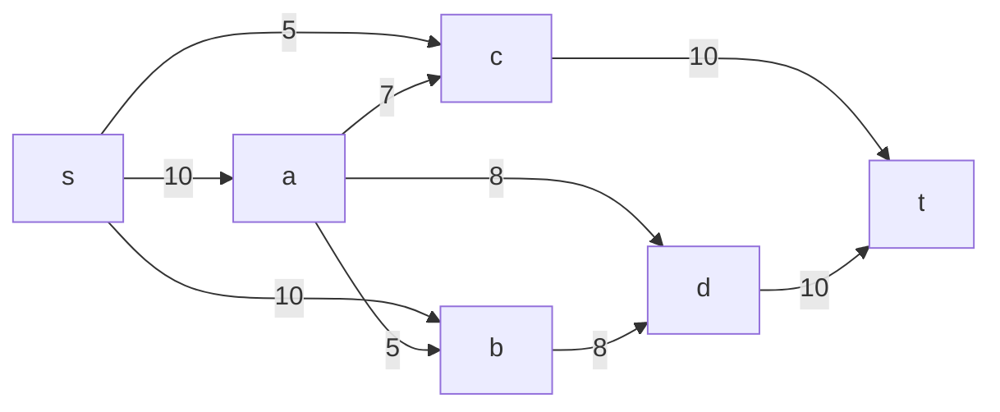
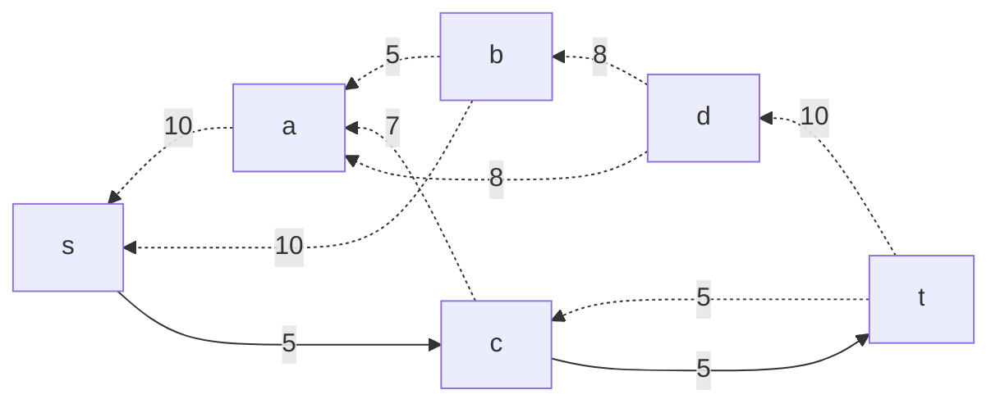
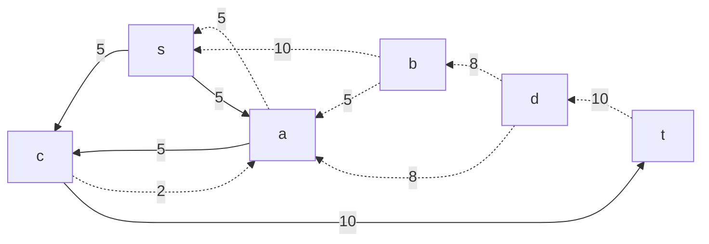
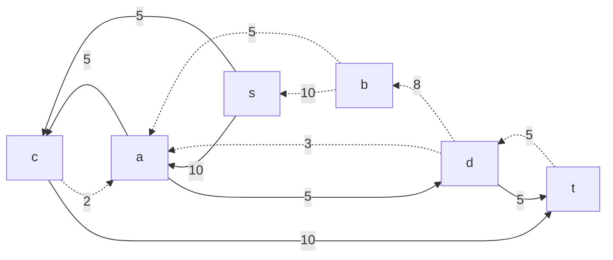
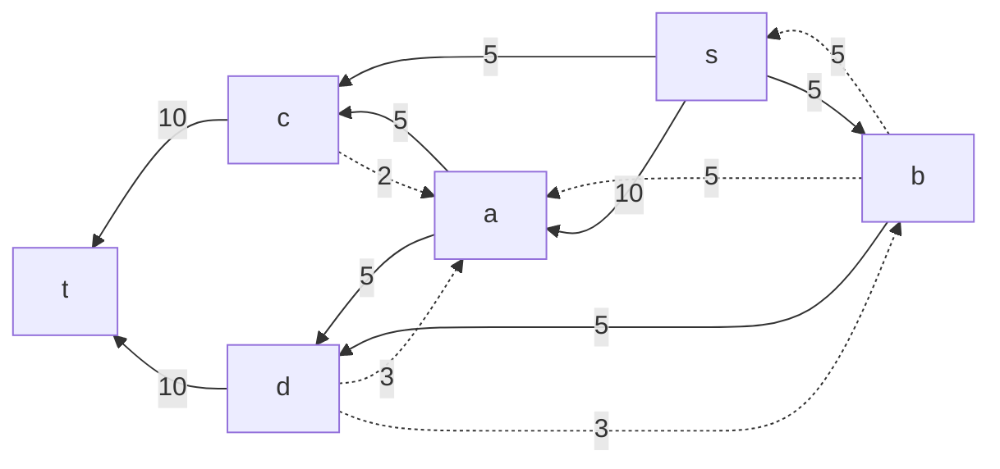
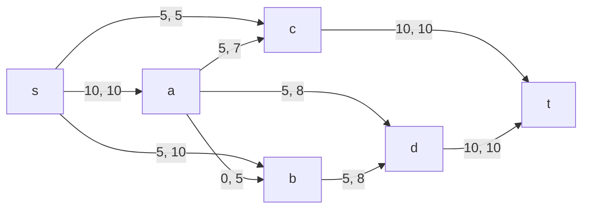
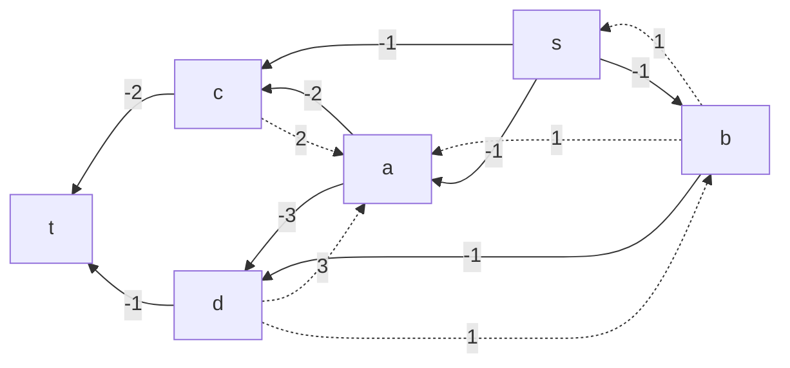
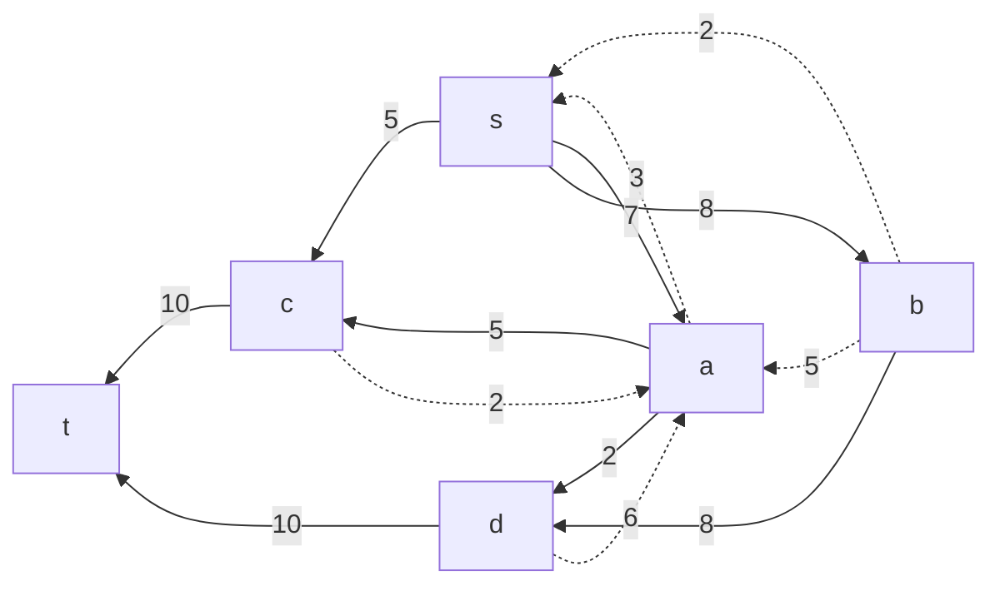
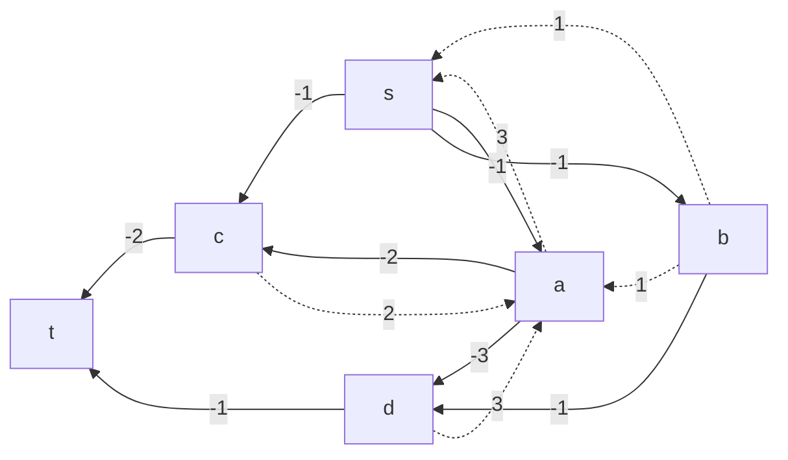
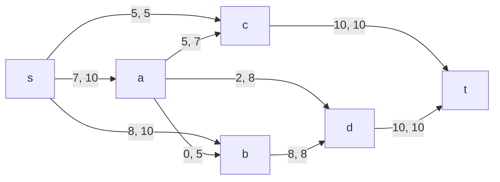

# Задача о максимальном потоке.
## Вариант 8:
#### Пропускная способность дуг сети p(e) и стоимость транспортировки  единицы потока c(e):

| Дуги                      | sa | sb | sc | ac | ad | ab | bd | ct | dt |
|:--------------------------|:--:|:--:|:--:|:--:|:--:|:--:|:--:|:--:|:--:|
| Пропускная способность    | 10 | 10 | 5  | 7  | 8  | 5  | 8  | 10 | 10 |
| Стоимость транспортировки | 1  | 1  | 1  | 2  | 3  | 1  | 1  | 2  | 1  |

## Решение:
### 1. Построим сеть с источником **s**, стоком **t** и указанными пропускными способностями дуг для поиска максимального потока.

Укажем начальный поток величиной 5 **s -> c -> t**.
Построим остаточную сеть, дуги с нулевым весом удалим из сети.

### 2. Проведем поиск увеличивающего пути в остаточной сети
В остаточной сети найден увеличивающий путь t -> c -> a -> s. Минимальный вес дуг на этом пути равен 5.
Уменьшим вес дуг на найденном пути, дуги для которых вес стал нулевым удалим из остаточной сети.

### 3. Продолжим поиск увеличивающего пути в остаточной сети
В остаточной сети найден увеличивающий путь t -> d -> a -> s. Минимальный вес дуг на этом пути равен 5.
Уменьшим вес дуг на найденном пути, дуги для которых вес стал нулевым удалим из остаточной сети.

### 4. Продолжим поиск увеличивающего пути в остаточной сети
В остаточной сети найден увеличивающий путь t -> d -> b -> s. Минимальный вес дуг на этом пути равен 5.
Уменьшим вес дуг на найденном пути, дуги для которых вес стал нулевым удалим из остаточной сети.

### 5. Завершим поиск увеличивающего пути в остаточной сети
В остаточной сети больше нет увеличивающих путей, найденный поток величиной 20 является максимальным для данной сети.

В данном случае левое число - локальный поток, правое - пропускная способность на дуге.

### 6. Рассчитаем стоимость полученного максимального потока.

| Дуги                                          | sa | sb | sc | ac | ad | ab | bd | ct | dt | Итого  |
|:----------------------------------------------|:--:|:--:|:--:|:--:|:--:|:--:|:--:|:--:|:--:|:------:|
| Пропускная способность p(e)                   | 10 | 10 | 5  | 7  | 8  | 5  | 8  | 10 | 10 |        |
| Локальный поток f(e)                          | 10 | 5  | 5  | 5  | 5  | 0  | 5  | 10 | 10 |        |
| Стоимость транспортировки единицы потока c(e) | 1  | 1  | 1  | 2  | 3  | 1  | 1  | 2  | 1  |        |
| Суммарная стоимость f(e)*c(e)                 | 10 | 5  | 5  | 10 | 15 | 0  | 5  | 20 | 10 | **80** |

Стоимость полученного потока составляет 80.

### 7. Попробуем уменьшить стоимость потока для чего построим остаточную сеть.
Для каждого ребра остаточной сети укажем стоимость транспортировки единицы потока.

В остаточной сети найден ориентированный цикл отрицательной стоимости s -> a -> d -> b -> s (- 1 - 3 + 1 + 1 = -2).
Найдем минимальный вес ребра в указанном цикле, изображенном **в остаточной сети с указанием величины потока**.

В данном случае минимальный вес (**3**) имеет неиспользованный резерв ребра **d -> b**.
Удалим найденный цикл - уменьшим на 2 вес всех ребер, входящих в цикл.
as3, da6, db8, sb8

### 8. Проведем повторный поиск цикла отрицательной стоимости в остаточной сети.
Скорректируем остаточную сеть с указанием стоимости транспортировки единицы потока.

В остаточной сети больше нет ориентированных циклов отрицательной стоимости

### 9. Рассчитаем стоимость полученного максимального потока.

| Дуги                                          | sa | sb | sc | ac | ad | ab | bd | ct | dt | Итого  |
|:----------------------------------------------|:--:|:--:|:--:|:--:|:--:|:--:|:--:|:--:|:--:|:------:|
| Пропускная способность p(e)                   | 10 | 10 | 5  | 7  | 8  | 5  | 8  | 10 | 10 |        |
| Локальный поток f(e)                          | 7  | 8  | 5  | 5  | 2  | 0  | 8  | 10 | 10 |        |
| Стоимость транспортировки единицы потока c(e) | 1  | 1  | 1  | 2  | 3  | 1  | 1  | 2  | 1  |        |
| Суммарная стоимость f(e)*c(e)                 | 7  | 8  | 5  | 10 | 6  | 0  | 8  | 20 | 10 | **74** |

Стоимость полученного потока составляет 68.

### Ответ:
Максимальный поток в сети равен 20, минимальная стоимость потока 74, она реализуется следующим локальными потоками:

