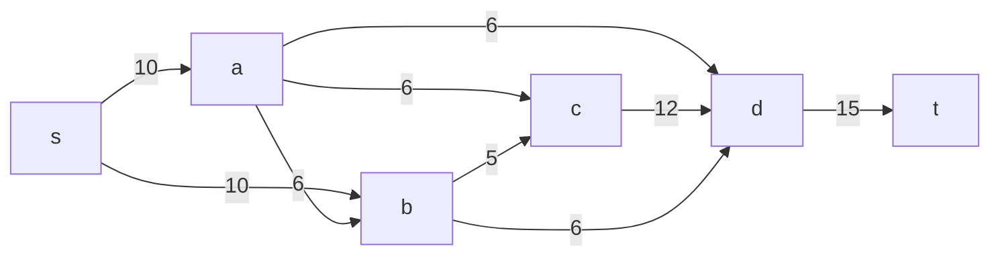
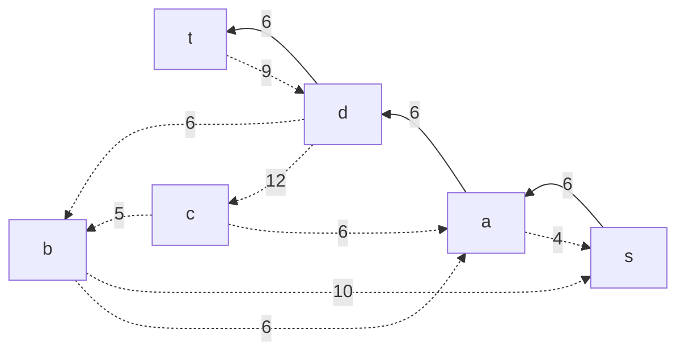

# Задание №10. Задача о максимальном потоке минимальной стоимости.

### Вариант 9:

### Постановка задачи
1. Дана сеть (взвешенный ориентированный граф) с источником s и стоком t.
2. Для каждой дуги определена пропускная способность и стоимость транспортировки.
3. Необходимо найти для указанной сети максимальный поток минимальной стоимости. 

#### Пропускная способность дуг сети p(e) и стоимость транспортировки  единицы потока c(e):

| Дуги                      | sa | sb | ab | ad | ac | cd | bd | dt | bc |
|:--------------------------|:--:|:--:|:--:|:--:|:--:|:--:|:--:|:--:|:--:|
| Пропускная способность    | 10 | 10 | 6  | 6  | 6  | 12 | 6  | 15 | 5  |
| Стоимость транспортировки | 1  | 1  | 1  | 3  | 1  | 5  | 7  | 1  | 1  |

### Задание
Для каждого варианта представлены условия задачи, в соответствии с которыми необходимо: 
1. Построить сеть с указанием пропускной способности дуг.
2. Построить остаточную сеть.
3. Определить максимальный поток методом поиска увеличивающих путей в остаточной сети.
4. Минимизировать стоимость максимального потока посредством поиска циклов отрицательной стоимости.
5. Оформить решение задачи по шагам с подробными комментариями, таблицами и диаграммами.
6. В ответе указать максимальную величину потока, минимальную стоимость транспортировки и сеть с указанием соответствующих локальных потоков.

### 1. Построим исходную сеть с источником **s**, стоком **t** и указанием пропускной способности

Укажем начальный путь с потоком 6: s → a → d → t и построим остаточную сеть.

