# Задание №10. Вариант 10
Пропускная способность дуг сети и стоимость транспортировки указана в таблице.

| Дуги                      | sa | sb | sc | ba | bc | cd | ac | ad | dt |
|:--------------------------|:--:|:--:|:--:|:--:|:--:|:--:|:--:|:--:|:--:|
| Пропускная способность    | 6  | 6  | 6  | 6  | 5  | 10 | 5  | 8  | 15 |
| Стоимость транспортировки | 2  | 2  | 4  | 1  | 1  | 1  | 3  | 4  | 3  |

### 1. Построим сеть с источником **s**, стоком **t** и указанными пропускными способностями дуг для поиска максимального потока.

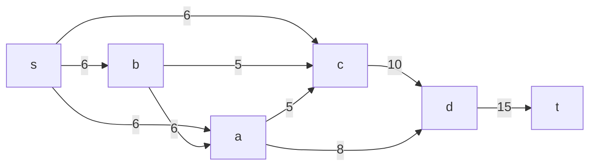
Укажем начальный поток величиной 6 **s -> a -> d -> t**. Построим соответствующую остаточную сеть.

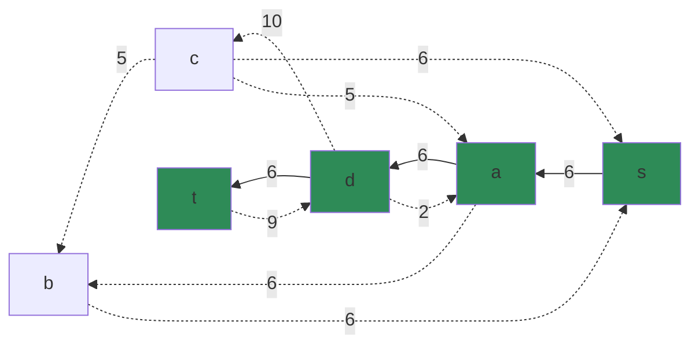

### 2. Проведем поиск увеличивающего пути в остаточной сети
В остаточной сети найден увеличивающий путь t -> d -> c -> s. Минимальный вес дуг на этом пути равен 6.

Уменьшим вес дуг на найденном пути, дуги для которых вес стал нулевым удалим из остаточной сети.

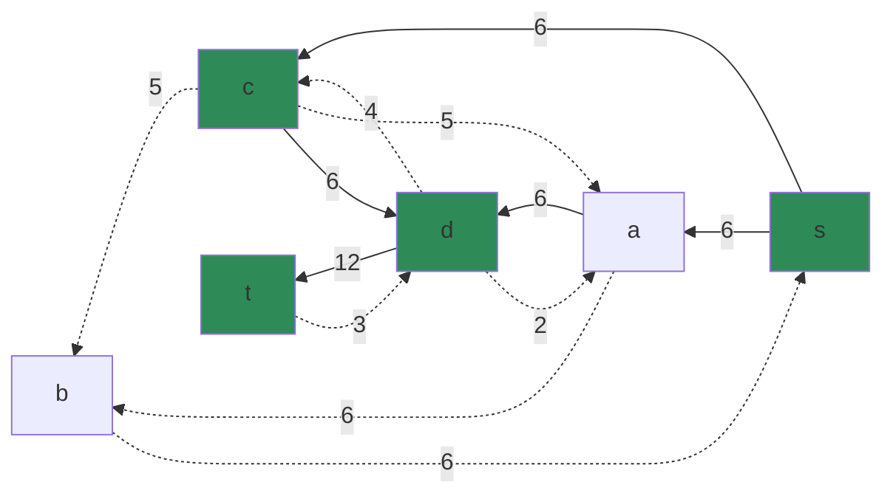

### 3. Продолжим поиск увеличивающего пути в остаточной сети
В остаточной сети найден увеличивающий путь t -> d -> c -> b -> s. Минимальный вес дуг на этом пути равен 3.

Уменьшим вес дуг на найденном пути, дуги для которых вес стал нулевым удалим из остаточной сети.

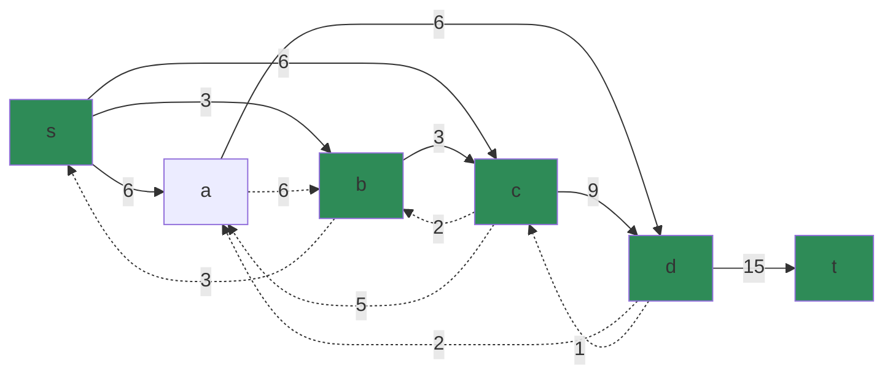

### 4. Продолжим поиск увеличивающего пути в остаточной сети

В остаточной сети не найдено увеличивающих путей, следовательно, алгоритм завершил работу и найденный поток величиной 15 является максимальным для данной сети.

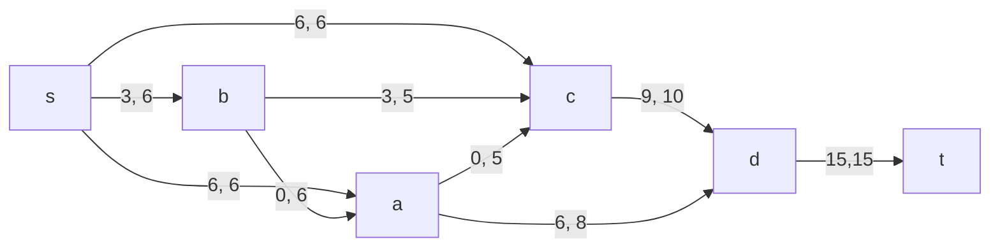

### 5. Рассчитаем стоимость полученного максимального потока.

| Дуги                            | sa | sb | sc | ba | bc | cd | ac | ad | dt | Итого  |
|:--------------------------|:--:|:--:|:--:|:--:|:--:|:--:|:--:|:--:|:--:|:------:|
| Пропускная способность p(e)    | 6  | 6  | 6  | 6  | 5  | 10 | 5  | 8  | 15 |        |
| Локальный поток f(e)           | 6  | 3  | 6  | 0  | 3  | 9  | 0  | 6  | 15  |        |
| Стоимость транспортировки c(e) | 2  | 2  | 4  | 1  | 1  | 1  | 3  | 4  | 3  |        |
| Суммарная стоимость f(e)*c(e)| 12 | 6 | 24  | 0  | 3 | 9  | 0 | 24  | 45  | **123** |

Стоимость полученного потока составляет 123. 

### 6. Попробуем уменьшить стоимость потока для чего построим остаточную сеть.
Для каждого ребра остаточной сети укажем стоимость транспортировки единицы потока.

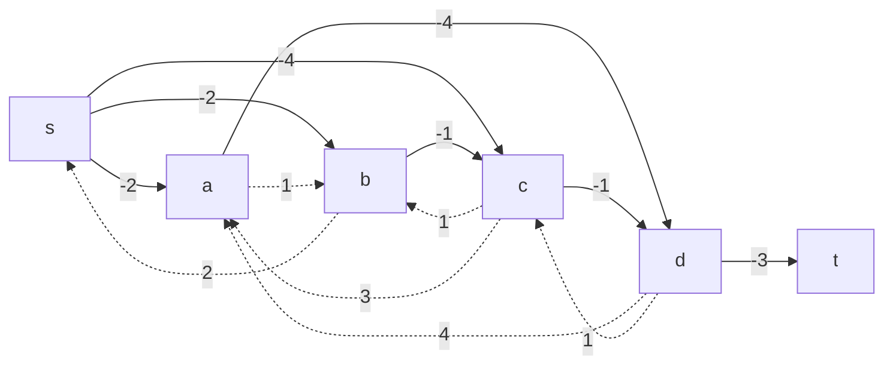

В остаточной сети найден ориентированный цикл отрицательной стоимости s -> a -> d -> c -> b -> s (- 2 - 4 + 1 + 1 + 2= -2). 

Найдем минимальный вес ребра в указанном цикле, изображенном **в остаточной сети с указанием величины потока**.  

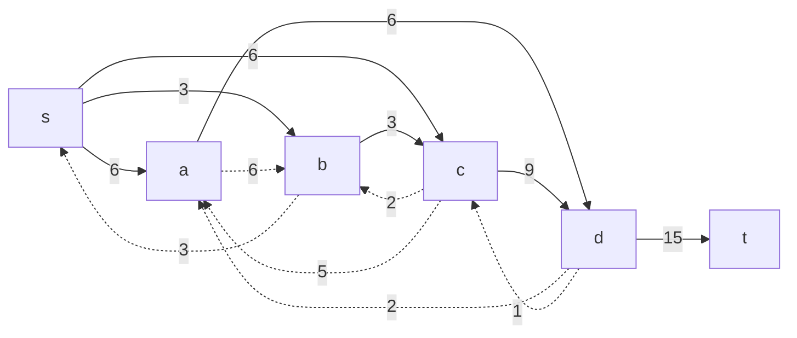

Минимальный вес ребра в цикле 1 - это неиспользованный резерв ребра c -> d.

Удалим найденный цикл - уменьшим на 1 вес всех ребер, входящих в цикл.

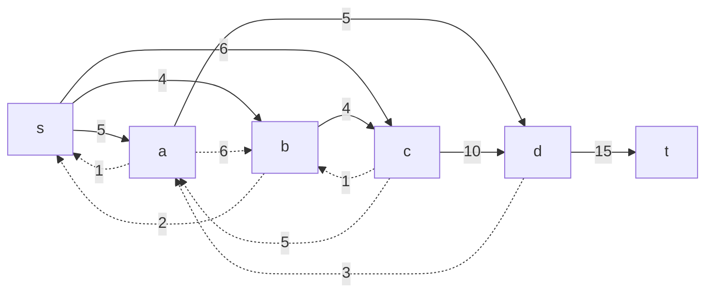

### 7. Проведем повторный поиск цикла отрицательной стоимости в остаточной сети.
Скорректируем остаточную сеть с указанием стоимости транспортировки единицы потока.

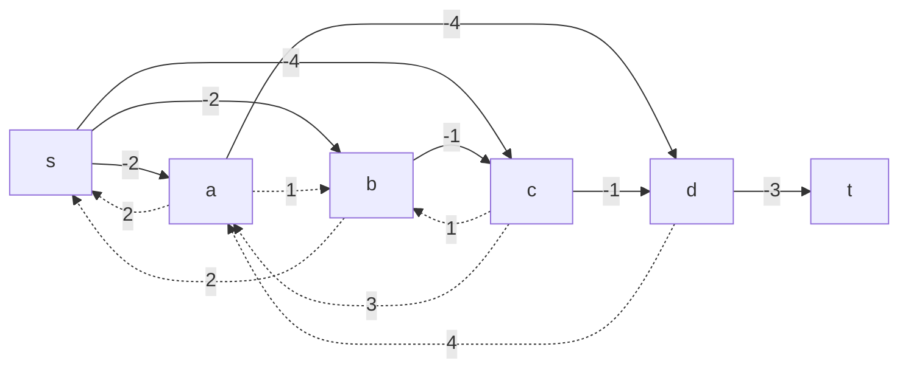

В остаточной сети найден ориентированный цикл отрицательной стоимости s -> c -> b -> s (- 4 + 1 + 2= -1). 

Найдем минимальный вес ребра в указанном цикле, изображенном **в остаточной сети с указанием величины потока**.  

Минимальный вес ребра в цикле 1 - это неиспользованный резерв ребер b -> c.

Удалим найденный цикл - уменьшим на 1 вес всех ребер, входящих в цикл.

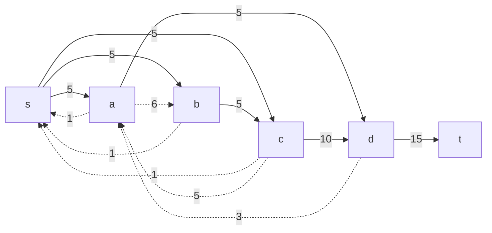

### 8. Проведем повторный поиск цикла отрицательной стоимости в остаточной сети.
Скорректируем остаточную сеть с указанием стоимости транспортировки единицы потока.

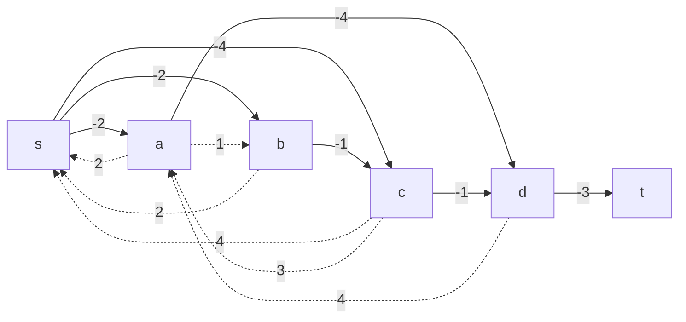
В остаточной сети отсутствуют циклы отрицательной стоимости, следовательно, стоимость потока минимальна.

### 9. Рассчитаем стоимость полученного максимального потока.

| Дуги                            | sa | sb | sc | ba | bc | cd | ac | ad | dt | Итого  |
|:--------------------------|:--:|:--:|:--:|:--:|:--:|:--:|:--:|:--:|:--:|:------:|
| Пропускная способность p(e)    | 6  | 6  | 6  | 6  | 5  | 10 | 5  | 8  | 15 |        |
| Локальный поток f(e)           | 5  | 4  | 6  | 0  | 4  | 10  | 0  | 5  | 15  |        |
| Стоимость транспортировки c(e) | 2  | 2  | 4  | 1  | 1  | 1  | 3  | 4  | 3  |        |
| Суммарная стоимость f(e)*c(e)| 10 | 8 | 24  | 0  | 4 | 10  | 0 | 20  | 45  | **121** |

Стоимость полученного потока составляет 121. 

### Ответ:
Максимальный поток в сети равен 15, минимальная стоимость потока 121, она реализуется следующим локальными потоками:

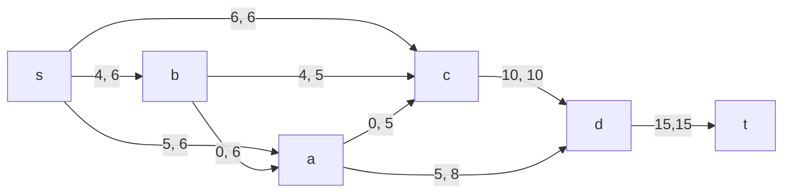