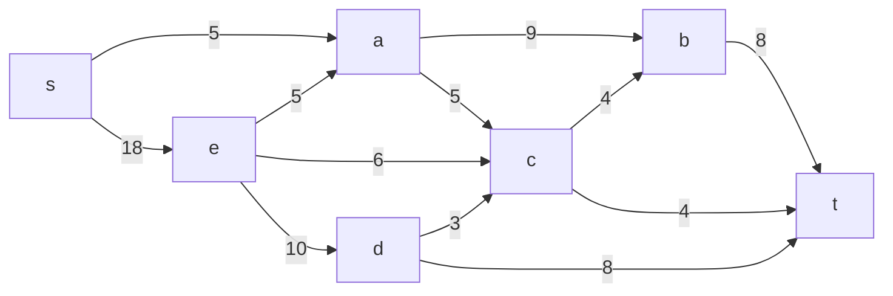
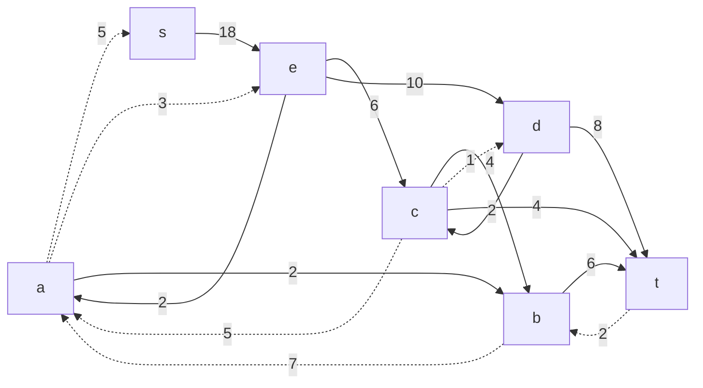
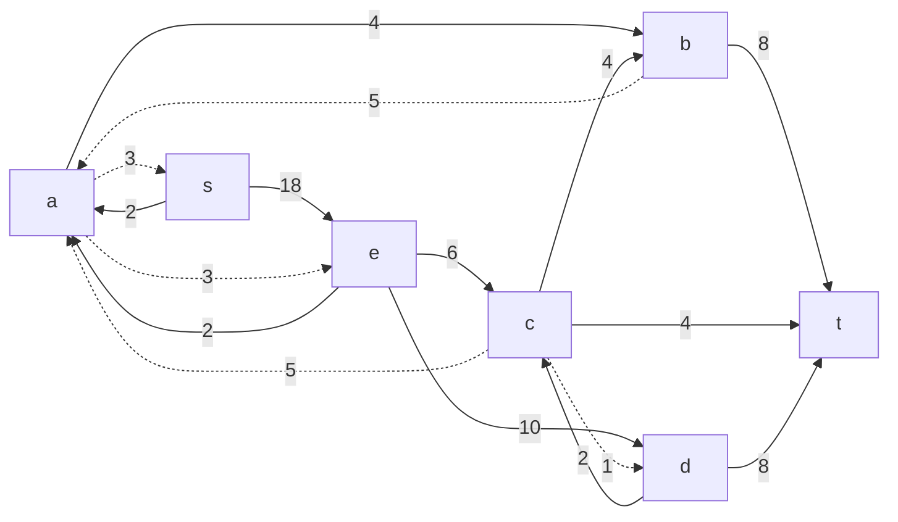
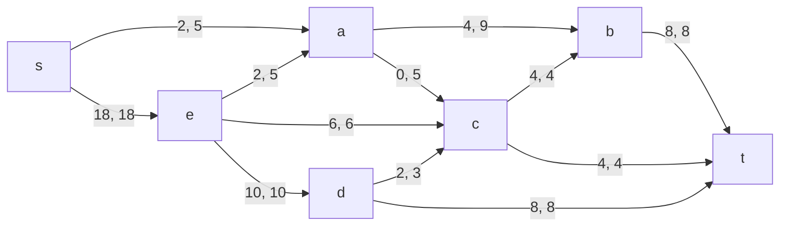
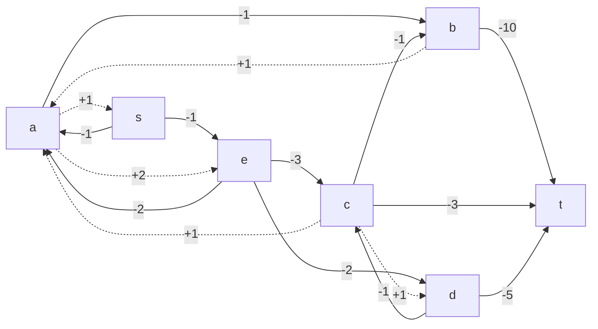
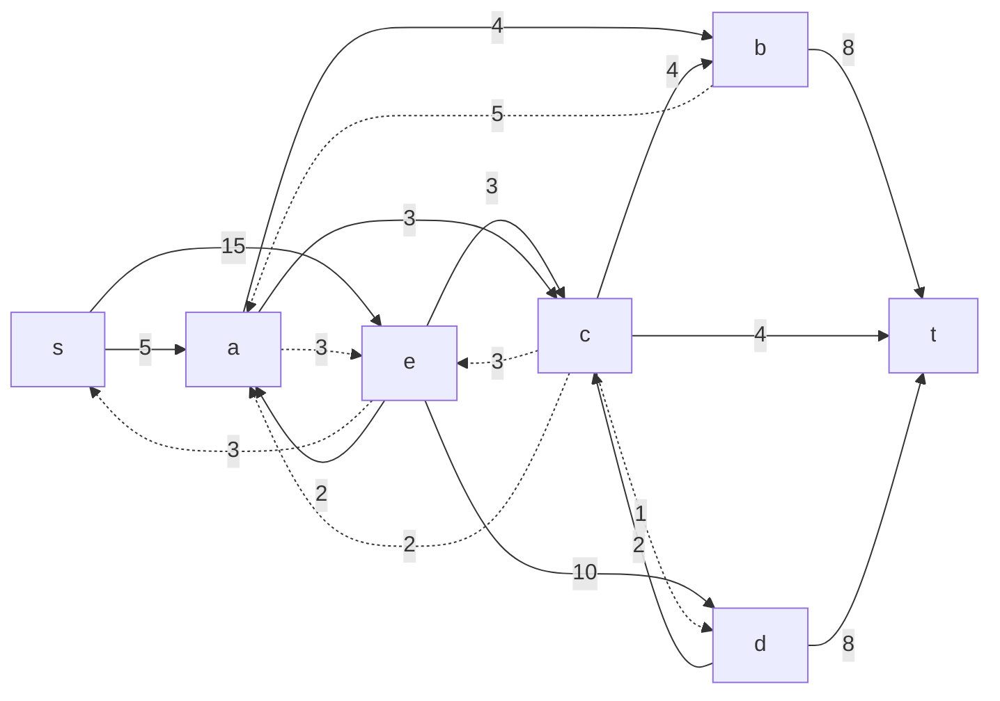
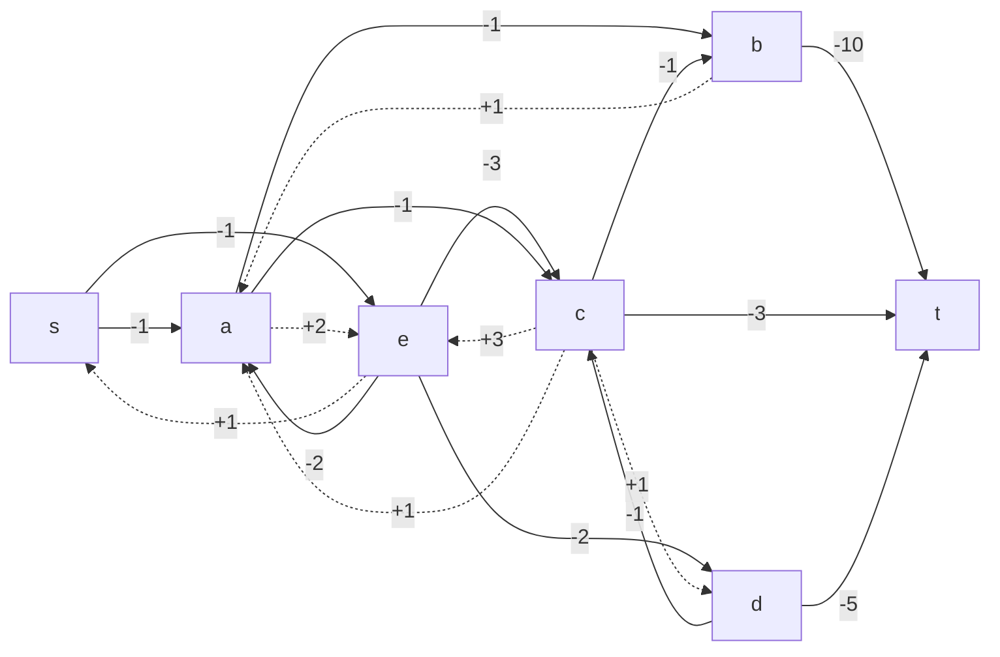

# Задание №10
# Задача о максимальном потоке минимальной стоимости. Вариант 11.
#### Пропускная способность дуг сети p(e) и стоимость транспортировки  единицы потока c(e):

| Дуги                      | sa | se | ea | ec | ed | ab | ac | cb | dc | bt | ct | dt |
|:--------------------------|:--:|:--:|:--:|:--:|:--:|:--:|:--:|:--:|:--:|:--:|:--:|:--:|
| Пропускная способность    | 5  | 18 | 5  | 6  | 10 | 9  | 5  | 4  | 3  | 8  | 4  | 8  |
| Стоимость транспортировки | 1  | 1  | 2  | 3  | 2  | 1  | 1  | 1  | 1  | 10 | 3  | 5  |

### 1. Построим сеть с источником **s**, стоком **t** и указанными пропускными способностями дуг для поиска максимального потока.

Укажем начальный поток величиной 18 **s -> e -> d/c/a -> t/b -> t**. Построим соответствующую остаточную сеть.

### 2. Проведем поиск увеличивающего пути в остаточной сети
В остаточной сети найден увеличивающий путь t -> b -> a -> s. Минимальный вес дуг на этом пути равен 2.

Уменьшим вес дуг на найденном пути, дуги для которых вес стал нулевым удалим из остаточной сети.

### 3. Продолжим поиск увеличивающего пути в остаточной сети

В остаточной сети не найдено увеличивающих путей, следовательно, алгоритм завершил работу и найденный поток величиной 20 является максимальным для данной сети.

### 4. Рассчитаем стоимость полученного максимального потока.

| Дуги                      | sa | se | ea | ec | ed | ab | ac | cb | dc | bt | ct | dt | Итого  |
|:--------------------------|:--:|:--:|:--:|:--:|:--:|:--:|:--:|:--:|:--:|:--:|:--:|:--:|:------:|
| Пропускная способность    | 5  | 18 | 5  | 6  | 10 | 9  | 5  | 4  | 3  | 8  | 4  | 8  |        |
| Локальный поток           | 2  | 18 | 2  | 6  | 10 | 4  | 0  | 4  | 2  | 8  | 4  | 8  |        |
| Стоимость транспортировки | 1  | 1  | 2  | 3  | 2  | 1  | 1  | 1  | 1  | 10 | 3  | 5  |        |
| Суммарная стоимость       | 2  | 18 | 4  | 18 | 20 | 4  | 0  | 4  | 2  | 80 | 12 | 40 | **204**|

Стоимость полученного потока составляет 204.

### 5. Попробуем уменьшить стоимость потока для чего построим остаточную сеть.
Для каждого ребра остаточной сети укажем стоимость транспортировки единицы потока.

В остаточной сети найден ориентированный цикл отрицательной стоимости a -> s -> e -> c -> a (+1 -1 -3 + 1 = -2)

Найдем минимальный вес ребра в указанном цикле, изображенном **в остаточной сети с указанием величины потока**.  

Минимальный вес ребра в цикле 3 - это неиспользованный резерв ребра a -> s.

Удалим найденный цикл - уменьшим на 3 вес всех ребер, входящих в цикл.

### 6. Проведем повторный поиск цикла отрицательной стоимости в остаточной сети.
Скорректируем остаточную сеть с указанием стоимости транспортировки единицы потока.

В остаточной сети отсутствуют циклы отрицательной стоимости, следовательно, стоимость потока минимальна.

### 7. Рассчитаем стоимость полученного максимального потока.

| Дуги                      | sa | se | ea | ec | ed | ab | ac | cb | dc | bt | ct | dt | Итого  |
|:--------------------------|:--:|:--:|:--:|:--:|:--:|:--:|:--:|:--:|:--:|:--:|:--:|:--:|:------:|
| Пропускная способность    | 5  | 18 | 5  | 6  | 10 | 9  | 5  | 4  | 3  | 8  | 4  | 8  |        |
| Локальный поток           | 5  | 15 | 2  | 3  | 10 | 4  | 3  | 4  | 2  | 8  | 4  | 8  |        |
| Стоимость транспортировки | 1  | 1  | 2  | 3  | 2  | 1  | 1  | 1  | 1  | 10 | 3  | 5  |        |
| Суммарная стоимость       | 5  | 15 | 4  | 9  | 20 | 4  | 3  | 4  | 2  | 80 | 12 | 40 | **198**|

### Ответ:
Максимальный поток в сети равен 20, минимальная стоимость потока 198, она реализуется следующим локальными потоками:

