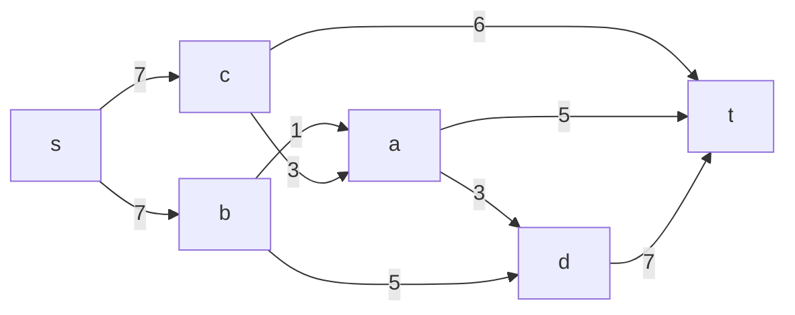
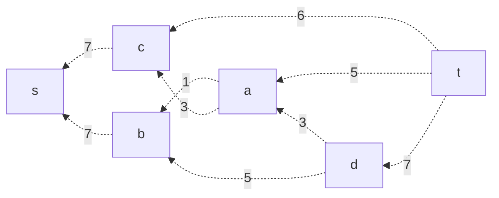
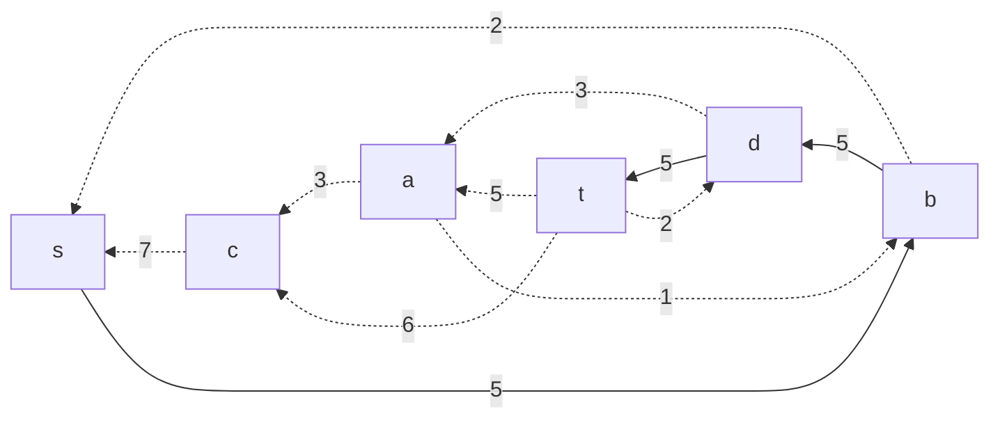
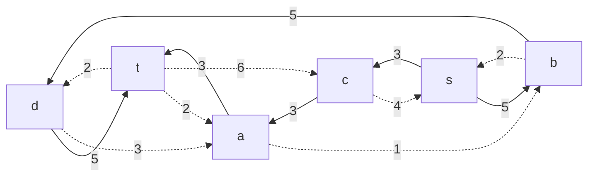
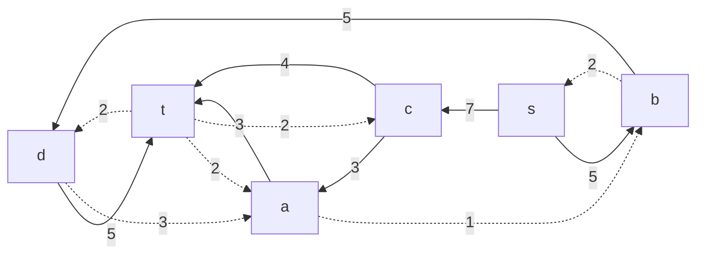
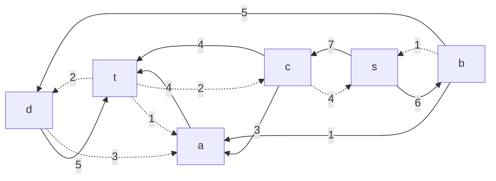
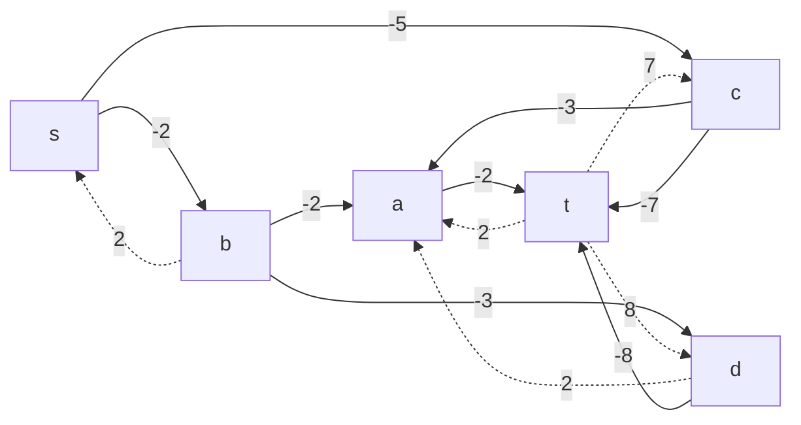
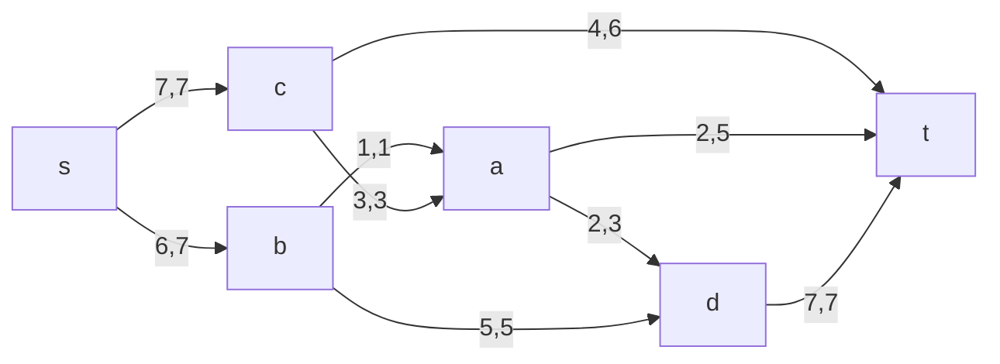
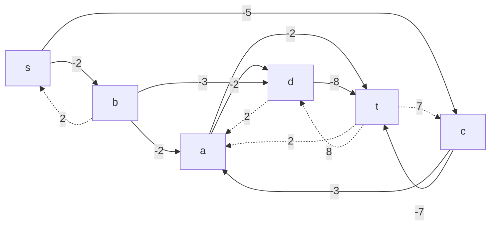
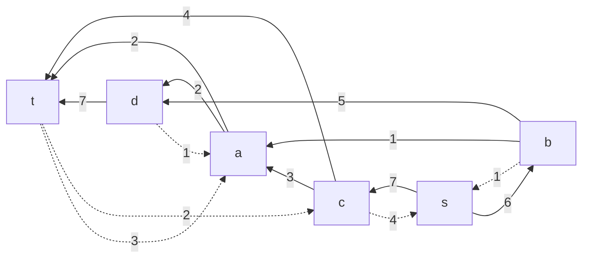

# Задание №10. Задача о максимальном потоке минимальной стоимости.
## Вариант 2:

### Постановка задачи
1. Дана сеть (взвешенный ориентированный граф) с источником s и стоком t.
2. Для каждой дуги определена пропускная способность и стоимость транспортировки.
3. Необходимо найти для указанной сети максимальный поток минимальной стоимости. 
### Пропускная способность дуг сети p(e) и стоимость транспортировки  единицы потока c(e):

|          Дуги            | sb | sc | ba | ad | bd | ca | ct | at | dt |
|:------------------------:|:--:|:--:|:--:|:--:|:--:|:--:|:--:|:--:|:--:|
| Пропускная способность   | 7  | 7  | 1  | 3  | 5  | 3  | 6  | 5  | 7  |
| Стоимость транспортировки| 2  | 5  | 2  | 2  | 3  | 3  | 7  | 2  | 8  |

### Задание
Для каждого варианта представлены условия задачи, в соответствии с которыми необходимо: 
1. Построить сеть с указанием пропускной способности дуг.
2. Построить остаточную сеть.
3. Определить максимальный поток методом поиска увеличивающих путей в остаточной сети.
4. Минимизировать стоимость максимального потока посредством поиска циклов отрицательной стоимости.
5. Оформить решение задачи по шагам с подробными комментариями, таблицами и диаграммами.
6. В ответе указать максимальную величину потока, минимальную стоимость транспортировки и сеть с указанием соответствующих локальных потоков.

### 1. Построим сеть с источником **s**, стоком **t** и указанными пропускными способностями дуг для поиска максимального потока.

Построим остаточную сеть.

### 2. Проведем поиск увеличивающего пути в остаточной сети
В остаточной сети найден увеличивающий путь t -> d -> b -> s. Минимальный вес дуг на этом пути равен 5.

Уменьшим вес дуг на найденном пути, дуги для которых вес стал нулевым удалим из остаточной сети.

### 2.1. Продолжим поиск увеличивающего пути в остаточной сети
В остаточной сети найден увеличивающий путь t -> a -> c -> s. Минимальный вес дуг на этом пути равен 3.

Уменьшим вес дуг на найденном пути, дуги для которых вес стал нулевым удалим из остаточной сети.

### 2.2. Продолжим поиск увеличивающего пути в остаточной сети
В остаточной сети найден увеличивающий путь t -> c -> s. Минимальный вес дуг на этом пути равен 4.

Уменьшим вес дуг на найденном пути, дуги для которых вес стал нулевым удалим из остаточной сети.

### 2.3. Продолжим поиск увеличивающего пути в остаточной сети
В остаточной сети найден увеличивающий путь t -> a -> b -> s. Минимальный вес дуг на этом пути равен 1.

Уменьшим вес дуг на найденном пути, дуги для которых вес стал нулевым удалим из остаточной сети.

### 3. Продолжим поиск увеличивающего пути в остаточной сети

В остаточной сети не найдено увеличивающих путей, следовательно, алгоритм завершил работу и найденный поток величиной **13** является максимальным для данной сети.

### 4. Рассчитаем стоимость полученного максимального потока.

|          Дуги                                 | sb  | sc  | ba | ad | bd  | ca | ct | at | dt |Итого  |
|:---------------------------------------------:|:--:|:--:|:--:|:--:|:--:|:--:|:--:|:--:|:--:|:----:|
| Пропускная способность p(e)                   | 7   | 7   | 1  | 3  | 5   | 3  | 6   | 5  | 7  |  |
| Локальный поток f(e)                          | 6   | 7   | 1  | 0  | 5   | 3  | 4   | 4  | 5  |  |
| Стоимость транспортировки единицы потока c(e) | 2   | 5   | 2  | 2  | 3   | 3  | 7   | 2  | 8  |  |
| Суммарная стоимость f(e)*c(e)                 | 12  | 35  | 2  | 0  | 15  | 9  | 28  | 8  | 40 | **149** |

Стоимость полученного потока составляет **149**. 

### 5. Попробуем уменьшить стоимость потока для чего построим остаточную сеть.
Для каждого ребра остаточной сети укажем стоимость транспортировки единицы потока.

В остаточной сети **не найден** ориентированный цикл отрицательной стоимости, следовательно, стоимость потока минимальна.

### 6. Для того, чтобы поработать с циклами отрицательной стоимости изменим конфигурацию потока.
Запустим поток величиной 13 следующим образом:

Рассчитаем стоимость:

|          Дуги                                 | sb  | sc  | ba | ad | bd  | ca | ct | at | dt |Итого  |
|:---------------------------------------------:|:--:|:--:|:--:|:--:|:--:|:--:|:--:|:--:|:--:|:----:|
| Пропускная способность p(e)                   | 7   | 7   | 1  | 3  | 5   | 3  | 6   | 5  | 7  |  |
| Локальный поток f(e)                          | 6   | 7   | 1  | 2  | 5   | 3  | 4   | 2  | 7  |  |
| Стоимость транспортировки единицы потока c(e) | 2   | 5   | 2  | 2  | 3   | 3  | 7   | 2  | 8  |  |
| Суммарная стоимость f(e)*c(e)                 | 12  | 35  | 2  | 4  | 15  | 9  | 28  | 4  | 56 | **165** |

### 7. Попробуем уменьшить стоимость потока для чего построим остаточную сеть.
Для каждого ребра остаточной сети укажем стоимость транспортировки единицы потока.

В остаточной сети найден ориентированный цикл отрицательной стоимости t -> a -> d -> t (2 - 2 -8 = -8). 

Найдем минимальный вес ребра в указанном цикле, изображенном **в остаточной сети с указанием величины потока**.  

Минимальный вес ребра в цикле 2 - это неиспользованный резерв ребра a -> d.

Удалим найденный цикл - уменьшим на 2 вес всех ребер, входящих в цикл.

### 8. Попробуем уменьшить стоимость потока для чего построим остаточную сеть.
Для каждого ребра остаточной сети укажем стоимость транспортировки единицы потока.

В остаточной сети отсутствуют циклы отрицательной стоимости, следовательно, стоимость потока минимальна.

### 9. Рассчитаем стоимость полученного максимального потока.

|          Дуги                                 | sb  | sc  | ba | ad | bd  | ca | ct | at | dt |Итого  |
|:---------------------------------------------:|:--:|:--:|:--:|:--:|:--:|:--:|:--:|:--:|:--:|:----:|
| Пропускная способность p(e)                   | 7   | 7   | 1  | 3  | 5   | 3  | 6   | 5  | 7  |  |
| Локальный поток f(e)                          | 6   | 7   | 1  | 0  | 5   | 3  | 4   | 4  | 5  |  |
| Стоимость транспортировки единицы потока c(e) | 2   | 5   | 2  | 2  | 3   | 3  | 7   | 2  | 8  |  |
| Суммарная стоимость f(e)*c(e)                 | 12  | 35  | 2  | 0  | 15  | 9  | 28  | 8  | 40 | **149** |

### Ответ:
Максимальный поток в сети равен **13**, минимальная стоимость потока **149**, она реализуется следующим локальными потоками:

