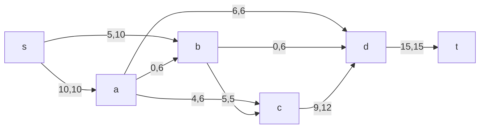
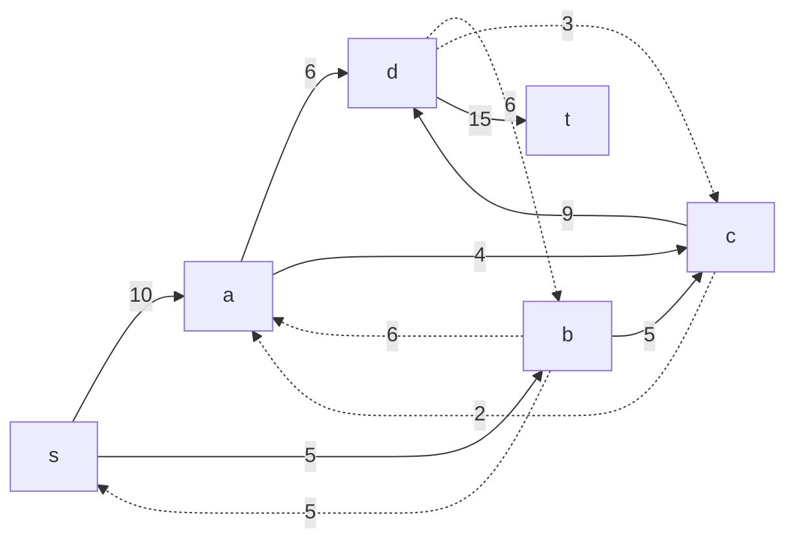
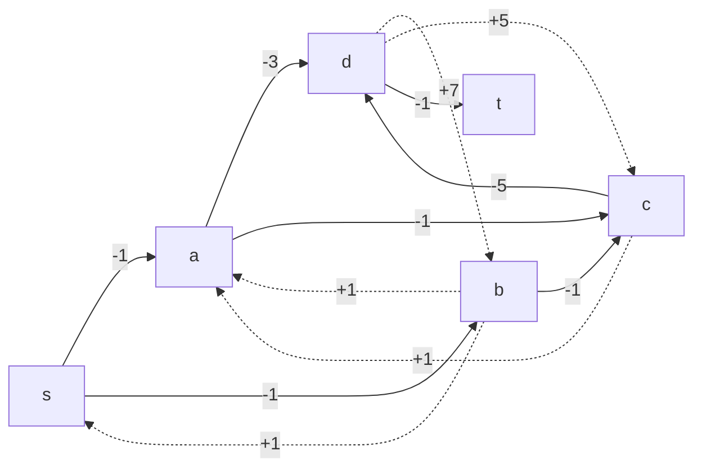

#### Вариант 9:
Команда no-name:
Долгих Юлия
Осока Варвара
Шперкин Савва

#### Пропускная способность дуг сети p(e) и стоимость транспортировки  единицы потока c(e):

| Дуги                      | sa | sb | ab | ad | ac | cd | bd | dt | bc |
|:--------------------------|:--:|:--:|:--:|:--:|:--:|:--:|:--:|:--:|:--:|
| Пропускная способность    | 10 | 10 | 6  | 6  | 6  | 12 | 6  | 15 | 5  |
| Стоимость транспортировки | 1  | 1  | 1  | 3  | 1  | 5  | 7  | 1  | 1  |

 ### Шаг 1
 Найти какой-нибудь поток максимальной величины
 
 ```mermaid
 graph LR
 s -->|10| a
 s -->|10| b
 a -->|6| b
 a -->|6| d
 a -->|6| c
 c -->|12| d
 b -->|6| d
 d -->|15| t
 b -->|5| c
 ```
 Построить остаточную сеть
  ```mermaid
 graph LR
 a -.->|10| s
 b -.->|10| s
 b -.->|6| a
 d -.->|6| a
 c -.->|6| a
 d -.->|12| c
 d -.->|6| b
 t -.->|15| d
 c -.->|5| b
 ```
 Найти путь из t в s (увеличивающий путь).
 t --> d --> a --> s
 min = 6
Нужно уменьшить веса всех дуг этого пути на величину дельта, где дельта - минимальный из весов дуг, входящих в этот путь.
 
 ```mermaid
graph RL
    s-->|6|a-->|6|d-->|6|t
    t-.->|9|d-.->|6|b-.->|6|a-.->|4|s
    d-.->|12|c-.->|5|b-.->|10|s
    c-.->|6|a    
```
### Шаг 2
Найти увеличивающий путь
t --> d-->c-->b-->s
min = 5
Нужно уменьшить веса всех дуг этого пути на величину дельта, где дельта - минимальный из весов дуг, входящих в этот путь.
 
 ```mermaid
graph RL
    s-->|6|a-->|6|d-->|11|t
    t-.->|4|d-.->|6|b-.->|6|a-.->|4|s
    d-.->|7|c
    b-.->|5|s-->|5|b
    c-.->|6|a
    c-->|5|d
    b-->|5|c
```
### Шаг 3
Найти увеличивающий путь 
t-->d-->c-->a-->s
min = 4
Нужно уменьшить веса всех дуг этого пути на величину дельта, где дельта - минимальный из весов дуг, входящих в этот путь.
 ```mermaid
graph RL
    s-->|10|a-->|6|d-->|15|t
    d-.->|6|b-.->|6|a
    d-.->|3|c
    b-.->|5|s-->|5|b
    c-.->|2|a
    c-->|9|d
    b-->|5|c
    a-->|4|c
```
Граф с максимальным потоком

### Шаг 4
Построить остаточную сеть, соответствующую текущему потоку и найти в ней цикл отрицательной стоимости.

Граф со стоимостями

### Шаг 5
Цикла отрицательной стоимости не обнаружено. Текущий поток является максимальным и имеет минимальную стоимость.

| Дуги                           | sa  | sb  | ab  | ad  | ac  | cd  | bd  | dt  | bc  | Итого  |
| :----------------------------- | :-: | :-: | :-: | :-: | :-: | :-: | :-: | :-: | :-: | ------ |
| Пропускная способность p(e)    | 10  | 10  |  6  |  6  |  6  | 12  |  6  | 15  |  5  |        |
| Локальный поток f(e)           | 10  |  5  |  0  |  6  |  4  |  9  |  0  | 15  |  5  |        |
| Стоимость транспортировки c(e) |  1  |  1  |  1  |  3  |  1  |  5  |  7  |  1  |  1  |        |
| Суммарная стоимость f(e)*c(e)  | 10  |  5  |  0  | 18  |  4  | 45  |  0  | 15  |  5  | **102** |