# :exclamation:Задание №10:exclamation:
# Задача о максимальном потоке минимальной стоимости.

## :dizzy_face: Постановка задачи
1. Дана сеть (взвешенный ориентированный граф) с источником s и стоком t.
2. Для каждой дуги определена пропускная способность и стоимость транспортировки.
3. Необходимо найти для указанной сети максимальный поток минимальной стоимости. 

### :neutral_face: Вариант 7:

Пропускная способность дуг сети p(e) и стоимость транспортировки  единицы потока c(e):

| Дуги                      | se | ea | ec | ed | ab | cb | dc | bt | ct | sd | dt |
|:--------------------------|:--:|:--:|:--:|:--:|:--:|:--:|:--:|:--:|:--:|:--:|:--:|
| Пропускная способность    | 18 | 5  | 6  | 10 | 5  | 4  | 3  | 8  | 4  | 5  | 12 |
| Стоимость транспортировки | 1  | 2  | 3  | 2  | 1  | 1  | 1  | 2  | 3  | 8  | 8  |
 ## :nerd_face: Решение:
 
### :one: Построим сеть с источником **s**, стоком **t** и указанными пропускными способностями дуг для поиска максимального потока.

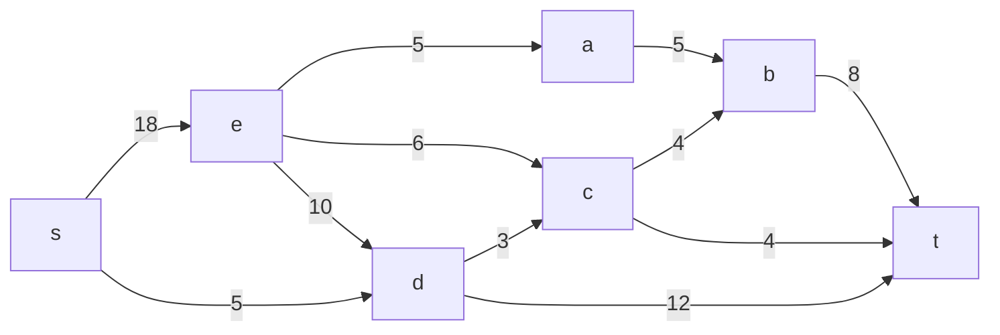
Построим остаточную сеть. Поскольку изначально поток в сети не задан, все дуги сети являются пустыми (локальный поток равен нулю), соответственно, в остаточную сеть необходимо вынести обратную дугу с весом, равным пропускной способности.

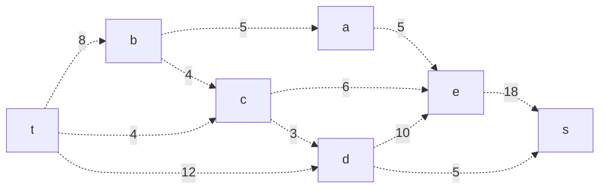

### :two: Проведем поиск увеличивающего пути в остаточной сети
В остаточной сети найден увеличивающий путь t -> d -> s. Минимальный вес дуг на этом пути равен 5.

Уменьшим вес дуг на найденном пути, дуги для которых вес стал нулевым удалим из остаточной сети.

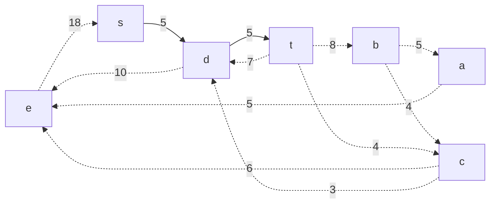

#### 2.1. Продолжим поиск увеличивающего пути в остаточной сети
В остаточной сети найден увеличивающий путь t -> b -> c -> e -> s. Минимальный вес дуг на этом пути равен 4.

Уменьшим вес дуг на найденном пути, дуги для которых вес стал нулевым удалим из остаточной сети.

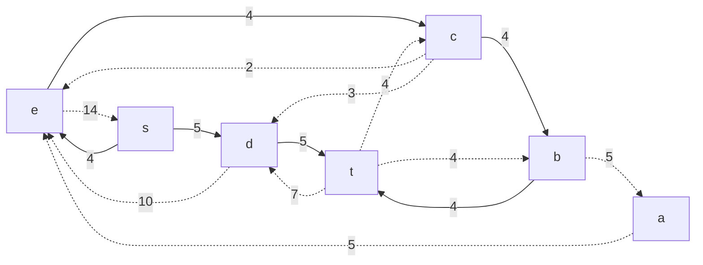
#### 2.2. Продолжим поиск увеличивающего пути в остаточной сети

В остаточной сети найден увеличивающий путь t -> c -> e -> s. Минимальный вес дуг на этом пути равен 2.

Уменьшим вес дуг на найденном пути, дуги для которых вес стал нулевым удалим из остаточной сети.

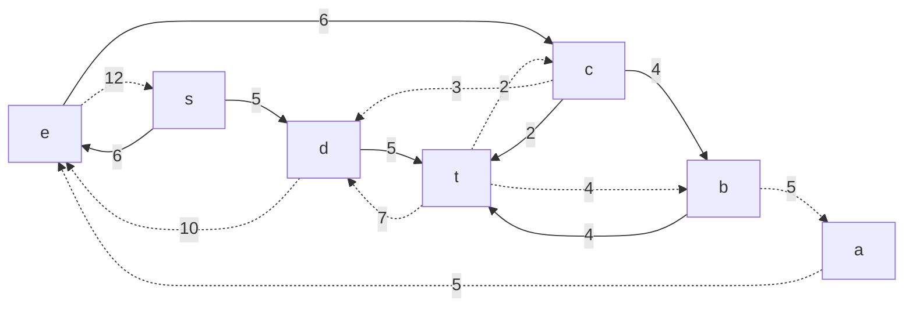
#### 2.3. Продолжим поиск увеличивающего пути в остаточной сети

В остаточной сети найден увеличивающий путь t -> d -> e -> s. Минимальный вес дуг на этом пути равен 7.

Уменьшим вес дуг на найденном пути, дуги для которых вес стал нулевым удалим из остаточной сети.

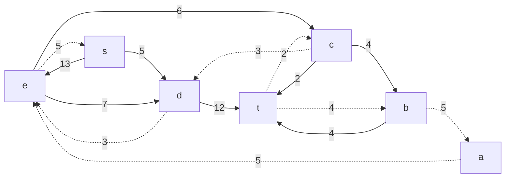
#### 2.4. Продолжим поиск увеличивающего пути в остаточной сети

В остаточной сети найден увеличивающий путь t -> b -> a -> e -> s. Минимальный вес дуг на этом пути равен 4.

Уменьшим вес дуг на найденном пути, дуги для которых вес стал нулевым удалим из остаточной сети.

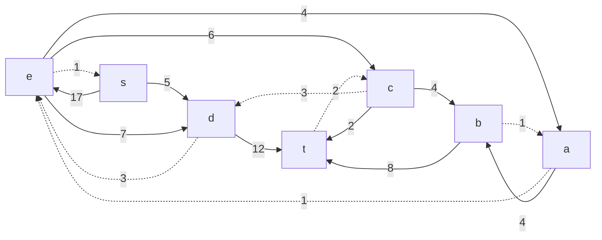
#### 2.5. Продолжим поиск увеличивающего пути в остаточной сети
В остаточной сети найден увеличивающий путь t -> c -> d -> e -> s. Минимальный вес дуг на этом пути равен 1.

Уменьшим вес дуг на найденном пути, дуги для которых вес стал нулевым удалим из остаточной сети.

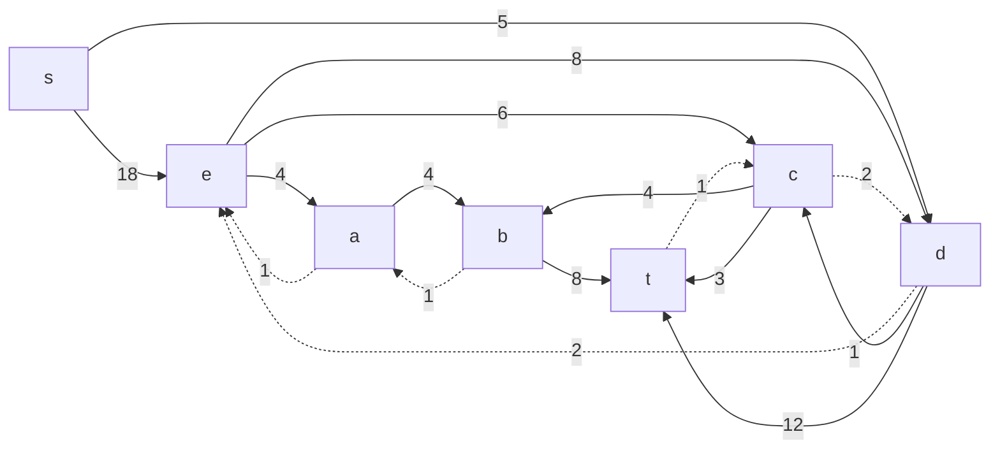
### :three: Продолжим поиск увеличивающего пути в остаточной сети

В остаточной сети не найдено увеличивающих путей, следовательно, алгоритм завершил работу и найденный поток величиной **23** является максимальным для данной сети.

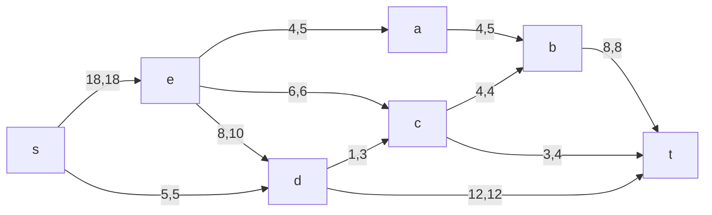

### :four: Рассчитаем стоимость полученного максимального потока.

| Дуги                                          | se | ea | ec | ed | ab | cb | dc | bt | ct | sd | dt | Итого|
|:----------------------------------------------|:--:|:--:|:--:|:--:|:--:|:--:|:--:|:--:|:--:|:--:|:--:|:--:|
| Пропускная способность p(e)                   | 18 | 5  | 6  | 10 | 5  | 4  | 3  | 8  | 4  | 5  | 12 |  |
| Локальный поток f(e)                          | 18 | 4  | 6  | 8  | 4  | 4  | 1  | 8  | 3  | 5  | 12 |  |
| Стоимость транспортировки единицы потока c(e) | 1  | 2  | 3  | 2  | 1  | 1  | 1  | 2  | 3  | 8  | 8  |
| Суммарная стоимость f(e)*c(e)                 | 18 | 8  | 18 | 16 | 4  | 4  | 1  | 16 | 9  | 40 | 96 | **230** |

Стоимость полученного потока составляет 230. 

### :five: Попробуем уменьшить стоимость потока для чего построим остаточную сеть.
Для каждого ребра остаточной сети укажем стоимость транспортировки единицы потока.

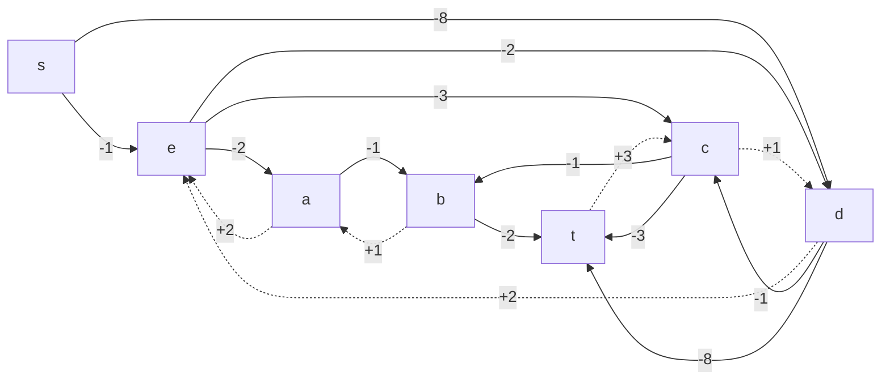

В остаточной сети найден ориентированный цикл отрицательной стоимости d -> t -> c -> d (- 8 + 1 + 2 = -4). 

Найдем минимальный вес ребра в указанном цикле, изображенном **в остаточной сети с указанием величины потока**.  

Минимальный вес ребра в цикле 1 - это неиспользованный резерв ребра c -> t.

Удалим найденный цикл - уменьшим на 1 вес всех ребер, входящих в цикл.

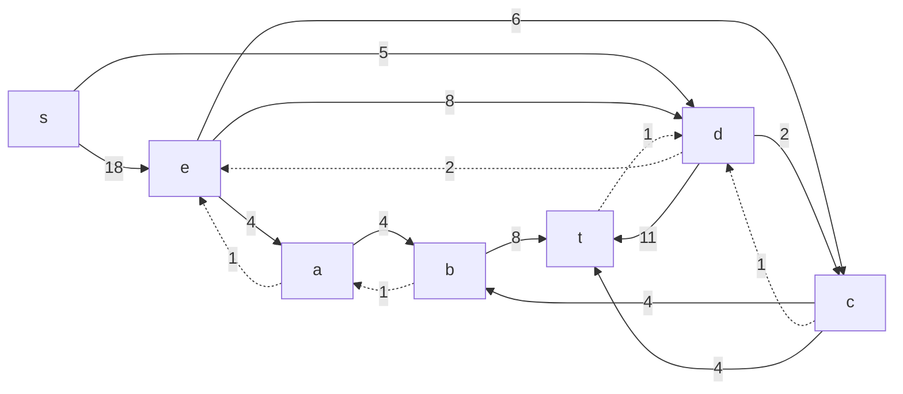

### :six: Проведем повторный поиск цикла отрицательной стоимости в остаточной сети.
Скорректируем остаточную сеть с указанием стоимости транспортировки единицы потока.

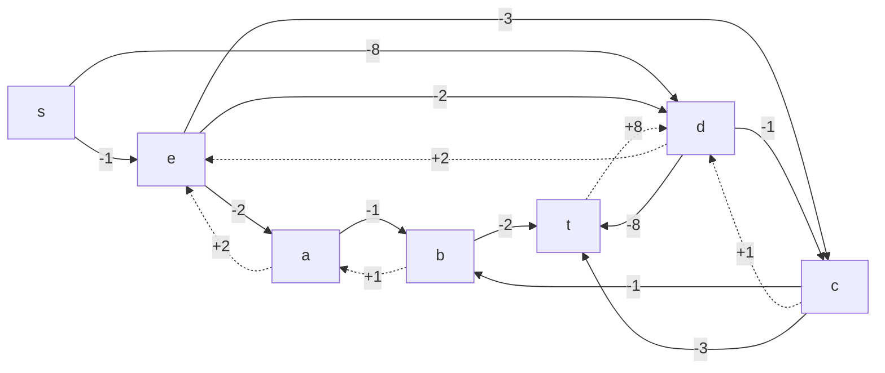

В остаточной сети найден ориентированный цикл отрицательной стоимости e -> c -> b -> a -> e (- 3 - 1 + 1 + 2 = -1). 

Найдем минимальный вес ребра в указанном цикле, изображенном **в остаточной сети с указанием величины потока**.  

Минимальный вес ребра в цикле 1 - это неиспользованный резерв ребер e -> a и a -> b.

Удалим найденный цикл - уменьшим на 1 вес всех ребер, входящих в цикл.

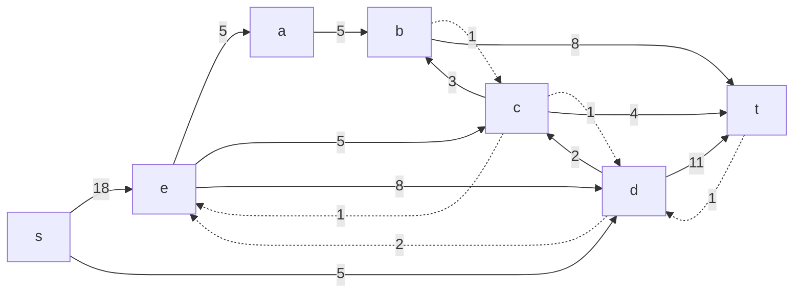

### :seven: Проведем повторный поиск цикла отрицательной стоимости в остаточной сети.
Скорректируем остаточную сеть с указанием стоимости транспортировки единицы потока.

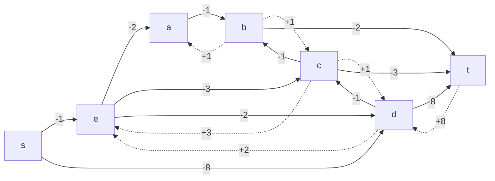

В остаточной сети отсутствуют циклы отрицательной стоимости, следовательно, стоимость потока минимальна.

### :eight: Рассчитаем стоимость полученного максимального потока.

| Дуги                                          | se | ea | ec | ed | ab | cb | dc | bt | ct | sd | dt | Итого|
|:----------------------------------------------|:--:|:--:|:--:|:--:|:--:|:--:|:--:|:--:|:--:|:--:|:--:|:--:|
| Пропускная способность p(e)                   | 18 | 5  | 6  | 10 | 5  | 4  | 3  | 8  | 4  | 5  | 12 |  |
| Локальный поток f(e)                          | 18 | 5  | 5  | 8  | 5  | 3  | 2  | 8  | 4  | 5  | 11 |  |
| Стоимость транспортировки единицы потока c(e) | 1  | 2  | 3  | 2  | 1  | 1  | 1  | 2  | 3  | 8  | 8  |
| Суммарная стоимость f(e)*c(e)                 | 18 | 10 | 15 | 16 | 5  | 3  | 2  | 16 | 12 | 40 | 88 | **225** |

Стоимость полученного потока составляет 225. 

### :innocent: Ответ:
Максимальный поток в сети равен 23, минимальная стоимость потока 225, она реализуется следующим локальными потоками:

