# Задание №10. Вариант №1
# Задача о максимальном потоке минимальной стоимости.

Пропускная способность дуг сети и стоимость транспортировки указана в таблице.

| Дуги                                          | sa | sb | sc | aс | at | ab | bd | ct | dt |
|:----------------------------------------------|:--:|:--:|:--:|:--:|:--:|:--:|:--:|:--:|:--:|
| Пропускная способность p(e)                   | 9  | 9  | 4  | 6  | 7  | 4  |  7 | 9  | 9  |
| Стоимость транспортировки единицы потока c(e) | 4  | 2  | 2  | 3  | 8  | 2  | 2  | 3  | 2  |

### 1. Построим сеть с источником **s**, стоком **t** и указанными пропускными способностями дуг для поиска максимального потока.

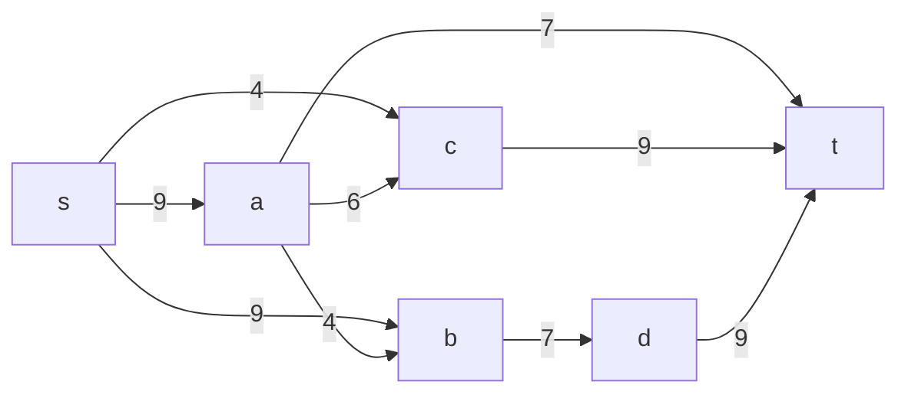
Укажем начальный поток величиной 7 **s -> b -> d -> t**. Построим соответствующую остаточную сеть.

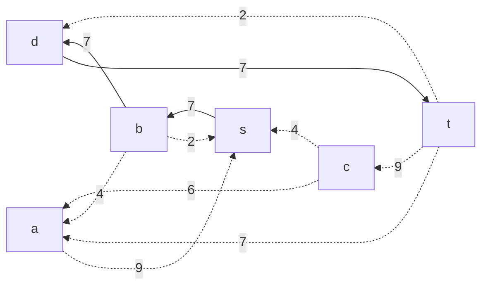

### 2. Проведем поиск увеличивающего пути в остаточной сети
В остаточной сети найден увеличивающий путь t -> c -> a -> s. Минимальный вес дуг на этом пути равен 6.

Уменьшим вес дуг на найденном пути, дуги для которых вес стал нулевым удалим из остаточной сети.

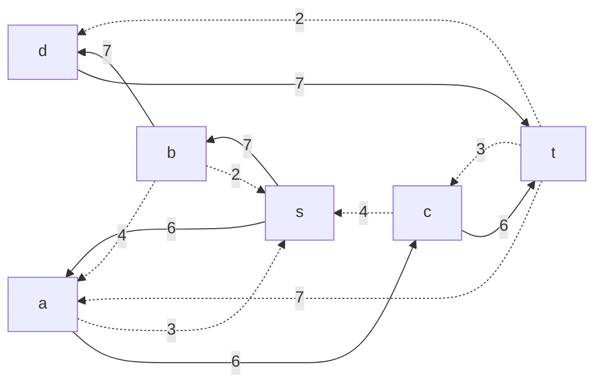

### 3. Продолжим поиск увеличивающего пути в остаточной сети
В остаточной сети найден увеличивающий путь t -> a -> s. Минимальный вес дуг на этом пути равен = 3.

Уменьшим вес дуг на найденном пути, дуги для которых вес стал нулевым удалим из остаточной сети.

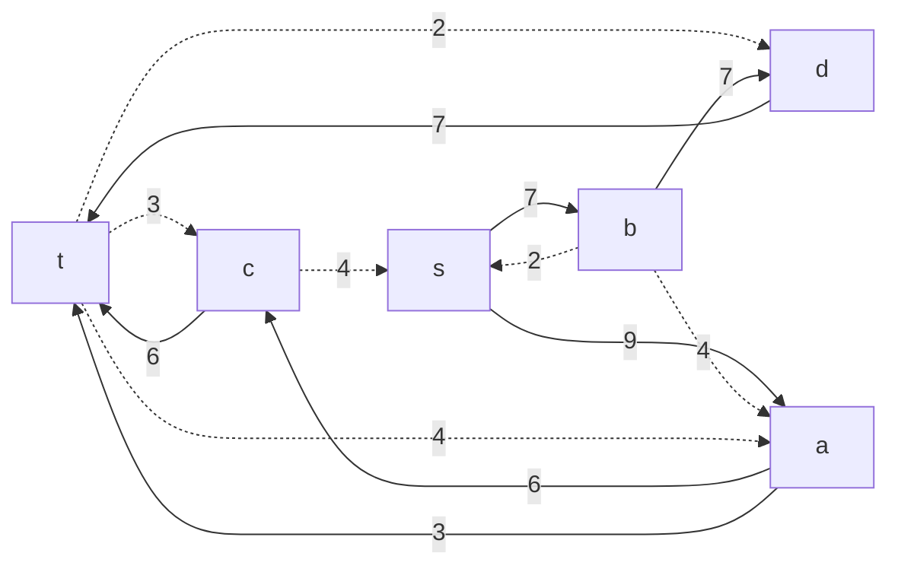

### 4. Продолжим поиск увеличивающего пути в остаточной сети
В остаточной сети найден увеличивающий путь t -> c -> s. Минимальный вес дуг на этом пути равен = 3.

Уменьшим вес дуг на найденном пути, дуги для которых вес стал нулевым удалим из остаточной сети.

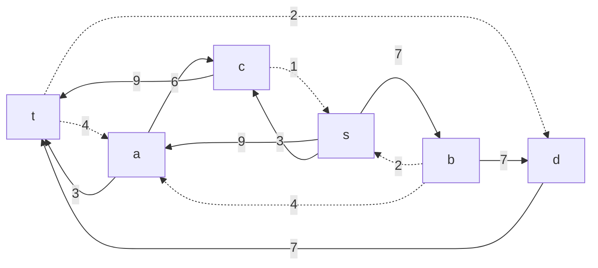

### 5. Продолжим поиск увеличивающего пути в остаточной сети
В остаточной сети найден увеличивающий путь t -> a -> c -> s. Минимальный вес дуг на этом пути равен = 1.

Уменьшим вес дуг на найденном пути, дуги для которых вес стал нулевым удалим из остаточной сети.

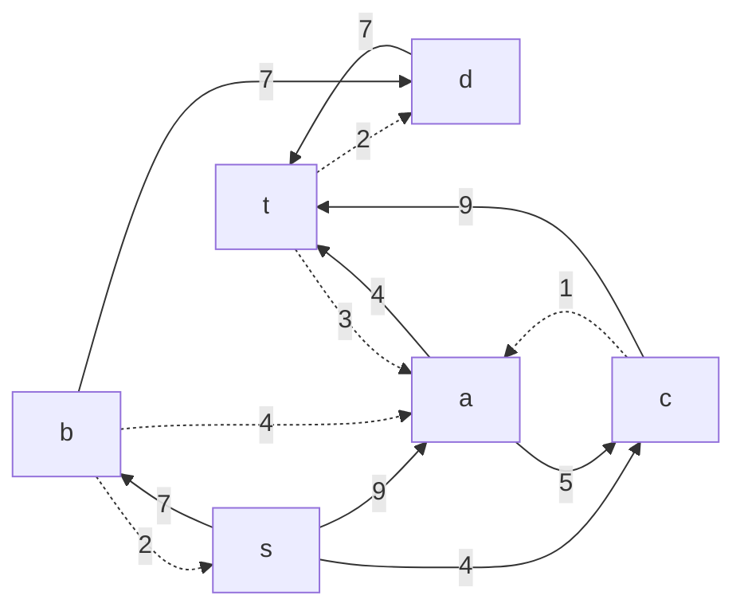

### 6. Продолжим поиск увеличивающего пути в остаточной сети

В остаточной сети не найдено увеличивающих путей, следовательно, алгоритм завершил работу и найденный поток величиной 9 является максимальным для данной сети.

### 7. Рассчитаем стоимость полученного максимального потока. В sb пропускную способность уменьшим до 7, а в bd увеличим до 9.

| Дуги                                          | sa | sb | sc | ac | at | ab | bd | ct | dt | Итого  |
|:----------------------------------------------|:--:|:--:|:--:|:--:|:--:|:--:|:--:|:--:|:--:|:------:|
| Пропускная способность p(e)                   | 9  | 7  | 4  | 6  | 7  | 4  | 9  | 9  | 9  |        |
| Локальный поток f(e)                          | 9  | 7  | 4  | 5  | 4  | 0  | 7  | 9  | 7  |        |
| Стоимость транспортировки единицы потока c(e) | 4  | 2  | 2  | 3  | 8  | 2  | 2  | 3  | 2  |        |
| Суммарная стоимость f(e)*c(e)                 | 36 | 14 | 8  | 15 | 32 | 0  | 14 | 27 | 14 | **160** |

Стоимость полученного потока составляет 160. 

### 8. Попробуем уменьшить стоимость потока для чего построим остаточную сеть.
Для каждого ребра остаточной сети укажем стоимость транспортировки единицы потока.

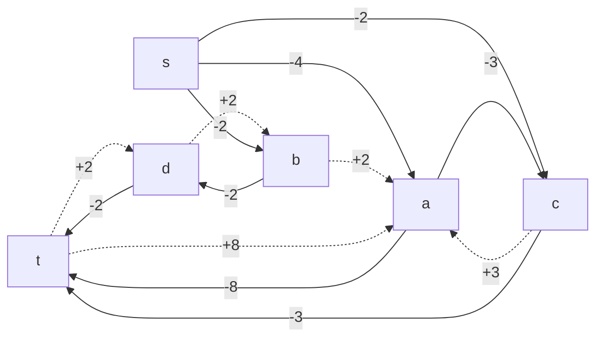

В остаточной сети найден ориентированный цикл отрицательной стоимости b -> a -> t -> d -> b (+2 -8 +2 +2 = -2). 

Найдем минимальный вес ребра в указанном цикле, изображенном **в остаточной сети с указанием величины потока**.

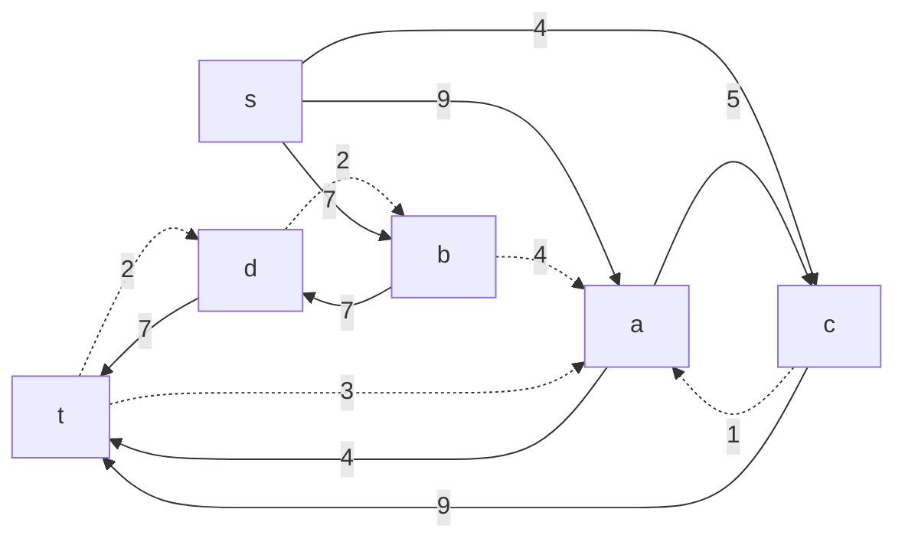

Минимальный вес ребра в цикле = 2.

Удалим найденный цикл - уменьшим на 2 вес всех ребер, входящих в цикл.

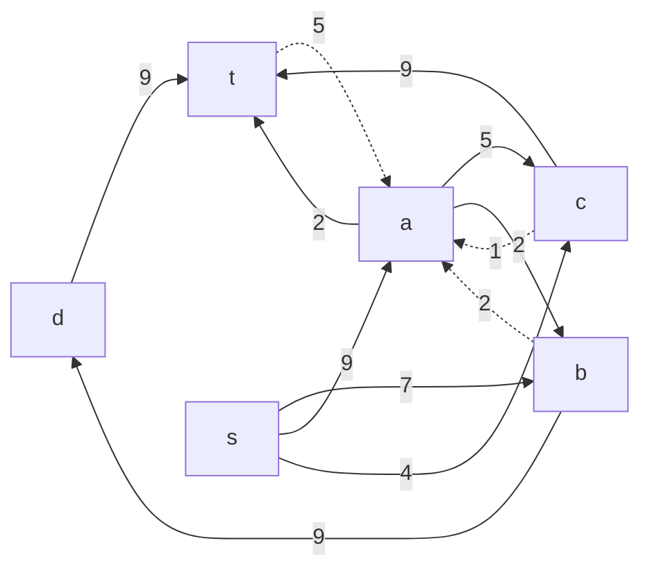

### 9. Проведем повторный поиск цикла отрицательной стоимости в остаточной сети.
Скорректируем остаточную сеть с указанием стоимости транспортировки единицы потока.

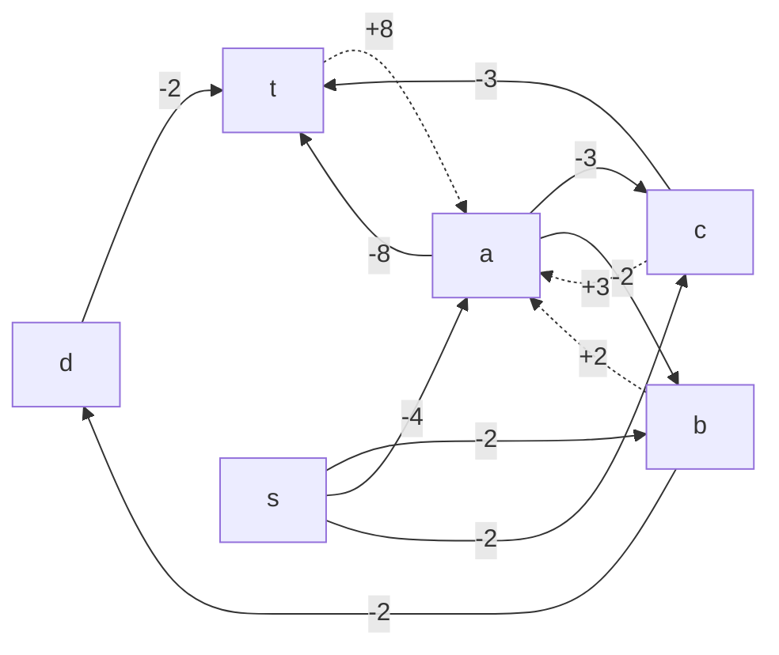

В остаточной сети отсутствуют циклы отрицательной стоимости, следовательно, стоимость потока минимальна.

### 10. Рассчитаем стоимость полученного максимального потока.

| Дуги                                          | sa | sb | sc | ac | at | ab | bd | ct | dt | Итого  |
|:----------------------------------------------|:--:|:--:|:--:|:--:|:--:|:--:|:--:|:--:|:--:|:------:|
| Пропускная способность p(e)                   | 9  | 7  | 4  | 6  | 7  | 4  | 9  | 9  | 9  |        |
| Локальный поток f(e)                          | 9  | 7  | 4  | 5  | 2  | 2  | 9  | 9  | 9  |        |
| Стоимость транспортировки единицы потока c(e) | 4  | 2  | 2  | 3  | 8  | 2  | 2  | 3  | 2  |        |
| Суммарная стоимость f(e)*c(e)                 | 36 | 14 | 8  | 15 | 16 | 4  | 18 | 27 | 18 | **156** |

Стоимость полученного потока составляет 156. 

### Ответ:
Максимальный поток в сети равен 20, минимальная стоимость потока 156, она реализуется следующим локальными потоками:

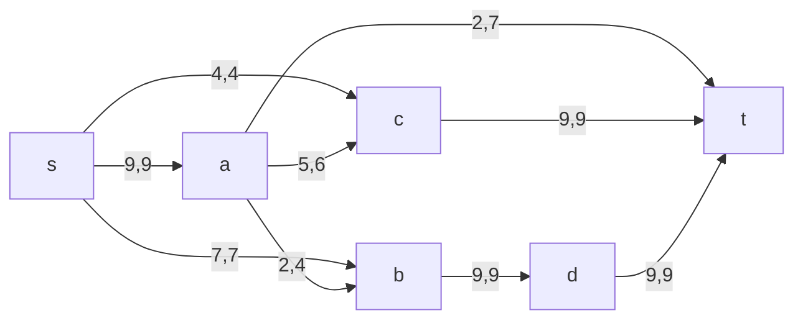