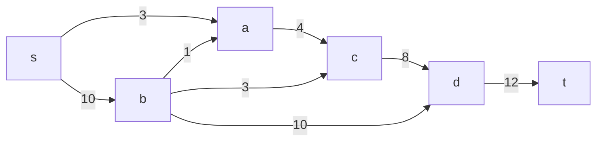
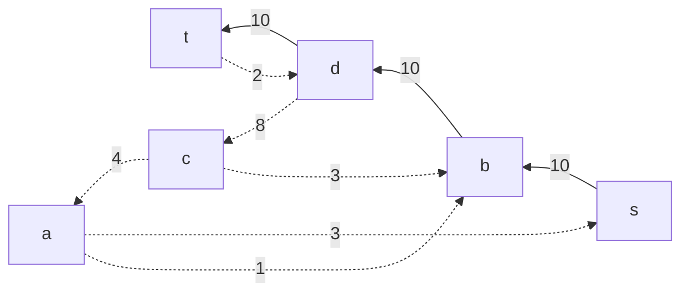
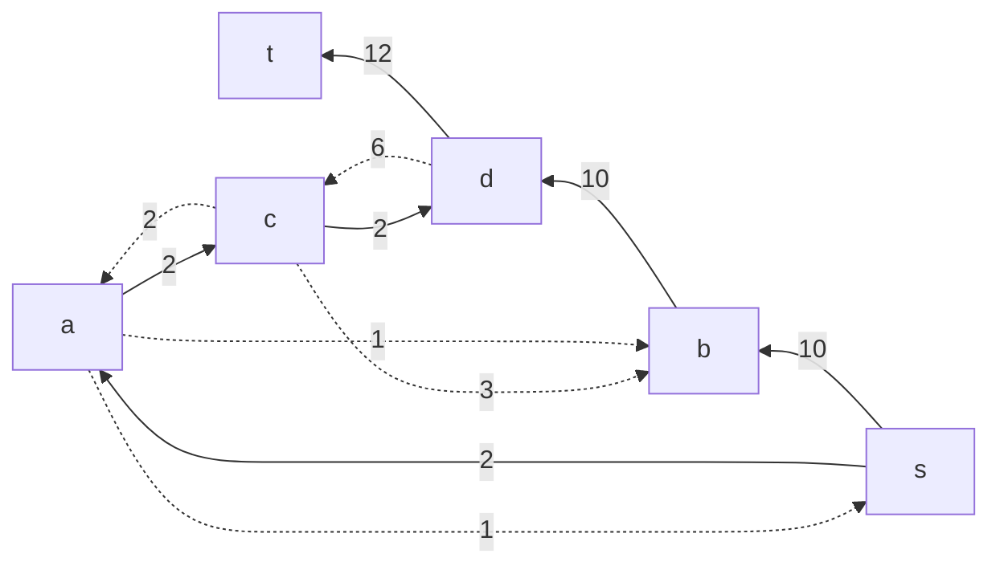
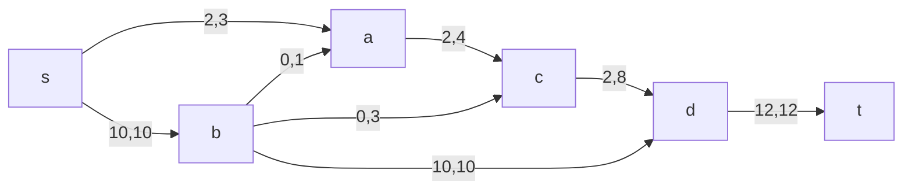
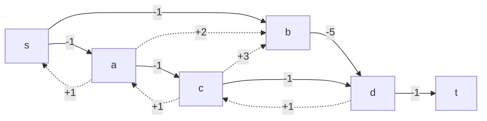
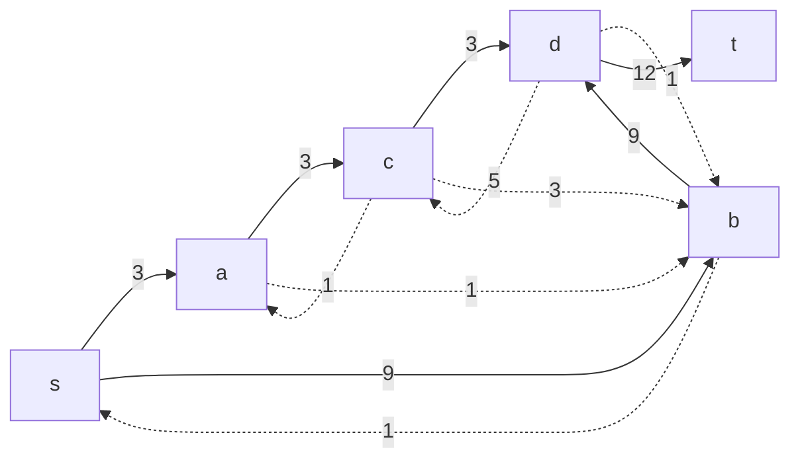
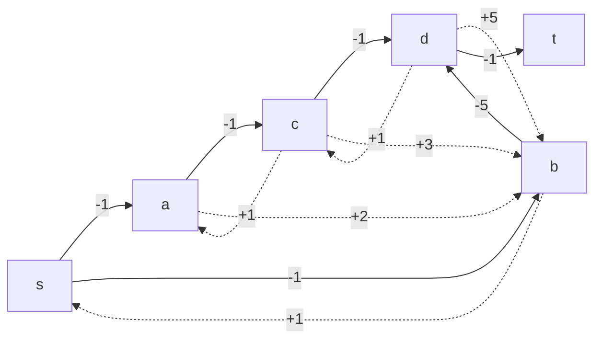
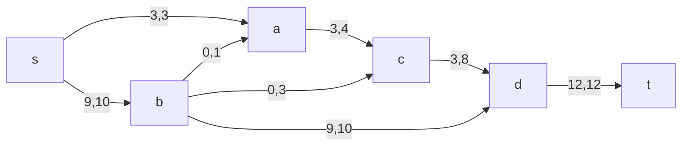

# Задание №10. Команда Second.
### Постановка задачи:
1. Дана сеть (взвешенный ориентированный граф) с источником s и стоком t.
2. Для каждой дуги определена пропускная способность и стоимость транспортировки.
3. Необходимо найти для указанной сети максимальный поток минимальной стоимости. 

## Вариант 5:
#### Пропускная способность дуг сети p(e) и стоимость транспортировки  единицы потока c(e):

| Дуги                      | sa | sb | ac | ba | bc | bd | cd | dt |
|:--------------------------|:--:|:--:|:--:|:--:|:--:|:--:|:--:|:--:|
| Пропускная способность    | 3  | 10 | 4  | 1  | 3  | 10 | 8  | 12 |
| Стоимость транспортировки | 1  | 1  | 1  | 2  | 3  | 5  | 1  | 1  |

## Этап 1: Построим сеть с источником *s*, стоком *t* и указанными пропускными способностями дуг.

Укажем начальный поток величиной 10 s -> b -> d -> t. Построим соответствующую остаточную сеть.

## Этап 2: Проведем поиск увеличивающего пути в остаточной сети

В остаточной сети найден увеличивающий путь t -> d -> c -> a -> s. Минимальный вес дуг на этом пути равен 2.

Уменьшим вес дуг на найденном пути, дуги для которых вес стал нулевым удалим из остаточной сети.

## Этап 3. Продолжим поиск увеличивающего пути в остаточной сети

В остаточной сети не найдено увеличивающих путей, следовательно, алгоритм завершил работу и найденный поток величиной 12 является максимальным для данной сети.

## Этап 4. Рассчитаем стоимость полученного максимального потока.

| Дуги                                          | sa | sb | ac | ba | bc | bd | cd | dt | Итого  |
|:----------------------------------------------|:--:|:--:|:--:|:--:|:--:|:--:|:--:|:--:|:------:|
| Пропускная способность p(e)                   | 3  | 10 | 4  | 1  | 3  | 10 | 8  | 12 |        |
| Локальный поток f(e)                          | 2  | 10 | 2  | 0  | 0  | 10 | 2  | 12 |        |
| Стоимость транспортировки единицы потока c(e) | 1  | 1  | 1  | 2  | 3  | 5  | 1  | 1  |        |
| Суммарная стоимость f(e)*c(e)                 | 2  | 10 | 2  | 0  | 0  | 50 | 2  | 12 | **78** |

Стоимость полученного потока составляет 78. 

## Этап 5. Попробуем уменьшить стоимость потока для чего построим остаточную сеть

Для каждого ребра остаточной сети укажем стоимость транспортировки единицы потока.

В остаточной сети найден ориентированный цикл отрицательной стоимости s -> b -> d -> c -> a -> s (- 1 - 5 + 1 + 1 + 1 = -3)

Минимальный вес ребра в цикле 1 - это неиспользованный резерв рёбер s -> a.

Удалим найденный цикл - уменьшим на 1 вес всех ребер, входящих в цикл.

## Этап 6: Проведем повторный поиск цикла отрицательной стоимости в остаточной сети

Скорректируем остаточную сеть с указанием стоимости транспортировки единицы потока.

В остаточной сети отсутствуют циклы отрицательной стоимости, следовательно, стоимость потока минимальна.

## Этап 7: Рассчитаем стоимость полученного максимального потока

| Дуги                                          | sa | sb | ac | ba | bc | bd | cd | dt | Итого  |
|:----------------------------------------------|:--:|:--:|:--:|:--:|:--:|:--:|:--:|:--:|:------:|
| Пропускная способность p(e)                   | 3  | 10 | 4  | 1  | 3  | 10 | 8  | 12 |        |
| Локальный поток f(e)                          | 3  | 9  | 3  | 0  | 0  | 9  | 3  | 12 |        |
| Стоимость транспортировки единицы потока c(e) | 1  | 1  | 1  | 2  | 3  | 5  | 1  | 1  |        |
| Суммарная стоимость f(e)*c(e)                 | 3  | 9  | 3  | 0  | 0  | 45 | 3  | 12 | **75** |

Стоимость полученного потока составляет 75.

## Ответ:

Максимальный поток в сети равен 12, минимальная стоимость потока 75, она реализуется следующим локальными потоками:

