# Задание №10
# Задача о максимальном потоке минимальной стоимости. Вариант 4.
#### Пропускная способность дуг сети p(e) и стоимость транспортировки  единицы потока c(e):

| Дуги                      | sa | sb | sc | ba | bc | cd | ac | ad | dt |
|:--------------------------|:--:|:--:|:--:|:--:|:--:|:--:|:--:|:--:|:--:|
| Пропускная способность    | 6  | 6  | 6  | 6  | 5  | 10 | 5  | 8  | 12 |
| Стоимость транспортировки | 1  | 1  | 3  | 1  | 1  | 1  | 3  | 4  | 1  |

## Построим сеть с источником s, стоком t и пропускными способностями дуг для поиска максимального потока
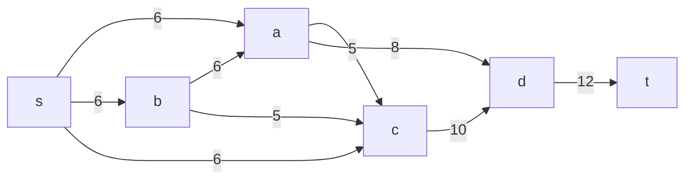

Укажем начальный поток величиной 6 $$s->a->d->t$$. Построим остаточную сеть.

```mermaid
graph LR
    s-->|6|a
    a-->|6|d
    d-.>|2|a
    d-->|6|t
    t-.->|6|-d
    d-.->|10|c
    c-.->|5|a
    c-.->|5|b
    c-.->|6|s
    b-.->|6|s
    a-.->|6|b
```

## Проведем поиск увеличивающего пути в остаточной сети
В остаточной сети найден увеличивающий путь $$t->d->a->b->s$$. Минимальный вес = 2
Уменьшим вес дуг на найденном пути, дуги для которых вес стал нулевым, удалим из остаточной сети.

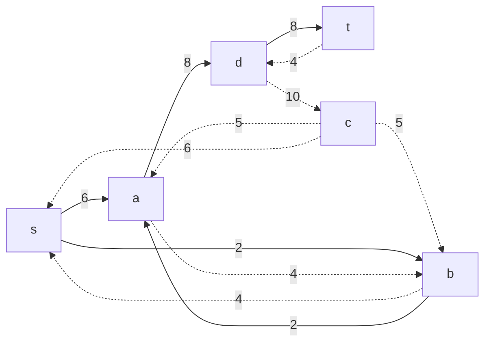

## Продолжаем поиск увеличивающего пути в остаточной сети
В остаточной сети найден увеличивающий путь $$t->d->c->a->b->s$$. Минимальный вес = 4
Уменьшим вес дуг на найденном пути, дуги для которых вес стал нулевым, удалим из остаточной сети.

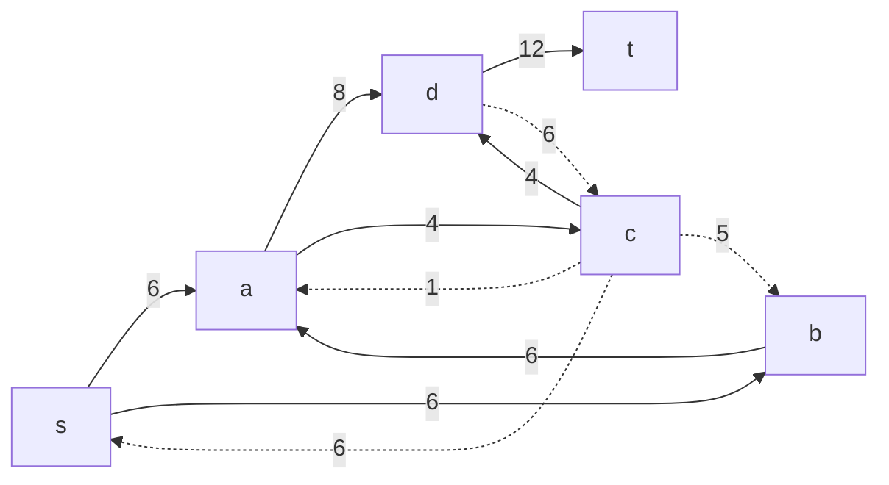
## Завершаем поиск увеличивающего пути в остаточной сети
В остаточной сети больше нет увеличивающих путей, найден поток ыеличиной 12 - он максимален для сети

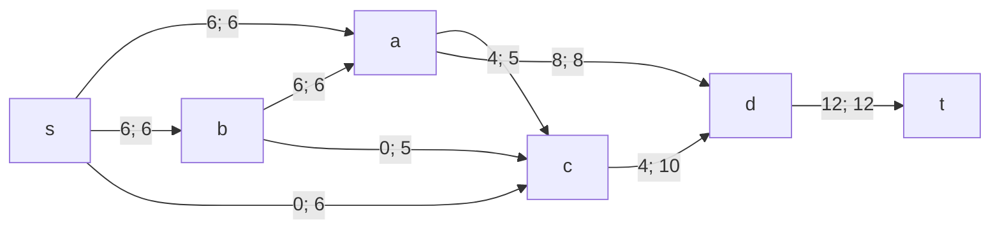
Левое число - локальный поток, правое - пропускная способность дуги

## Рассчитаем стоимость полученного максимального потока.

| Дуги                           | sa | sb | sc | ba | bc | cd | ac | ad | dt | Итого |
|:-------------------------------|:--:|:--:|:--:|:--:|:--:|:--:|:--:|:--:|:--:|:--:|
| Пропускная способность p(e)    | 6  | 6  | 6  | 6  | 5  | 10 | 5  | 8  | 12 |    |
| Локальный поток f(e)           | 6  | 6  | 0  | 6  | 0  | 4  | 4  | 8  | 12 |    |
| Стоимость транспортировки c(e) | 1  | 1  | 3  | 1  | 1  | 1  | 3  | 4  | 1  |    |
| Суммарная стоимость f(e)*c(e)  | 6  | 6  | 0  | 6  | 0  | 4  | 12 | 32 | 12 | 78 |

## (1) Попробуем уменьшить стоимость потока для чего построим остаточную сеть
Для каждого ребра остаточной сети укажем стоимость транспортировки.

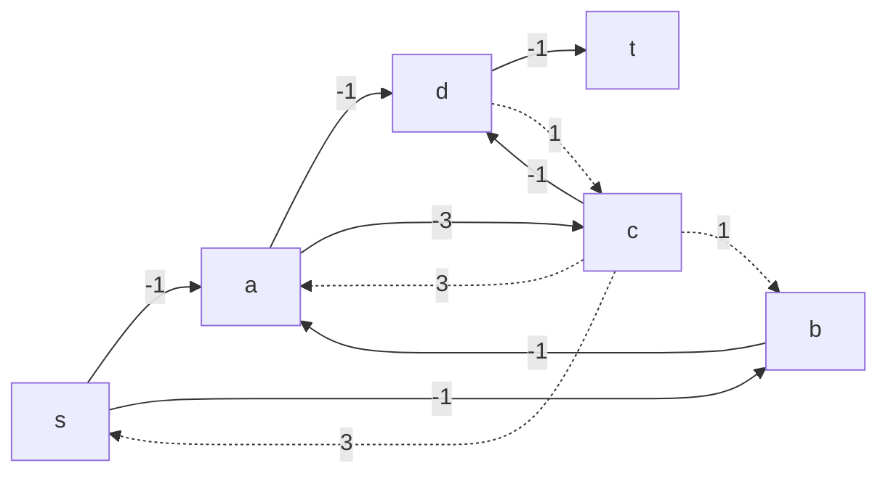
В остаточной сети найден ориентированный цикл отрицательной стоимости $$s->b->a->d->c->s$$ (-1-1-4+1+3=-1)
Найдём минимальный вес ребра в этом цикле в остаточной сети с указанием величины потока.


Минимальный вес = 6 имеет неиспользованный резерв рёбер $$d->c$$ и $$c->s$$. Уменьшим на 6 вес всех ребёр в цикле

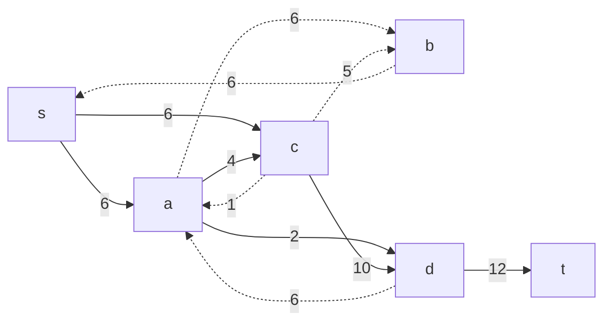
## (2) Попробуем уменьшить стоимость потока для чего построим остаточную сеть

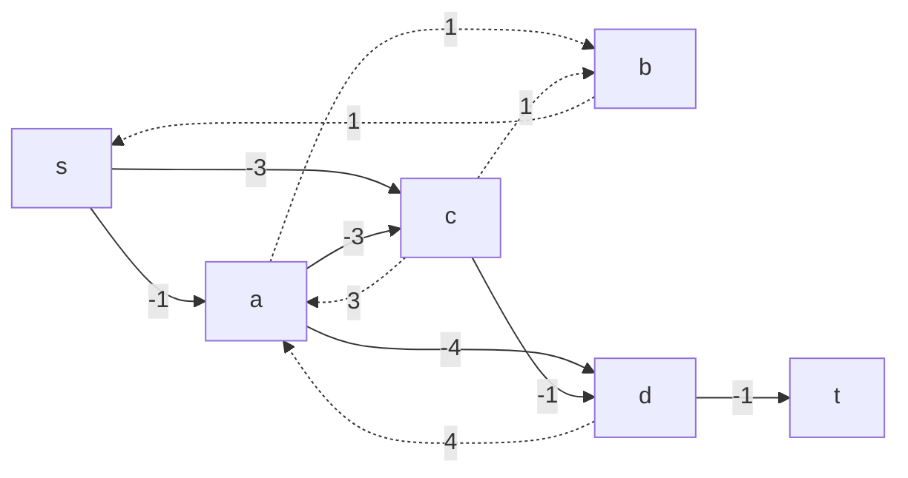

В остаточной сети найден ориентированный цикл отрицательной стоимости $$s->c->b->s$$ (-3+1+1=-1)
Найдём минимальный вес ребра в этом цикле в остаточной сети с указанием величины потока.


Минимальный вес = 5. Уменьшаем

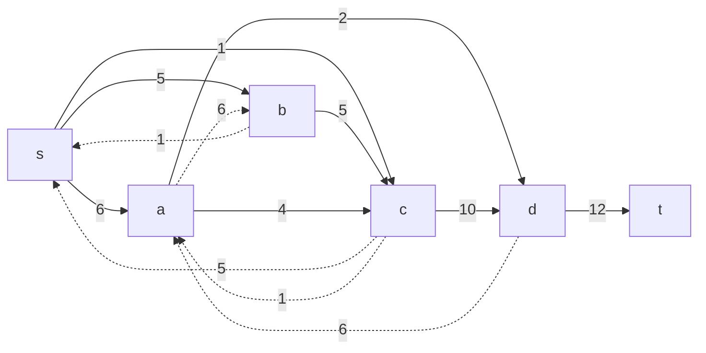

## (3) Попробуем уменьшить стоимость потока для чего построим остаточную сеть
    
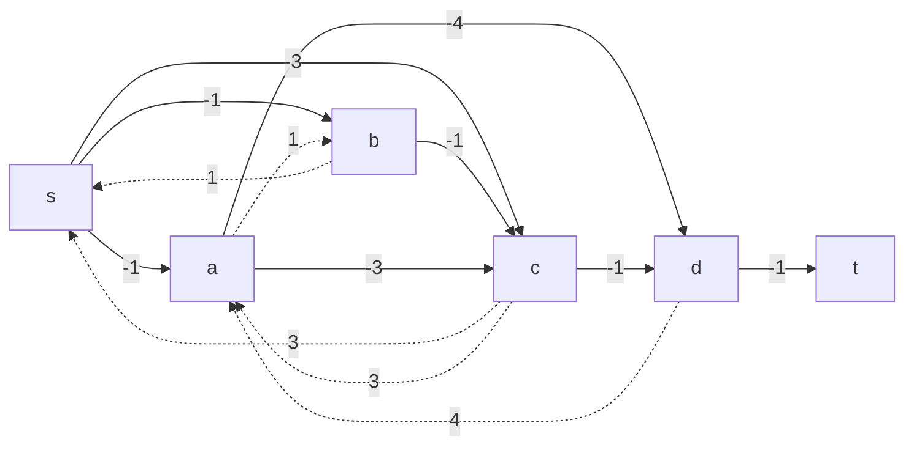

В остаточной сети найден ориентированный цикл отрицательной стоимости $$s->a->c->s$$ (-1-3+3=-1)
Найдём минимальный вес ребра в этом цикле в остаточной сети с указанием величины потока.

Минимальный вес = 5. Уменьшаем

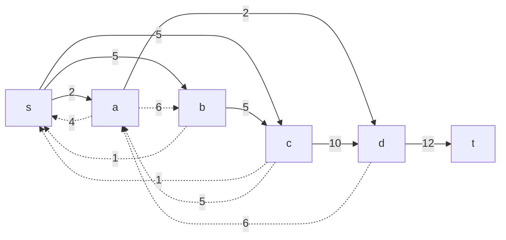

## (4) Попробуем уменьшить стоимость потока для чего построим остаточную сеть
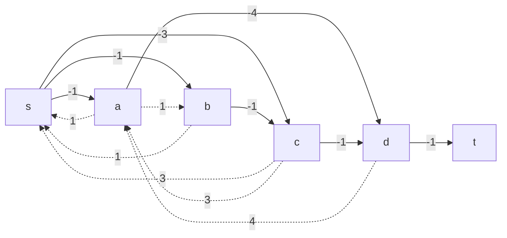
В остаточной сети больше нет ориентированных циклов отрицательной стоимости

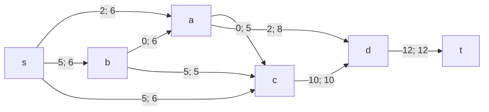

| Дуги                           | sa | sb | sc | ba | bc | cd | ac | ad | dt | Итого |
|:-------------------------------|:--:|:--:|:--:|:--:|:--:|:--:|:--:|:--:|:--:|:--:|
| Пропускная способность p(e)    | 6  | 6  | 6  | 6  | 5  | 10 | 5  | 8  | 12 |    |
| Локальный поток f(e)           | 2  | 5  | 5  | 0  | 5  | 10 | 0  | 2  | 12 |    |
| Стоимость транспортировки c(e) | 1  | 1  | 3  | 1  | 1  | 1  | 3  | 4  | 1  |    |
| Суммарная стоимость f(e)*c(e)  | 2  | 5  | 15 | 0  | 5  | 10 | 0  | 8  | 12 | 57 |

Стоимость полученного потока составляет 57.

# Ответ:
Максимальный поток в сети равен 12, минимальная стоимость потока 68
