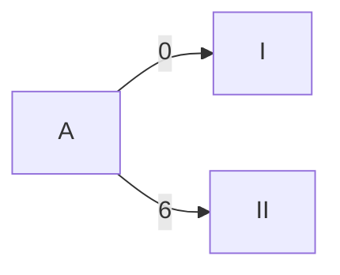
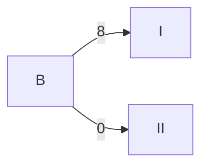
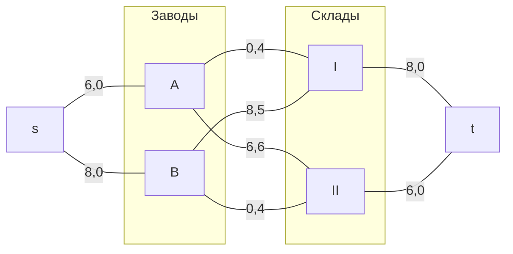
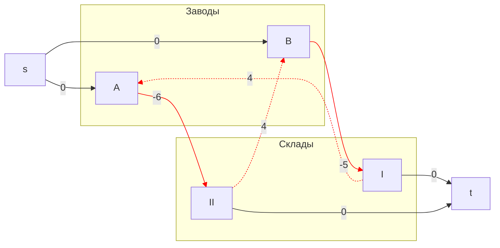
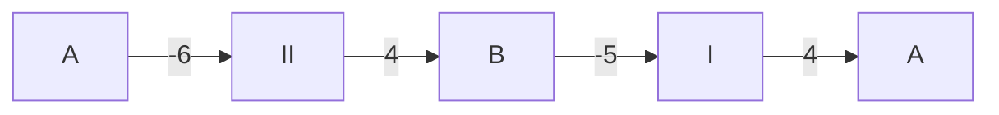
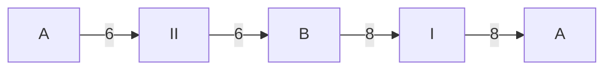
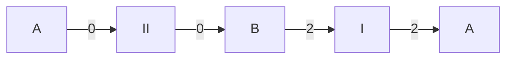
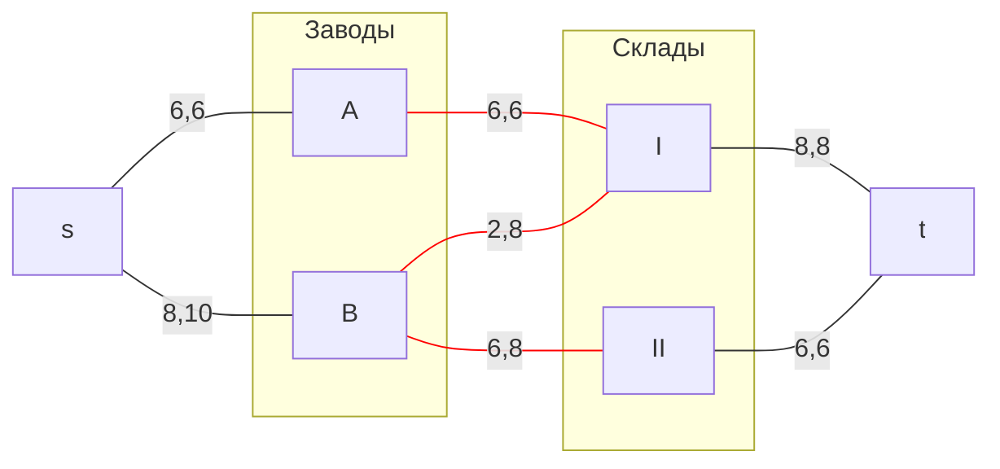
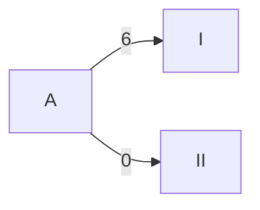
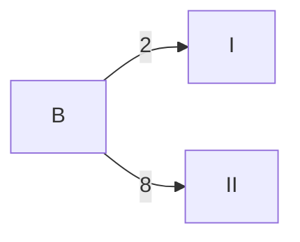

## Транспортная задача. Решение с использованием алгоритма поиска максимального потока минимальной стоимости.
### Вариант 1:

Два завода имеют производительность 6 и 10, а два складских помещения имеют вместимость 8 и 6. Матрица затрат на перевозку одной единицы товара (строки – это заводы, столбцы – это склады) имеет вид:

$$
 \begin{pmatrix}    
  4 & 6 \\ 
  5 & 4 \\ 
 \end{pmatrix}    
$$

Требуется:
1. Найти стоимость перевозки с первого завода на второй склад 6 единиц товара, а со второго завода на первый склад 8 единиц товара;
2. Используя алгоритм поиска максимального потока минимальной стоимости, скорректировать указанный выше вариант перевозки товаров, так чтобы объём перевозимых товаров не изменился, а стоимость их перевозки стала минимальной.
   
| Заводы/Cклады    |  I  |  II  | 
|:-------------|:---:|:---:|
| **A** |  4 |  6 |
| **B** |  5 |  4 |
### Шаг 1. 
Допустим, что с первого завода на второй склад 6 единиц товара, а со второго завода на первый склад 8 единиц товара:

Стоимость перевозки при данном распределении равна **S**= (6 * 6) + (8 * 5) = **76** 

### Шаг 2.
Используем алгоритм поиска максимального потока минимальной стоимости.
1) Нарисуем полный двудольный граф, в левой доле которого 2 вершины (заводы A и B), а в правой - 2 вершины (слады I и II).

Добавим локальные потоки и стоимости за единицу товара по этому потоку.

Добавим источник **s**, сток **t**, а также по дуге из s к каждому заводу и по дуге от кажждого склада до t. Стоимость этих дуг равна 0.

Максимальная величина потоков в сети **F=14**.

2) Построим остаточную сеть

Для каждого ребра остаточной сети укажем стоимость транспортировки единицы потока. Они отрицательны у всех дуг, направленных из левой доли в правую, и положительные для всех обратных дуг.

В построенной остаточной сети найден цикл отрицательной стоимости:

Также обозначим веса ребер:

Минимальный вес в цикле равен **6**. 

3) Удалим найденный цикл, уменьшив на **6** вес всех ребер, входящих в цикл.

После снижения на 6 всех весов в цикле, исчезнут дуги A -> II, а появятся дуги A -> I и B -> II:

Стоимость нового потока равна:
**S** = (6 * 4) + (2 * 5) + (6 * 4) = **58** 

### Ответ: 
Оптимальный вариант доставки продукции:

Затраты при таком способе распределения минимальны и составляют **58** (у.е.).
