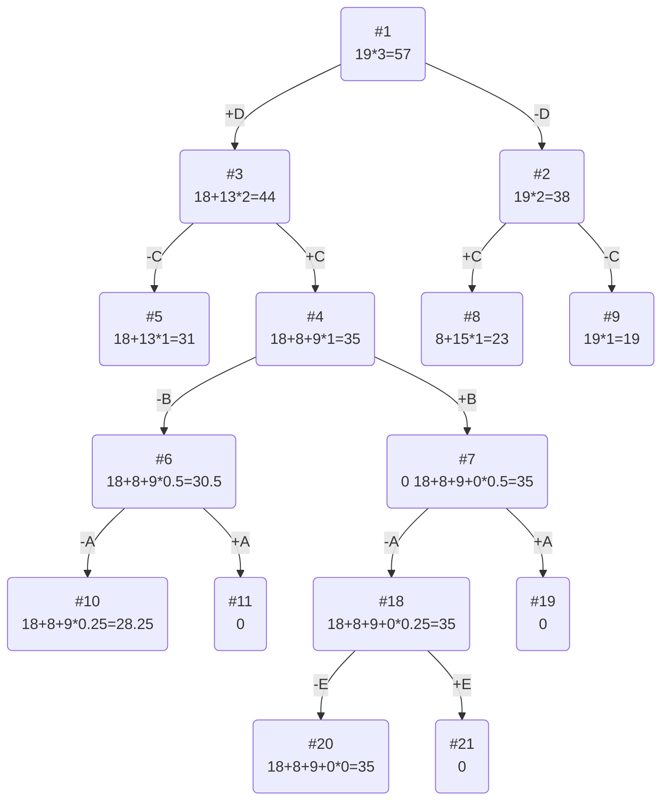

# Задание №11
# Задача о рюкзаке (Knapsack problem). Метод ветвей и границ.

## Задание
Для каждого варианта представлены условия задачи, в соответствии с которыми необходимо: 
1. Решить задачу о рюкзаке с применением метода ветвей и границ.
2. Оформить решение задачи по шагам с подробными комментариями, таблицами и диаграммами.
3. В ответе указать:
   - максимально возможную стоимость предметов в рюкзаке,
   - набор предметов, обеспечивающих максимальную стоимость,
   - общий вес предметов в рюкзаке,
   - свободное место в рюкзаке.

## Постановка задачи
Задача о рюкзаке (англ. Knapsack problem) — дано N предметов, ni предмет имеет массу wi > 0 и стоимость pi > 0. Необходимо выбрать из этих предметов такой набор, чтобы суммарная масса не превосходила заданной величины W (вместимость рюкзака), а суммарная стоимость была максимальна. 

## Пример решения задачи о рюкзаке
## Условия задачи (Вариант 5)

| Предметы  |  A  | B  | C | D  | E  |
|:----------|:---:|:--:|:-:|:--:|:--:|
| Стоимость |  5  |  9 | 8 | 18 | 3  |
| Вес       | 10  |  9 | 4 |  6 | 12 |

Ограничение вместимости: 19

## Решение
### 1. Рассчитаем ценность каждого предмета
| Предметы  |  A  | B  | C | D  | E  |
|:----------|:---:|:--:|:-:|:--:|:--:|
| Стоимость |  5  |  9 | 8 | 18 | 3  |
| Вес       | 10  |  9 | 4 |  6 | 12 |
| Ценность  | 1/2 |  1 | 2 |  3 | 1/4|

### 2. Отсортируем предметы по убыванию ценности
| Предметы  | D  | C | B  |  A  |  E  |
|:----------|:--:|:-:|:--:|:---:|:---:|
| Стоимость | 18 | 8 | 9  |  5  |  3  |
| Вес       | 6  | 4 | 9  | 10  | 12  |
| Ценность  | 3  | 2 | 1  | 1/2 | 1/4 |

### 3. Рассчитаем оценку сверху для пустого рюкзака

Свободное место в рюкзаке: 19

Наибольшая ценность предмета: 3

Оценка сверху для пустого рюкзака: 19 * 3 = 57

### 4. Найдем решение задачи с использованием метода ветвей и границ

### Ответ
- Наибольшая стоимость предметов в рюкзаке 27.
- Набор предметов, обеспечивающих максимальную стоимость, D, E, общим весом 15.
- Свободное место в рюкзаке 0.
