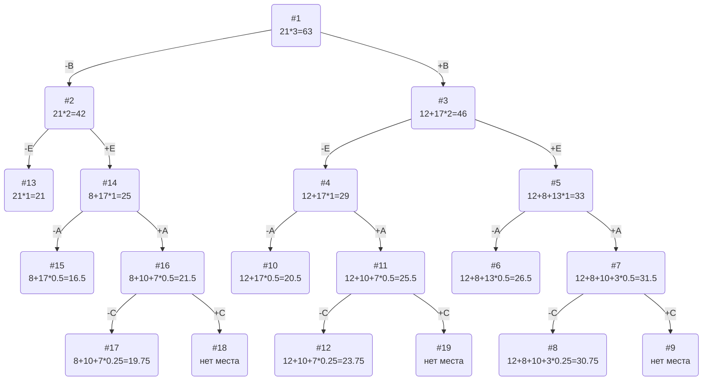

## Постановка задачи
Задача о рюкзаке (англ. Knapsack problem) — дано N предметов, ni предмет имеет массу wi > 0 и стоимость pi > 0. Необходимо выбрать из этих предметов такой набор, чтобы суммарная масса не превосходила заданной величины W (вместимость рюкзака), а суммарная стоимость была максимальна. 

## Условия задачи

| Предметы  | A  | B  | C  | D  | E |
|:----------|:--:|:--:|:--:|:--:|:-:|
| Стоимость | 10 | 12 | 5  | 3  | 8 |
| Вес       | 10 | 4  | 10 | 12 | 4 |

Ограничение вместимости: 21

## Решение
### 1. Рассчитаем ценность каждого предмета
| Предметы  | A  | B  | C  | D  | E |
|:----------|:--:|:--:|:--:|:--:|:-:|
| Стоимость | 10 | 12 | 5  | 3  | 8 |
| Вес       | 10 | 4  | 10 | 12 | 4 |
| Ценность  | 1  | 3  | 1/2| 1/4| 2 |

### 2. Отсортируем предметы по убыванию ценности
| Предметы  | B  | E | A  |  C  |  D  |
|:----------|:--:|:-:|:--:|:---:|:---:|
| Стоимость | 12 | 8 | 10 |  5  |  3  |
| Вес       | 4  | 4 | 10 | 10  | 12  |
| Ценность  | 3  | 2 | 1  | 1/2 | 1/4 |

### 3. Рассчитаем оценку сверху для пустого рюкзака

Свободное место в рюкзаке: 21

Наибольшая ценность предмета: 3

Оценка сверху для пустого рюкзака: 21 * 3 = 63

### 4. Найдем решение задачи с использованием метода ветвей и границ

### Ответ
- Предмет D невозможно поместить, поскольку на предыдущих шагах мы не смогли добавить предмет C, который весит меньше D, из-за отсутствия места
- Наибольшая стоимость предметов в рюкзаке 30.
- Набор предметов, обеспечивающих максимальную стоимость: B, E, A, общим весом 18.
- Свободное место в рюкзаке 3.