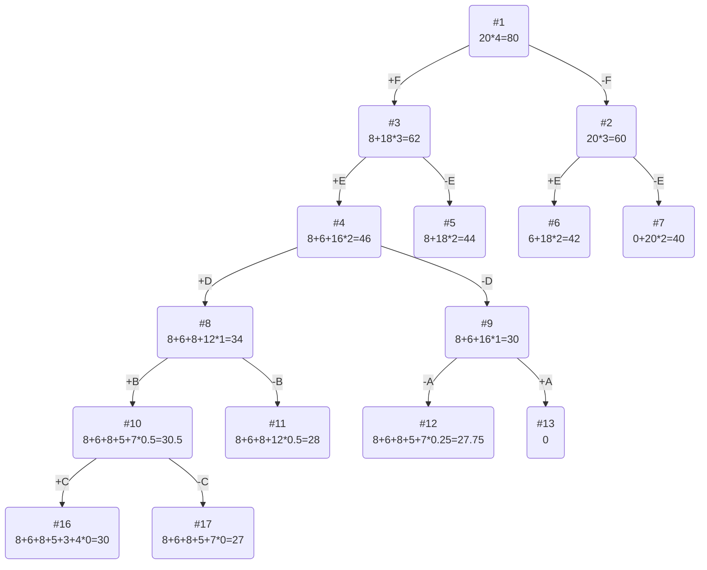

# Задание №11. Вариант 6
## Условия задачи

| Предметы  |  A  | B |  C  | D | E | F |
|:----------|:---:|:-:|:---:|:-:|:-:|:-:|
| Стоимость |  5  | 5 |  3  | 8 | 6 | 8 |
| Вес       | 10  | 5 | 12  | 4 | 2 | 2 |

Ограничение вместимости: 20

## Решение
### 1. Рассчитаем ценность каждого предмета
| Предметы  |  A  | B |  C  | D | E | F |
|:----------|:---:|:-:|:---:|:-:|:-:|:-:|
| Стоимость |  5  | 5 |  3  | 8 | 6 | 8 |
| Вес       | 10  | 5 | 12  | 4 | 2 | 2 |
| Ценность  | 1/2 | 1 | 1/4 | 2  | 3  | 4 |

### 2. Отсортируем предметы по убыванию ценности
| Предметы  |  F  | E |  D  | B | A | C |
|:----------|:---:|:-:|:---:|:-:|:-:|:-:|
| Стоимость |  8  | 6 |  8  | 5 | 5 | 3 |
| Вес       | 2  | 2 | 4  | 5 | 10 | 12 |
| Ценность  | 4 | 3 | 2 | 1  | 1/2  | 1/4 |

### 3. Рассчитаем оценку сверху для пустого рюкзака

Свободное место в рюкзаке: 20

Наибольшая ценность предмета: 4

Оценка сверху для пустого рюкзака: 20 * 4 = 80

### 4. Найдем решение задачи с использованием метода ветвей и границ

### Ответ
- Максимальная стоимость предметов в рюкзаке: 27

- Набор предметов, обеспечивающих максимальную стоимость: F, E, D, B

F: стоимость 8, вес 2

E: стоимость 6, вес 2

D: стоимость 8, вес 4

B: стоимость 5, вес 5

- Общий вес предметов в рюкзаке: 13

- Свободное место в рюкзаке: 7