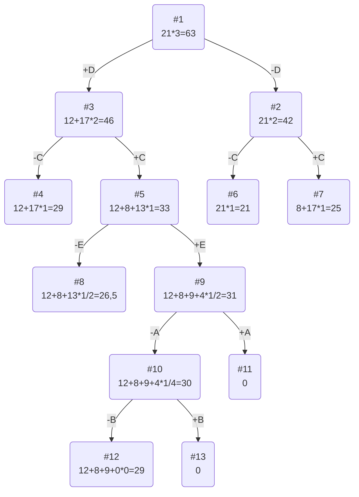

# Задание №11
# Задача о рюкзаке. Метод ветвей и границ. Вариант 7.
## Условиe задачи
| Предметы  |  A  | B  | C | D  | E |
|:----------|:---:|:--:|:-:|:--:|:-:|
| Стоимость |  5  | 3  | 8 | 12 | 9 |
| Вес       | 10  | 12 | 4 | 4  | 9 |

Ограничение вместимости: 21
## Решение
### 1. Рассчитаем ценность каждого предмета
| Предметы  |  A  | B  | C | D  | E |
|:----------|:---:|:--:|:-:|:--:|:-:|
| Стоимость |  5  | 3  | 8 | 12 | 9 |
| Вес       | 10  | 12 | 4 | 4  | 9 |
| Ценность  | 1/2 | 1/4| 2 | 3  | 1 |
### 2. Отсортируем предметы по убыванию ценности
| Предметы  |  D  | C  | E | A  | B |
|:----------|:---:|:--:|:-:|:--:|:-:|
| Стоимость | 12  |  8 | 9 |  5 | 3  |
| Вес       |  4  |  4 | 9 | 10 | 12 |
| Ценность  |  3  |  2 | 1 |1/2 | 1/4|
### 3. Рассчитаем оценку сверху для пустого рюкзака
Свободное место в рюкзаке: 21

Наибольшая ценность предмета: 3

Оценка сверху для пустого рюкзака: 21 * 3 = 63
### 4. Найдем решение задачи с использованием метода ветвей и границ

## Ответ
- Наибольшая стоимость предметов в рюкзаке 29.
- Набор предметов, обеспечивающих максимальную стоимость, D, С, E общим весом 17.
- Свободное место в рюкзаке 4.