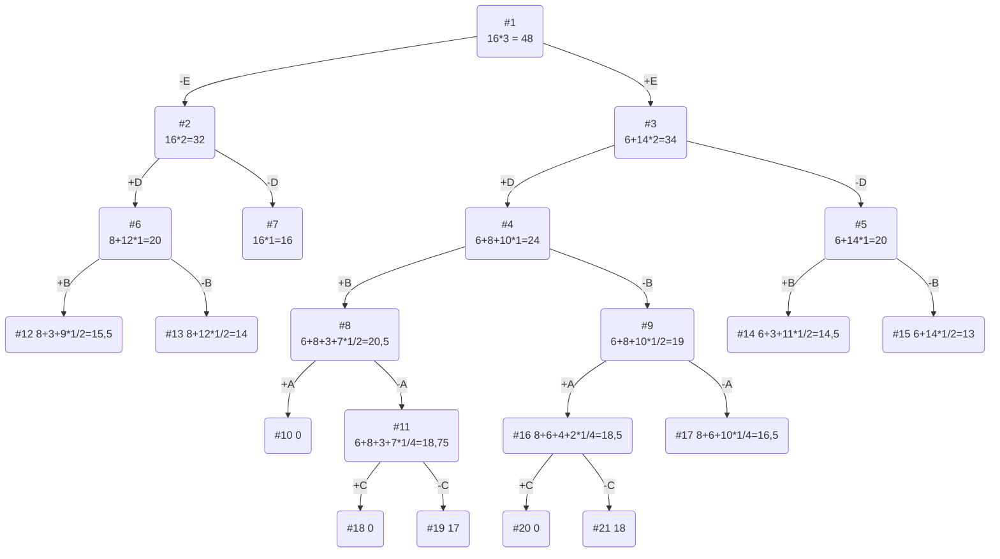

# Задание №11. Задача о рюкзаке (Knapsack problem). Метод ветвей и границ. Вариант 4

## Постановка задачи

1. Дано 5 предметов вместе с их стоимостью и весом:

| Предметы  |  A  | B |  C  | D | E |
|:----------|:-:|:-:|:---:|:-:|:-:|
| Стоимость | 4 | 3 | 3 | 8 | 6 |
| Вес       | 8 | 3 | 12 | 4 | 2 |
1. Вместимость рюкзака = 16.
2. Необходимо выбрать из предметов такой набор, чтобы их суммарный вес не превышал вместимость рюкзака, а суммарная стоимость была максимальна.

## Решение задачи

### 1. Вычислим ценность каждого предмета:

| Предметы  |  A  | B |  C  | D | E |
|:----------|:---:|:-:|:---:|:-:|:-:|
| Стоимость |  4  | 3 |  3  | 8 | 6 |
| Вес       |  8  | 3 | 12 | 4 | 2 |
| Ценность  |  1/2  | 1 | 1/4 | 2 | 3 |

### 2. Отсортируем предметы по убыванию ценности:

| Предметы  |  E  | D |  B  | A | C |
|:----------|:---:|:-:|:---:|:-:|:-:|
| Стоимость |  6  | 8 | 3 | 4 | 6 |
| Вес       |  2  | 4 | 3 | 8 | 2 |
| Ценность  |  3  | 2 | 1 | 1/2 | 3 |

### 3. Рассчитаем оценку сверху для пустого рюкзака:

Свободное место в рюкзаке: 16.

Наибольшая ценность предмета: 3.

Оценка сверху для пустого рюкзака: 16 * 3 = 48.

### 4. Найдем решение задачи с использованием метода ветвей и границ:

### Ответ

1. Наибольшая стоимость предметов в рюкзаке = 18 и соответствует набору предметов: A, D, E с весом 14.
2. Свободное место в рюкзаке = 2.