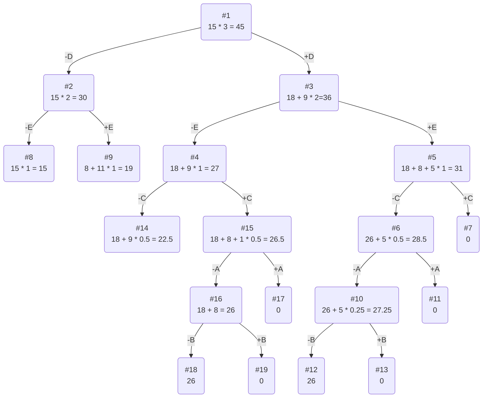

# :exclamation:Задание №11:exclamation:
## Задача о рюкзаке (Knapsack problem). Метод ветвей и границ.

### :dizzy_face: Постановка задачи
Задача о рюкзаке (англ. Knapsack problem) — дано N предметов, ni предмет имеет массу wi > 0 и стоимость pi > 0. Необходимо выбрать из этих предметов такой набор, чтобы суммарная масса не превосходила заданной величины W (вместимость рюкзака), а суммарная стоимость была максимальна. 

## :neutral_face: Вариант 3

| Предметы  |  A  | B  | C | D  | E |
|:----------|:---:|:--:|:-:|:--:|:-:|
| Стоимость |  5  | 3  | 8 | 18 | 8 |
| Вес       | 10  | 12 | 8 | 6  | 4 |

Ограничение вместимости: 15

## :nerd_face: Решение
### :one: Рассчитаем ценность каждого предмета
| Предметы  |  A  | B   | C | D  | E |
|:----------|:---:|:---:|:-:|:--:|:-:|
| Стоимость |  5  | 3   | 8 | 18 | 8 |
| Вес       | 10  | 12  | 8 | 6  | 4 |
| Ценность  | 1/2 | 1/4 | 1 | 3  | 2 |

### :two: Отсортируем предметы по убыванию ценности
| Предметы  | D  | E | C |  A  |  B  |
|:----------|:--:|:-:|:-:|:---:|:---:|
| Стоимость | 18 | 8 | 8 |  5  |  3  |
| Вес       | 6  | 4 | 8 | 10  | 12  |
| Ценность  | 3  | 2 | 1 | 1/2 | 1/4 |

### :three: Рассчитаем оценку сверху для пустого рюкзака

Свободное место в рюкзаке: 15

Наибольшая ценность предмета: 3

Оценка сверху для пустого рюкзака: 15 * 3 = 45

### :four: Найдем решение задачи с использованием метода ветвей и границ

Наибольшую стоимость предметов можно получить двумя путями:
1. Предметы D и E
2. Предметы D и C

### :innocent: Ответ
- Наибольшая стоимость предметов в рюкзаке 26.
- Набор предметов, обеспечивающих максимальную стоимость:
1. D, E, общим весом 10,
2. D, C, общим весом 14.
- Свободное место в рюкзаке:
1. Для предметов D, E: 5,
2. Для предметов D, C: 1.
