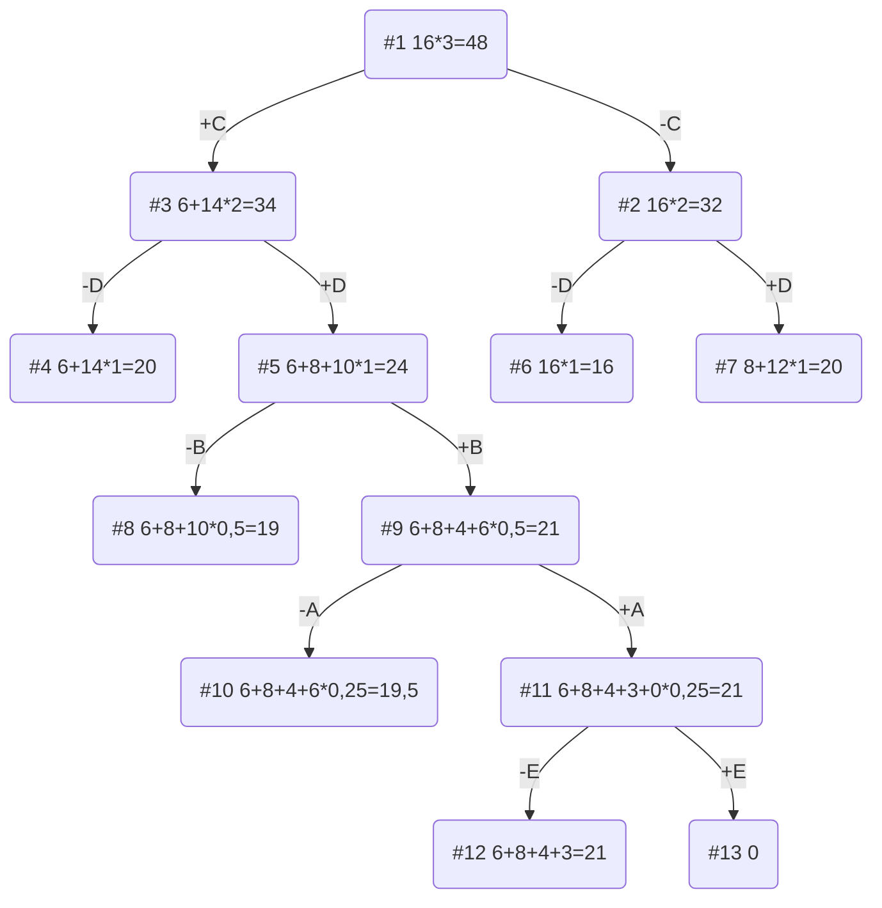

# Задание №11. Команда Second.
### Постановка задачи:
Задача о рюкзаке (англ. Knapsack problem) — дано N предметов, ni предмет имеет массу wi > 0 и стоимость pi > 0. Необходимо выбрать из этих предметов такой набор, чтобы суммарная масса не превосходила заданной величины W (вместимость рюкзака), а суммарная стоимость была максимальна.

### Вариант 10:

| Предметы  |  A  | B |  C | D |  E |
|:----------|:---:|:-:|:--:|:-:|:--:|
| Стоимость |  3  | 4 | 6  | 8 | 3  |
| Вес       |  6  | 4 | 2  | 4 | 12 |

Ограничение вместимости: 16

## Этап 1: Рассчитаем ценность каждого предмета

| Предметы  |  A  |  B  | C | D  |  E  |
|:----------|:---:|:---:|:-:|:--:| :--:|
| Стоимость |  3  |  4  | 6 | 8  |  3  |
| Вес       |  6  |  4  | 2 | 4  |  12 |
| Ценность  | 1/2 |  1  | 3 | 2  | 1/4 |

## Этап 2: Отсортируем предметы по убыванию ценности

| Предметы  | C  | D | B |  A  |  E  |
|:----------|:--:|:-:|:-:|:---:|:---:|
| Стоимость | 6  | 8 | 4 |  3  |  3  |
| Вес       | 2  | 4 | 4 |  6  | 12  |
| Ценность  | 3  | 2 | 1 | 1/2 | 1/4 |

## Этап 3: Рассчитаем оценку сверху для пустого рюкзака

Свободное место в рюкзаке: 16

Наибольшая ценность предмета: 3

Оценка сверху для пустого рюкзака: 16 * 3 = 48

## Этап 4: Найдем решение задачи с использованием метода ветвей и границ

## Ответ
- Наибольшая стоимость предметов в рюкзаке 21.
- Набор предметов, обеспечивающих максимальную стоимость: C, D, B, A общим весом 16.
- Свободное место в рюкзаке: 0.