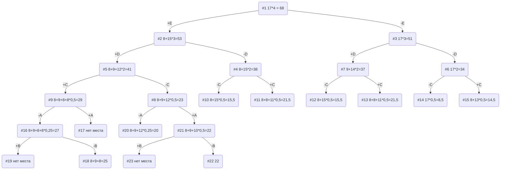

# Задание №11
# Задача о рюкзаке (Knapsack problem). Метод ветвей и границ. Вариант 2.
## Условия задачи

| Предметы  |  A  | B  | C | D  | E  |
|:----------|:---:|:--:|:-:|:--:|:--:|
| Стоимость |  5  | 3  | 8 | 9  | 8  |
| Вес       | 10  | 12 | 4 | 3  | 2  |

Ограничение вместимости: 17

## Решение
### 1. Рассчитаем ценность каждого предмета
| Предметы  |  A  |  B  | C | D  | E  |
|:----------|:---:|:---:|:-:|:--:|:--:|
| Стоимость |  5  |  3  | 8 | 9  | 8  |
| Вес       | 10  | 12  | 4 | 3  | 2  |
| Ценность  | 1/2 | 1/4 | 2 | 3  | 4  |

### 2. Отсортируем предметы по убыванию ценности
| Предметы  | E  | D  | C  |  A  |  B  |
|:----------|:--:|:--:|:--:|:---:|:---:|
| Стоимость | 8  | 9  | 8  | 5   | 3   |
| Вес       | 2  | 3  | 4  | 10  | 12  |
| Ценность  | 4  | 3  | 2  | 1/2 | 1/4 |

### 3. Рассчитаем оценку сверху для пустого рюкзака

Свободное место в рюкзаке: 17

Наибольшая ценность предмета: 4

Оценка сверху для пустого рюкзака: 17 * 4 = 68

### 4. Найдем решение задачи с использованием метода ветвей и границ

### Ответ
- Наибольшая стоимость предметов в рюкзаке 25.
- Набор предметов, обеспечивающих максимальную стоимость, D, E, C общим весом 9.
- Свободное место в рюкзаке 17-9=8.