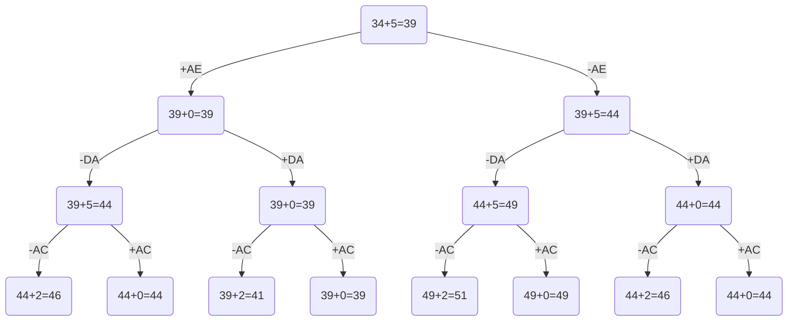

# Задание №12. 
### Постановка задачи:
Имеется N городов, связанных дорогами. Расстояния между городами известны. Коммивояжер (бродячий торговец) должен выйти из первого города, посетить по одному разу в некотором порядке города 2,3..n и вернуться в первый город. В каком порядке следует посещать города, чтобы замкнутый путь коммивояжера имел кратчайшее расстояние?

### Вариант 2:
Матрица расстояний:

|       | **A** | **B** | **C** | **D** | **E** |
|-------|:-----:|:-----:|:-----:|:-----:|:-----:|
| **A** | **∞** |  16   |  11   |  12   |  11   |
| **B** |   6   | **∞** |  11   |   5   |  14   |
| **C** |   8   |  12   | **∞** |   7   |  12   |
| **D** |   6   |  15   |  10   | **∞** |  15   |
| **E** |  14   |  16   |   7   |   5   | **∞** |

### Этап 1: Проведем редукцию строк матрицы

### Шаг 1: Найдем минимальный элемент в каждой строке (игнорируем ∞)
A:11
B:5
C:7
D:6
E:5
Сумма констант редукции по строкам 34
### Шаг 2: Вычтем минимальные элементы из всех элементов строк
Получим новую редуцированную матрицу:
|       | **A** | **B** | **C** | **D** | **E** |
|-------|:-----:|:-----:|:-----:|:-----:|:-----:|
| **A** | **∞** |  5   |  0   |  1   |  0   |
| **B** |   1   | **∞** |  6   |   0   |  9   |
| **C** |   1   |  5   | **∞** |   0   |  5   |
| **D** |   0   |  9   |  4   | **∞** |  9   |
| **E** |  9   |  11   |   2   |   0   | **∞** |

### Этап 2: Проведем редукцию столбцов матрицы
Шаг 1: Найдем минимальный элемент в каждом столбце (игнорируем ∞)
A: 0
B: 5
C: 0
D: 0
E: 0
Сумма констант редукции по столбцам 5
Шаг 2: Вычтем минимальные элементы из всех элементов столбцов
Получим новую редуцированную матрицу:
|       | **A** | **B** | **C** | **D** | **E** |
|-------|:-----:|:-----:|:-----:|:-----:|:-----:|
| **A** | **∞** |  0   |  0   |  1   |  0   |
| **B** |   1   | **∞** |  6   |   0   |  9   |
| **C** |   1   |  0   | **∞** |   0   |  5   |
| **D** |   0   |  4   |  4   | **∞** |  9   |
| **E** |  9   |  6   |   2   |   0   | **∞** |

### Этап 3: Оценка длины маршрута
Оценка длины маршрута снизу соответствует сумме констант редукции по строкам и по столбцам: 34 + 5 = 39.

## Этап 4: Найдем решение задачи с использованием метода ветвей и границ

Считаем "штраф" каждого нулевого ребра.
|        | **Штраф** |
|:-------|:---------:|
| **AB** |     0     |
| **AC** |     2     |
| **AE** |     5     |
| **BD** |     1     |
| **CB** |     0     |
| **CD** |     0     |
| **DA** |     5     |
| **ED** |     2     |

Максимальный штраф 5, выберем ребро AE, как одно из ребер с максимальным штрафом.

### Узел #1: Начальная Нода
LB = 39
В этой ноде мы рассматриваем два направления: включение и исключение ребра AE. Исходное значение нижней границы (LB) равно 39.
### Узел #2: Исключение ребра AE
LB = 44
В этом узле исследуем два варианта:
Вариант 1: Исключаем ребро DA
LB = 49
Рассматриваем включение ребра AC (максимальный штраф 2).
Подузел #8: Исключение AC (LB = 51) — это хуже, и не подходит.
Подузел #9: Включение AC (LB = 49) — тоже не лучше текущего LB.
Вариант 2: Включаем ребро DA
LB = 44
Избираем AC.
Подузел #10: Исключение AC (LB = 46) — хуже.
Подузел #11: Включение AC (LB = 44) — без изменений, не оптимально.
### Узел #3: Включение ребра AE
LB = 39
Здесь также исследуем два направления:
Вариант 1: Исключаем ребро DA
LB = 44
Рассматриваем включение AC.
Подузел #12: Исключение AC (LB = 46) — не получаем улучшения.
Подузел #13: Включение AC (LB = 44) — вновь без изменений.
Вариант 2: Включаем ребро DA
LB = 39
Ребро AC с максимальным штрафом 2.
Подузел #14: Исключение AC (LB = 41) — хуже, чем LB = 39.
Подузел #15: Включение AC (LB = 39) — остаемся на текущем уровне.
### Узел #4: Исключение ребра DA из узла #2
LB = 49
Проверяем выбор AC.
Подузел #8: Исключение AC (LB = 51) — не подходим, слишком высоко.
Подузел #9: Включение AC (LB = 49) — без оптимизации, остается 49.
### Узел #5: Включение ребра DA из узла #2
LB = 44
Выбор AC.
Подузел #10: Исключаем AC (LB = 46) — это еще хуже.
Подузел #11: Включаем AC (LB = 44) — не изменяет ситуацию.
### Узел #6: Исключение DA из узла #3
LB = 44
Анализируем AC.
Подузел #12: Исключение AC (LB = 46) — не подходит.
Подузел #13: Включение AC (LB = 44) — остаемся на месте.
### Узел #7: Включение ребра DA из узла #3
LB = 39
Рассматриваем AC с штрафом 2.
Подузел #14: Исключение AC (LB = 41) — ухудшение.
Подузел #15: Включение AC (LB = 39) — остается текущий LB.
### Ответ
В конечном итоге мы приходим к выводу, что кратчайший путь — это узел #3 (включение AE и DA) с минимальным значением 39.