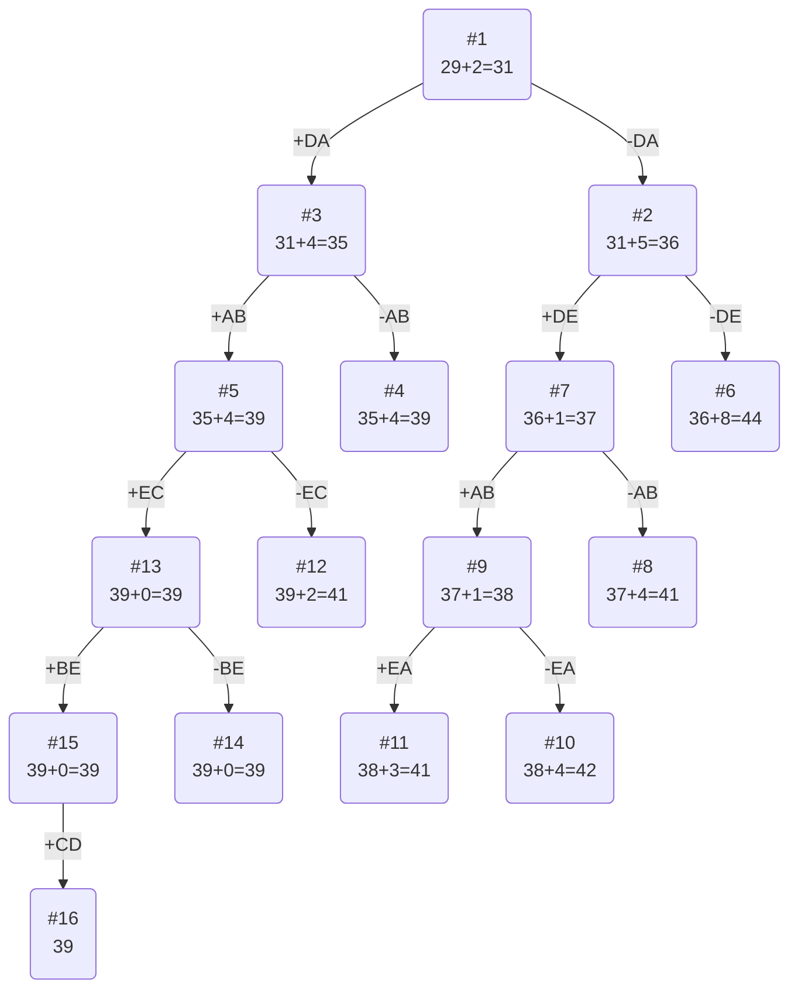

# Задание №12
# Задача коммивояжера (Traveling salesman problem). Метод ветвей и границ.
## Условия задачи
### Вариант 4:
Матрица расстояний:

|       | **A** | **B** | **C** | **D** | **E** |
|-------|:-----:|:-----:|:-----:|:-----:|:-----:|
| **A** | **∞** |   6   |   5   |   9   |  10   |
| **B** |  13   | **∞** |  12   |   8   |  15   |
| **C** |  14   |  10   | **∞** |   5   |  14   |
| **D** |   6   |  13   |  10   | **∞** |   7   |
| **E** |  11   |  13   |   7   |   5   | **∞** |

## Решение
### 1. Проведем редукцию сначала строк матрицы, а затем столбцов

#### Редукция по строкам:

|       | **A** | **B** | **C** | **D** | **E** |  min  |
|-------|:-----:|:-----:|:-----:|:-----:|:-----:|:-----:|
| **A** | **∞** |   6   |   5   |   9   |  10   |   5   |
| **B** |  13   | **∞** |  12   |   8   |  15   |   8   |
| **C** |  14   |  10   | **∞** |   5   |  14   |   5   |
| **D** |   6   |  13   |  10   | **∞** |   7   |   6   |
| **E** |  11   |  13   |   7   |   5   | **∞** |   5   |

Сумма констант редукции по строкам 29

Марица после редукции строк:

|       | **A** | **B** | **C** | **D** | **E** |
|:------|:-----:|:-----:|:-----:|:-----:|:-----:|
| **A** | **∞** |   1   |   0   |   4   |   5   |
| **B** |   5   | **∞** |   4   |   0   |   7   |
| **C** |   9   |   5   | **∞** |   0   |   9   |
| **D** |   0   |   7   |   4   | **∞** |   1   |
| **E** |   6   |   8   |   2   |   0   | **∞** |

#### Редукция по столбцам:

|       | **A** | **B** | **C** | **D** | **E** |
|-------|:-----:|:-----:|:-----:|:-----:|:-----:|
| **A** | **∞** |   1   |   0   |   4   |   5   |
| **B** |   5   | **∞** |   4   |   0   |   7   |
| **C** |   9   |   5   | **∞** |   0   |   9   |
| **D** |   0   |   7   |   4   | **∞** |   1   |
| **E** |   6   |   8   |   2   |   0   | **∞** |
|  min  |   0   |   1   |   0   |   0   |   1   |

Сумма констант редукции по столбцам 2

Марица после редукции столбцов:

|       | **A** | **B** | **C** | **D** | **E** |
|-------|:-----:|:-----:|:-----:|:-----:|:-----:|
| **A** | **∞** |   0   |   0   |   4   |   4   |
| **B** |   5   | **∞** |   4   |   0   |   6   |
| **C** |   9   |   4   | **∞** |   0   |   8   |
| **D** |   0   |   6   |   4   | **∞** |   0   |
| **E** |   6   |   7   |   2   |   0   | **∞** |

Оценка длины маршрута: 29 + 2 = 31

### 3. Найдем решение задачи с использованием метода ветвей и границ

Чтобы определить ребро, по которому будет произведено ветвление из корневого узла рассчитаем штрафы для ребер с нулевой оценкой:

|        | **Штраф** |
|:-------|:---------:|
| **DA** |     5     |
| **EB** |     4     |
| **AC** |     2     |
| **ED** |     2     |
| **CD** |     4     |
| **BD** |     4     |
| **DE** |     4     |

Максимальный штраф 5, выберем ребро DA, как реберо с максимальным штрафом.

#### Узел №2:
Узел №2 с исключением ребра DA имеет оценку 31 + 5 (штраф) = 36

#### Узел №3
Для получения оценки узла 3 необходимо рассчитать сумму констант редукции для матрицы с учетом включения ребра DA, для этого в матрице:
- удалим строку D,
- удалим столбец A,
- Заменим на бесконечность значение AD.

|       | **B** | **C** | **D** | **E** |
|-------|:-----:|:-----:|:-----:|:-----:|
| **A** |   0   |   0   | **∞** |   4   |
| **B** | **∞** |   4   |   0   |   6   |
| **C** |   4   | **∞** |   0   |   8   |
| **E** |   7   |   2   |   0   | **∞** |
|  min  |   0   |   0   |   0   |   4   |

Матрица после редукции:

|       | **B** | **C** | **D** | **E** |
|-------|:-----:|:-----:|:-----:|:-----:|
| **A** |   0   |   0   | **∞** |   0   |
| **B** | **∞** |   4   |   0   |   2   |
| **C** |   4   | **∞** |   0   |   4   |
| **E** |   7   |   2   |   0   | **∞** |

Сумма констант редукции 4

Оценка узла 3 = 31 + 4 (редукция) = 35

Продолжим поиск из узла 3

#### Выбор ребра
Чтобы определить ребро, по которому будет произведено ветвление из узла 3 рассчитаем штрафы для ребер с нулевой оценкой:

|        | **Штраф** |
|:-------|:---------:|
| **AB** |     4     |
| **AC** |     2     |
| **ED** |     2     |
| **CD** |     4     |
| **BD** |     2     |
| **AE** |     2     |

Максимальный штраф 4, выберем ребро AB, как одно из ребер с максимальным штрафом.

#### Узел №4:
Узел №4 с исключением ребра AB имеет оценку 31 + 5 (штраф) = 36

#### Узел №5
Для получения оценки узла 5 необходимо рассчитать сумму констант редукции для матрицы с учетом включения ребра AB, для этого в матрице:
- удалим строку A,
- удалим столбец B

|       | **C** | **D** | **E** |
|-------|:-----:|:-----:|:-----:|
| **B** |   4   |   0   |   2   |
| **C** | **∞** |   0   |   4   |
| **E** |   2   |   0   | **∞** |
|  min  |   2   |   0   |   2   |

Матрица после редукции:

|       | **C** | **D** | **E** |
|-------|:-----:|:-----:|:-----:|
| **B** |   2   |   0   |   0   |
| **C** | **∞** |   0   |   2   |
| **E** |   0   |   0   | **∞** |

Сумма констант редукции 4

Оценка узла 5 = 23 + 1 (редукция) = 24

Продолжим поиск из узла 2

#### Выбор ребра
Для узла 2 необходимо преобразовать матрицу:
- Заменить значение DA на бесконечность,
- Провести редукцию матрицы (сумма констант уже учтена в штрафе).

|       | **A** | **B** | **C** | **D** | **E** |
|-------|:-----:|:-----:|:-----:|:-----:|:-----:|
| **A** | **∞** |   0   |   0   |   4   |   4   |
| **B** |   5   | **∞** |   4   |   0   |   6   |
| **C** |   9   |   4   | **∞** |   0   |   8   |
| **D** | **∞** |   6   |   4   | **∞** |   0   |
| **E** |   6   |   7   |   2   |   0   | **∞** |
|  min  |   5   |   0   |   0   |   0   |   0   |

Матрица после редукции:

|       | **A** | **B** | **C** | **D** | **E** |
|-------|:-----:|:-----:|:-----:|:-----:|:-----:|
| **A** | **∞** |   0   |   0   |   4   |   4   |
| **B** |   0   | **∞** |   4   |   0   |   6   |
| **C** |   4   |   4   | **∞** |   0   |   8   |
| **D** | **∞** |   6   |   4   | **∞** |   0   |
| **E** |   1   |   7   |   2   |   0   | **∞** |

Чтобы определить ребро, по которому будет произведено ветвление из узла 2 рассчитаем штрафы для ребер с нулевой оценкой:

|        | **Штраф** |
|:-------|:---------:|
| **BA** |     1     |
| **AB** |     4     |
| **AC** |     2     |
| **ED** |     1     |
| **CD** |     4     |
| **BD** |     0     |
| **DE** |     8     |

Максимальный штраф 8, выберем ребро DE, как ребро с максимальным штрафом.

#### Узел №6:
Узел №6 с исключением ребра DE имеет оценку 36 + 8 (штраф) = 44

#### Узел №7
Для получения оценки узла 7 необходимо рассчитать сумму констант редукции для матрицы с учетом включения ребра DE, для этого в матрице:
- удалим строку D,
- удалим столбец E,
- Заменим на бесконечность значение ED.

|       | **A** | **B** | **C** | **D** |  min  |
|-------|:-----:|:-----:|:-----:|:-----:|:-----:|
| **A** | **∞** |   0   |   0   |   4   |   0   |
| **B** |   0   | **∞** |   4   |   0   |   0   |
| **C** |   4   |   4   | **∞** |   0   |   0   |
| **E** |   1   |   7   |   2   | **∞** |   1   |

Матрица после редукции:

|       | **A** | **B** | **C** | **D** |
|-------|:-----:|:-----:|:-----:|:-----:|
| **A** | **∞** |   0   |   0   |   4   |
| **B** |   0   | **∞** |   4   |   0   |
| **C** |   4   |   4   | **∞** |   0   |
| **E** |   0   |   6   |   1   | **∞** |

Сумма констант редукции 1

Оценка узла 7 = 36 + 1 (редукция) = 37

Продолжим поиск из узла 7

#### Выбор ребра
Чтобы определить ребро, по которому будет произведено ветвление из узла 7 рассчитаем штрафы для ребер с нулевой оценкой:

|        | **Штраф** |
|:-------|:---------:|
| **BA** |     0     |
| **EA** |     1     |
| **AB** |     4     |
| **AC** |     1     |
| **CD** |     4     |
| **BD** |     0     |

Максимальный штраф 4, выберем ребро AB, как одно из ребер с максимальным штрафом.

#### Узел №8:
Узел №8 с исключением ребра AB имеет оценку 37 + 4 (штраф) = 41

#### Узел №9
Для получения оценки узла 9 необходимо рассчитать сумму констант редукции для матрицы с учетом включения ребра AB, для этого в матрице:
- удалим строку A,
- удалим столбец B,
- Заменим на бесконечность значение BA.

|       | **A** | **C** | **D** |
|-------|:-----:|:-----:|:-----:|
| **B** | **∞** |   4   |   0   |
| **C** |   4   | **∞** |   0   |
| **E** |   0   |   1   | **∞** |
|  min  |   0   |   1   |   0   |

Матрица после редукции:

|       | **A** | **C** | **D** |
|-------|:-----:|:-----:|:-----:|
| **B** | **∞** |   3   |   0   |
| **C** |   4   | **∞** |   0   |
| **E** |   0   |   0   | **∞** |

Сумма констант редукции 1

Оценка узла 7 = 36 + 1 (редукция) = 37

Продолжим поиск из узла 9

#### Выбор ребра
Чтобы определить ребро, по которому будет произведено ветвление из узла 9 рассчитаем штрафы для ребер с нулевой оценкой:

|        | **Штраф** |
|:-------|:---------:|
| **EA** |     4     |
| **EC** |     3     |
| **CD** |     4     |
| **BD** |     3     |

Максимальный штраф 4, выберем ребро EA, как одно из ребер с максимальным штрафом.

#### Узел №10:
Узел №10 с исключением ребра EA имеет оценку 38 + 4 (штраф) = 42

#### Узел №11
Для получения оценки узла 11 необходимо рассчитать сумму констант редукции для матрицы с учетом включения ребра EA, для этого в матрице:
- удалим строку E,
- удалим столбец A,
- BD заменим на ∞ 

|       | **C** | **D** |
|-------|:-----:|:-----:|
| **B** |   3   | **∞** |
| **C** | **∞** |   0   |
|  min  |   3   |   0   |

Матрица после редукции:

|       | **C** | **D** |
|-------|:-----:|:-----:|
| **B** |   0   | **∞** |
| **C** | **∞** |   0   |

Сумма констант редукции 3

Оценка узла 11 = 38 + 3 (редукция) = 41

Продолжим поиск из узла 5

#### Выбор ребра
Чтобы определить ребро, по которому будет произведено ветвление из узла 5 рассчитаем штрафы для ребер с нулевой оценкой:

|        | **Штраф** |
|:-------|:---------:|
| **EC** |     2     |
| **ED** |     0     |
| **CD** |     2     |
| **BD** |     0     |
| **BE** |     2     |

Максимальный штраф 2, выберем ребро EC, как одно из ребер с максимальным штрафом.

#### Узел №12:
Узел №12 с исключением ребра EC имеет оценку 39 + 2 (штраф) = 41

#### Узел №13
Для получения оценки узла 13 необходимо рассчитать сумму констант редукции для матрицы с учетом включения ребра EC, для этого в матрице:
- удалим строку E,
- удалим столбец C,
- Заменим на бесконечность значение CE.

|       | **D** | **E** |
|-------|:-----:|:-----:|
| **B** |   0   |   0   |
| **C** |   0   | **∞** |

Сумма констант редукции 0

Оценка узла 13 = 39 + 0 (редукция) = 39

Продолжим поиск из узла 13

#### Выбор ребра
Чтобы определить ребро, по которому будет произведено ветвление из узла 13 рассчитаем штрафы для ребер с нулевой оценкой:

|        | **Штраф** |
|:-------|:---------:|
| **BD** |     0     |
| **CD** |     0     |
| **BE** |     0     |

Максимальный штраф 0, выберем ребро BE, как одно из ребер с максимальным штрафом.

#### Узел №14:
Узел №14 с исключением ребра BE имеет оценку 39 + 0 (штраф) = 39

#### Узел №15
Для получения оценки узла 15 необходимо рассчитать сумму констант редукции для матрицы с учетом включения ребра BE, для этого в матрице:
- удалим строку B,
- удалим столбец E,

|       | **D** |
|-------|:-----:|
| **C** |   0   |

Сумма констант редукции 0

Оценка узла 15 = 39 + 0 (редукция) = 39

Продолжим поиск из узла 15

#### Выбор ребра
Альтернатив у ребра CD нет

#### Узел №16
Ребро CD включается в маршрут, длина которого составляет 39

### Ответ
- Кратчайший маршрут DABECD.
- Длина маршрута 39 (6 + 6 + 15 + 7 + 5).