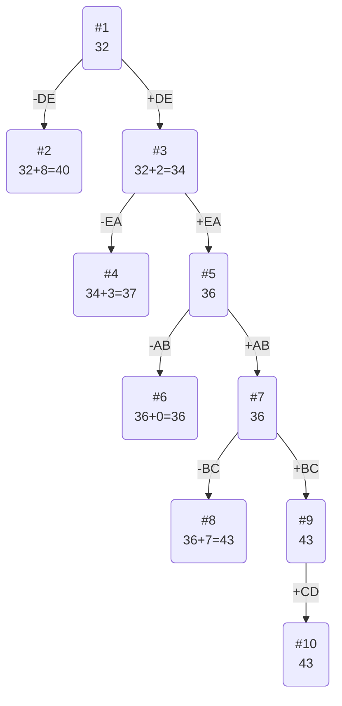

# Задание №12
# Задача коммивояжера (Traveling salesman problem). Метод ветвей и границ. Вариант 10.

Матрица расстояний:

|       | **A** | **B** | **C** | **D** | **E** |
|-------|:-----:|:-----:|:-----:|:-----:|:-----:|
| **A** | **∞** |   8   |   8   |   8   |  14   |
| **B** |   6   | **∞** |   8   |   8   |  12   |
| **C** |  11   |   7   | **∞** |  14   |   5   |
| **D** |  10   |  14   |  13   | **∞** |   8   |
| **E** |   5   |   8   |  10   |  15   | **∞** |

## 1. Выполняем редукцию матрицы затрат.
### Редукция по строкам
В каждой строке выбираем минимальное чило и вычитаем его из всей строки

|       | **A** | **B** | **C** | **D** | **E** | редукция |
|-------|:-----:|:-----:|:-----:|:-----:|:-----:|:-----:|
| **A** | **∞** |   8   |   8   |   8   |  14   | -8
| **B** |   6   | **∞** |   8   |   8   |  12   | -6
| **C** |  11   |   7   | **∞** |  14   |   5   | -5
| **D** |  10   |  14   |  13   | **∞** |   8   | -8
| **E** |   5   |   8   |  10   |  15   | **∞** | -5

Сумма констант редукции по строкам 32

|       | **A** | **B** | **C** | **D** | **E** |
|-------|:-----:|:-----:|:-----:|:-----:|:-----:|
| **A** | **∞** |   0   |   0   |   0   |   6   |
| **B** |   0   | **∞** |   2   |   2   |   6   |
| **C** |  6    |   2   | **∞** |  9    |   0   |
| **D** |  2    |  6    |  5    | **∞** |   0   |
| **E** |   0   |   3   |  5    |  10   | **∞** |

### Редукция по столбцам
|       | **A** | **B** | **C** | **D** | **E** |
|-------|:-----:|:-----:|:-----:|:-----:|:-----:|
| **A** | **∞** |   0   |   0   |   0   |   6   |
| **B** |   0   | **∞** |   2   |   2   |   6   |
| **C** |   6    |   2   | **∞** |  9    |   0   |
| **D** |   2    |  6    |  5    | **∞** |   0   |
| **E** |   0   |   3   |  5    |  10   | **∞** |

Поскольку в каждом столбце содержится 0, редукция по столбцам не производится. Матрица остается неизменной.

## 2. Оценка длины маршрута
Оценка длины маршрута снизу соответствует сумме констант редукции = 32

## 3. Решим задачу с использованием метода ветвей и границ

Посчитаем штрафы, чтобы понять, по какому ребру будет произведено ветвление из корнегого ребра.

|        | **Штраф** |
|:-------|:---------:|
| **AB** |     2     |
| **AC** |     5     |
| **AD** |     2     |
| **BA** |     2     |
| **CE** |     2     |
| **DE** |     8     |
| **EA** |     5     |

Максимальный штраф - 8, выбираем ребро DE

#### Узел №2
Узел №2 с исключением ребра DE имеет оценку 32 + 8 (штраф) = 40

#### Узел №3
Для получения оценки узла №3 необходимо рассчитать сумму констант редукции для матрицы с учетом включения ребра DE, для этого в матрице:

- Удалим строку D
- Удалим столбец E
- Заменим на бесконечность значение ED

|       | **A** | **B** | **C** | **D** |**Редукция**|
|-------|:-----:|:-----:|:-----:|:-----:|:-----:|
| **A** | **∞** |   0   |   0   |   0   | **0** |
| **B** |   0   | **∞** |   2   |   2   | **0** |
| **C** |   6   |   2   | **∞** |   9   | **-2** |
| **E** |   0   |   3   |   5   | **∞** | **0** |

Матрица после редукции:
|       | **A** | **B** | **C** | **D** |
|-------|:-----:|:-----:|:-----:|:-----:|
| **A** | **∞** |   0   |   0   |   0   |
| **B** |   0   | **∞** |   2   |   2   |
| **C** |   4   |   0   | **∞** |   7   |
| **E** |   0   |   3   |   5   | **∞** |

Сумма констант редукции равна **2**.

Оценка узла №3 = **32 + 2 (редукция)** = **34**

#### Выбор следующей вершины и ребра

Нам необходимо выбрать вершину с минимальной оценкой. Это вершина №3 (оценка **34**).

Чтобы определить ребро, по которому будет произведено ветвление из узла №3, рассчитаем штрафы для ребер с нулевой оценкой из только что полученной матрицы:

|        | **Штраф** |
|:-------|:---------:|
| **AB** |     0     |
| **AC** |     0     |
| **AD** |     0     |
| **BA** |     0     |
| **EA** |     3     |

Максимальный штраф **3**, выберем ребро **EA**, так как оно – ребро с максимальным штрафом.

#### Узел №4
Узел №4 с исключением ребра EA имеет оценку 34 + 3 (штраф) = 37

#### Узел №5
Для получения оценки узла №5 необходимо рассчитать сумму констант редукции для матрицы с учетом включения ребра EA, для этого в матрице:
- Удалим строку E,
- Удалим столбец A,
- Заменим на бесконечность значение AE.
- Ребро EA приходит в ранее задействованную вершину A, чтобы избежать преждевременного замыкания цикла, ребро AE также следует заменить на бесконечность.

|       | **B** | **C** | **D** | **Редукция**|
|-------|:-----:|:-----:|:-----:|:-----:|
| **A** |   0   |   0   |   0   |
| **B** | **∞** |   2   |   2   | **-2**|
| **C** |   0   | **∞** |   7   |

Матрица после редукции:
|       | **B** | **C** | **D** |
|-------|:-----:|:-----:|:-----:|
| **A** |   0   |   0   |   0   |
| **B** | **∞** |   0   |   0   |
| **C** |   0   | **∞** |   7   |

Сумма констант редукции равна ***2***.

Оценка узла №5 = 34 + 2 (редукция) = 36

#### Выбор следующей вершины и ребра

Выбираем узел с минимальной оценкой, это узел №5 (оценка 36).

Рассчитаем штрафы для ребер с нулевой оценкой из последней матрицы:

|        | **Штраф** |
|:-------|:---------:|
| **AB** |     0     |
| **AC** |     0     |
| **AD** |     0     |
| **BC** |     0     |
| **BD** |     0     |
| **CB** |     0     |

Максимальный штраф равен 0, выбираем любое ребро, например, AB для следующего ветвления.

#### Узел №6 (исключение AB)
Узел №6 с исключением ребра AB имеет оценку 36 + 0 (штраф) = 36

#### Узел №7 (включение AB)
Включаем ребро AB, после удаления строки A и столбца B:
- Заменим на бесконечность BA.
- Избегаем замыкания цикла: заменим на бесконечность ребро CB.

Матрица становится:
|       | **C** | **D** |
|-------|:-----:|:-----:|
| **B** |   0   |   0   |
| **C** | **∞** |   7   |

Здесь уже не требуется редукция (сумма констант редукции = 0).

Оценка узла №7 = 36 + 0 (редукция) = 36

#### Узел №8
Узел №8 с исключением ребра BC имеет оценку 36 + 7 (штраф) = 43

#### Узел №9 (включение BC)
Включаем ребро BC, после удаления строки B и столбца C:
- Заменим на бесконечность ребро CB.

|       | **D** |
|-------|:-----:|
| **C** |   7   |

Сумма констант редукции 7, следовательно, оценка узла №9 = 36 + 7 = 43

Продолжим:
- Для завершения маршрута добавляем ребро CD, замыкая цикл маршрута.

#### Итоговое решение:
Оптимальный маршрут: **E → A → B → C → D → E**.
Стоимость маршрута равна оценке узла №9: **43**.