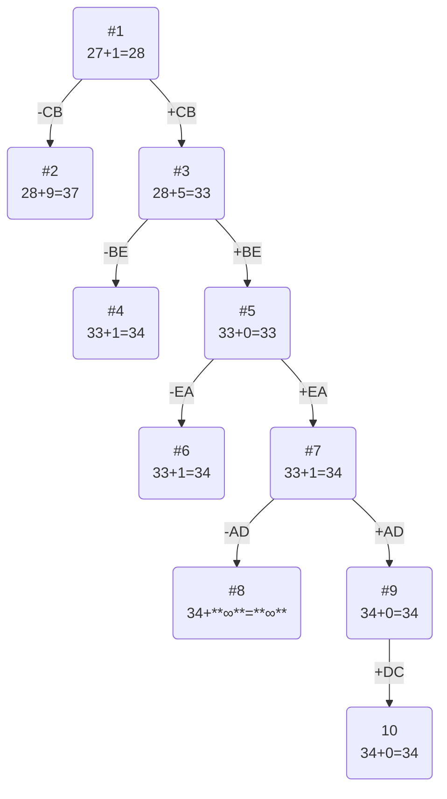

# Задание №12. Вариант 6
## Условия задачи
Матрица расстояний:

|       | **A** | **B** | **C** | **D** | **E** |
|:------|:-----:|:-----:|:-----:|:-----:|:-----:|
| **A** | **∞** |  14   |   7   |   6   |   6   |
| **B** |  11   | **∞** |  13   |   6   |   5   |
| **C** |  15   |   6   | **∞** |  15   |  15   |
| **D** |   5   |   8   |   7   | **∞** |   7   |
| **E** |  10   |   5   |  12   |  11   | **∞** |

## Решение
### 1. Проведем редукцию строк матрицы

|       | **A** | **B** | **C** | **D** | **E** |Min|
|:------|:-----:|:-----:|:-----:|:-----:|:-----:|:----:|
| **A** | **∞** |  14   |   7   |   6   |   6   |   6   |
| **B** |  11   | **∞** |  13   |   6   |   5   |    5  | 
| **C** |  15   |   6   | **∞** |  15   |  15   |    6 |
| **D** |   5   |   8   |   7   | **∞** |   7   |    5  |
| **E** |  10   |   5   |  12   |  11   | **∞** |   5   |
| Sum   |       |       |       |       |       | 27  |

Сумма констант редукции по строкам 27

Марица после редукции строк:

|       | **A** | **B** | **C** | **D** | **E** |
|:------|:-----:|:-----:|:-----:|:-----:|:-----:|
| **A** | **∞** |   8   |   1   |   0   |   0   |
| **B** |   6   | **∞** |   8   |  1   |   0   |
| **C** |  9   |   0   | **∞** |   9   |   9   |
| **D** |   0   |   3   |   2   | **∞** |   2   |
| **E** |   5   |   0   |   7   |   6   | **∞** |

### 2. Проведем редукцию столбцов матрицы

|       | **A** | **B** | **C** | **D** | **E** |Min|
|:------|:-----:|:-----:|:-----:|:-----:|:-----:|:---:|
| **A** | **∞** |   8   |   1   |   0   |   0   |    | 
| **B** |   6   | **∞** |   8   |  1   |   0   |    |
| **C** |  9   |   0   | **∞** |   9   |   9   |     |
| **D** |   0   |   3   |   2   | **∞** |   2   |    |
| **E** |   5   |   0   |   7   |   6   | **∞** |     |
| Min   |      |      |   1   |      |      |  1  |

Сумма констант редукции по столбцам 1

Марица после редукции столбцов:

|       | **A** | **B** | **C** | **D** | **E** |
|:------|:-----:|:-----:|:-----:|:-----:|:-----:|
| **A** | **∞** |   8   |   0   |   0   |   0   |
| **B** |   6   | **∞** |   7   |  1   |   0   |
| **C** |  9   |   0   | **∞** |   9   |   9   |
| **D** |   0   |   3   |   1   | **∞** |   2   |
| **E** |   5   |   0   |   6   |   6   | **∞** |

### 3. Оценка длины маршрута

Оценка длины маршрута снизу соответствует сумме констант редукции по строкам и по столбцам

27 + 1 = 28

### 4. Найдем решение задачи с использованием метода ветвей и границ

Чтобы определить ребро, по которому будет произведено ветвление из корневого узла рассчитаем штрафы для ребер с нулевой оценкой:

|        | **Штраф** |
|:-------|:---------:|
| **AC** |    1      |
| **AD** |    1     |
| **AE** |    0      |
| **BE** |    1     |
| **CB** |    9      |
| **DA** |    6      |
| **EB** |    5      |

Максимальный штраф 9, выберем ребро CB, как одно из ребер с максимальным штрафом.

#### Узел №2
Узел №2 с исключением ребра CB имеет оценку 28 + 9 (штраф) = 37

#### Узел №3
Для получения оценки узла 3 необходимо рассчитать сумму констант редукции для матрицы с учетом включения ребра CB, для этого в матрице:
- удалим строку C,
- удалим столбец B,
- Заменим на бесконечность значение BC.

|       | **A** | **C** | **D** | **E** |     |
|:------|:-----:|:-----:|:-----:|:-----:|:----:|
| **A** | **∞** |   0   |   0   |   0   |    | 
| **B** |   6   | **∞** |  1   |   0   |     |
| **D** |   0   |   1   | **∞** |   2   |     |
| **E** |   5   |   6   |   6   | **∞** |  5  |
| Sum   |       |       |       |       | 5   |

Матрица после редукции:

|       | **A** | **C** | **D** | **E** |
|:------|:-----:|:-----:|:-----:|:-----:|
| **A** | **∞** |   0   |   0   |   0   |
| **B** |   6   | **∞** |  1   |   0   |
| **D** |   0   |   1   | **∞** |   2   |
| **E** |   0   |   1   |   1   | **∞** |

Сумма констант редукции 5

Оценка узла 3 = 28 + 5 (редукция) = 33

Продолжим поиск из узла 3

#### Выбор ребра
Чтобы определить ребро, по которому будет произведено ветвление из узла 3 рассчитаем штрафы для ребер с нулевой оценкой:

|        | **Штраф** |
|:-------|:---------:|
| **AC** |     1     |
| **AD** |     1     |
| **AE** |     0     |
| **BE** |     1     |
| **DA** |     1     |
| **EA** |     1     |

Максимальный штраф 1, выберем ребро BE, как ребро с максимальным штрафом.

#### Узел №4
Узел №4 с исключением ребра BE имеет оценку 33 + 1 (штраф) = 34

#### Узел №5
Для получения оценки узла 5 необходимо рассчитать сумму констант редукции для матрицы с учетом включения ребра BE, для этого в матрице:
- удалим строку B,
- удалим столбец E,
- Заменим на бесконечность значение EC.

|       | **A** | **C** | **D** |
|:------|:-----:|:-----:|:-----:|
| **A** | **∞** |   0   |   0   |
| **D** |   0   |   1   | **∞** |
| **E** |   0   |   **∞**   |   1   |
| Min   |       |      |       | 

Матрица после редукции:

|       | **A** | **C** | **D** |
|:------|:-----:|:-----:|:-----:|
| **A** | **∞** |   0   |   0   |
| **D** | 0 |   1   | **∞** |
| **E** |   0   |   **∞**   |   1   |

Сумма констант редукции 0

Оценка узла 5 = 33 + 0 (редукция) = 33

Продолжим поиск из узла 5

#### Выбор ребра
Чтобы определить ребро, по которому будет произведено ветвление из узла 5 рассчитаем штрафы для ребер с нулевой оценкой:

|        | **Штраф** |
|:-------|:---------:|
| **AC** |     1     |
| **AD** |     1     |
| **DA** |     1     |
| **EA** |     1     |

Максимальный штраф 1, выберем ребро EA, как ребро с максимальным штрафом.

#### Узел №6
Узел №6 с исключением ребра EA имеет оценку 33 + 1 (штраф) = 34

#### Узел №7
Для получения оценки узла 7 необходимо рассчитать сумму констант редукции для матрицы с учетом включения ребра EA, для этого в матрице:
- удалим строку E,
- удалим столбец A,
- Заменим на бесконечность значение AC.

|       | **C** | **D** |    |
|:------|:-----:|:-----:|:-----:|
| **A** |   **∞**   |   0   |       |
| **D** |   1   | **∞** |   1    |
| Min   |      |       |    1    |

Матрица после редукции:

|       | **C** | **D** |
|:------|:-----:|:-----:|
| **A** |   **∞**  |   0   |
| **D** |   0  | **∞** |

Сумма констант редукции 1

Оценка узла 7 = 33 + 1 (редукция) = 34

Продолжим поиск из узла 7

#### Выбор ребра
Чтобы определить ребро, по которому будет произведено ветвление из узла 7 рассчитаем штрафы для ребер с нулевой оценкой:

|        | **Штраф** |
|:-------|:---------:|
| **AD** |     **∞**   |
| **DC** |      **∞**  |

Максимальный штраф **∞**, выберем ребро AD, как ребро с максимальным штрафом.

#### Узел №8
Узел №8 с исключением ребра AD имеет оценку 34 + **∞** (штраф) = **∞**

#### Узел №9
Для получения оценки узла 9 необходимо рассчитать сумму констант редукции для матрицы с учетом включения ребра AD, для этого в матрице:
- удалим строку A,
- удалим столбец D

|       | **C** |    |
|:------|:-----:|:-----:|
| **D** |   0  |  0    |
| Min   |      |    0    |

Матрица после редукции:

|       | **C** |
|:------|:-----:|
| **D** |   0   |

Сумма констант редукции 0

Оценка узла 9 = 34 + 0 (редукция) = 34

Продолжим поиск из узла 9

#### Выбор ребра
Альтернатив у ребра DC нет

#### Узел №10
Ребро DC включается в маршрут, длина которого составляет 34

### Ответ
- Кратчайший маршрут CBEADC.
- Длина маршрута 34.
