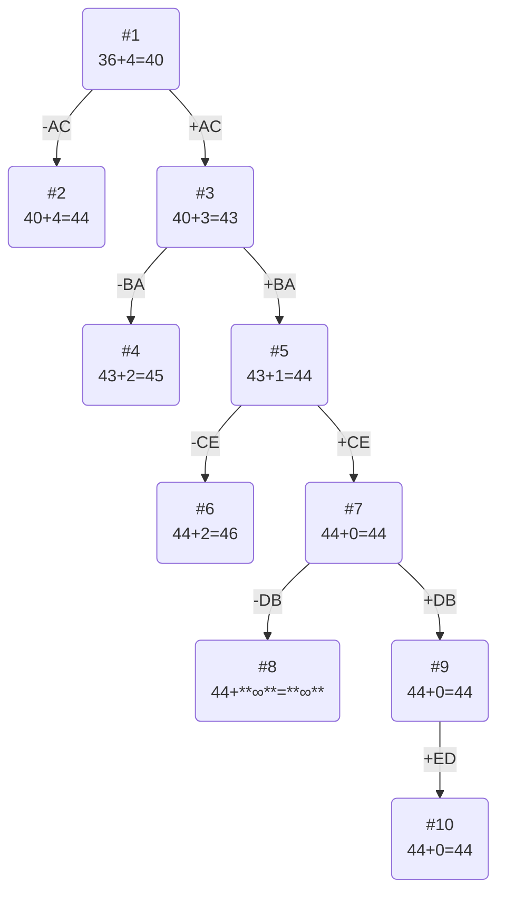

# Задание №12
# Задача коммивояжера (Traveling salesman problem). Метод ветвей и границ. Вариант 7.
## Условиe задачи
Матрица расстояний:
|       | **A** | **B** | **C** | **D** | **E** |
|-------|:-----:|:-----:|:-----:|:-----:|:-----:|
| **A** | **∞** |   9   |   5   |   9   |  12   |
| **B** |   8   | **∞** |   5   |  14   |  12   |
| **C** |  15   |   8   | **∞** |   8   |  11   |
| **D** |  12   |   6   |   5   | **∞** |  11   |
| **E** |  14   |  15   |  13   |  14   | **∞** |

## Решение
## Этап I. Выполняем редукцию матрицы затрат по строкам и столбцам.
### Редукция по строкам
В каждой строке выбираем минимальное чило и вычитаем его из всей строки.

|       | **A** | **B** | **C** | **D** | **E**  | **Редукция** |
|-------|:-----:|:-----:|:-----:|:-----:|:-----:|:-----:|
| **A** | **∞** |   9   |   5   |   9   |  12   |  **-5**   |
| **B** |   8   | **∞** |   5   |  14   |  12   |  **-5**   |
| **C** |  15   |   8   | **∞** |   8   |  11   |  **-8**   |
| **D** |  12   |   6   |   5   | **∞** |  11   |  **-5**   |
| **E** |  14   |  15   |  13   |  14   | **∞** |  **-13**  |

Сумма констант редукции по строкам 36

Результат:
|       | **A** | **B** | **C** | **D** | **E** |
|-------|:-----:|:-----:|:-----:|:-----:|:-----:|
| **A** | **∞** |   4   |   0   |   4   |   7   |
| **B** |   3   | **∞** |   0   |   9   |   7   |
| **C** |   7   |   0   | **∞** |   0   |   3   |
| **D** |   7   |   1   |   0   | **∞** |   6   |
| **E** |   1   |   2   |   0   |   1   | **∞** |

### Редукция по столбцам
|       | **A** | **B** | **C** | **D** | **E** |
|-------|:-----:|:-----:|:-----:|:-----:|:-----:|
| **A** | **∞** |   4   |   0   |   4   |   7   |
| **B** |   3   | **∞** |   0   |   9   |   7   |
| **C** |   7   |   0   | **∞** |   0   |   3   |
| **D** |   7   |   1   |   0   | **∞** |   6   |
| **E** |   1   |   2   |   0   |   1   | **∞** |
| **Редукция** |  **-1** |       |       |      |   **-3**   |

Сумма констант редукции по столбцам 4

Результат:
|       | **A** | **B** | **C** | **D** | **E** |
|-------|:-----:|:-----:|:-----:|:-----:|:-----:|
| **A** | **∞** |   4   |   0   |   4   |   4   |
| **B** |   2   | **∞** |   0   |   9   |   4   |
| **C** |   6   |   0   | **∞** |   0   |   0   |
| **D** |   6   |   1   |   0   | **∞** |   3   |
| **E** |   0   |   2   |   0   |   1   | **∞** |

## Этап II. Оценка длины маршрута.
Оценка длины маршрута снизу соответствует сумме констант редукции по строкам и по столбцам:

**36 + 4 = 40**

## Этап III. Найдем решение задачи с использованием метода ветвей и границ.

Чтобы определить ребро, по которому будет произведено ветвление из корневого узла рассчитаем штрафы для ребер с нулевой оценкой:
|        | **Штраф** |
|:-------|:---------:|
| **AC** |     4     |
| **BC** |     2     |
| **CB** |     1     |
| **CD** |     1     |
| **CE** |     3     |
| **DC** |     1     |
| **EA** |     2     |
| **EC** |     0     |

Максимальный штраф 4, выберем ребро AC, как оно – ребро с максимальным штрафом.

#### Узел №2
Узел №2 с исключением ребра AС имеет оценку 40 + 4 (штраф) = 44

#### Узел №3
Для получения оценки узла 3 необходимо рассчитать сумму констант редукции для матрицы с учетом включения ребра AC, для этого в матрице:
- удалим строку A,
- удалим столбец C,
- Заменим на бесконечность значение CA.

|       | **A** | **B** | **D** | **E** |**Редукция**|
|-------|:-----:|:-----:|:-----:|:-----:|:-----:|
| **B** |   2   | **∞** |   9   |   4   | **-2**|
| **C** | **∞** |   0   |   0   |   0   |
| **D** |   6   |   1   | **∞** |   3   | **-1**|
| **E** |   0   |   2   |   1   | **∞** |

Матрица после редукции:
|       | **A** | **B** | **D** | **E** |
|-------|:-----:|:-----:|:-----:|:-----:|
| **B** |   0   | **∞** |   7   |   2   |
| **C** | **∞** |   0   |   0   |   0   |
| **D** |   5   |   0   | **∞** |   2   |
| **E** |   0   |   2   |   1   | **∞** |

Сумма констант редукции равна ***3***.

Оценка узла №3 = 40 + 3 (редукция) = 43

#### Выбор следующей вершины и ребра

Нам необходимо выбрать вершину с минимальной оцненкой. Это вершина №3.

Чтобы определить ребро, по которому будет произведено ветвление из узла №3 рассчитаем штрафы для ребер из только что полученной маьтрицы с нулевой оценкой:
|        | **Штраф** |
|:-------|:---------:|
| **BA** |     2     |
| **CB** |     0     |
| **CD** |     1     |
| **CE** |     2     |
| **DB** |     2     |
| **EA** |     1     |

Максимальный штраф 2, выберем ребро BA, так как оно – одно из ребер с этим штрафом.

#### Узел №4
Узел №4 с исключением ребра BA имеет оценку 43 + 2 (штраф) = 45

#### Узел №5
Для получения оценки узла №5 необходимо рассчитать сумму констант редукции для матрицы с учетом включения ребра BA, для этого в матрице:
- Удалим строку B,
- Удалим столбец A,
- Заменим на бесконечность значение AB.
- Ребро BA приходит в ранее задействованную вершину A, то есть у нас есть часть маршрута BAC, чтобы избежать преждевременного замыкания цикла, ребро CB также следует заменить на бесконечность

|       | **B** | **D** | **E** |**Редукция**|
|-------|:-----:|:-----:|:-----:|:-----:|
| **C** | **∞** |   0   |   0   |
| **D** |   0   | **∞** |   2   |
| **E** |   2   |   1   | **∞** | **-1**|

Матрица после редукции:
|       | **B** | **D** | **E** |
|-------|:-----:|:-----:|:-----:|
| **C** | **∞** |   0   |   0   |
| **D** |   0   | **∞** |   2   |
| **E** |   1   |   0   | **∞** |

Сумма констант редукции равна ***1***.

Оценка узла №3 = 43 + 1 (редукция) = 44

#### Выбор следующей вершины и ребра

Нам необходимо выбрать самую низкую (саму близкую к ответу) вершину с минимальной оцненкой. Это вершина №5.

Чтобы определить ребро, по которому будет произведено ветвление из узла №5 рассчитаем штрафы для ребер из только что полученной маьтрицы с нулевой оценкой:
|        | **Штраф** |
|:-------|:---------:|
| **CB** |     0     |
| **CD** |     0     |
| **CE** |     2     |
| **DB** |     2     |
| **ED** |     1     |

Максимальный штраф 2, выберем ребро CE, так как оно – одно из ребер с этим штрафом.

#### Узел №6
Узел №6 с исключением ребра CE имеет оценку 44 + 2 (штраф) = 46

#### Узел №7
Для получения оценки узла 7 необходимо рассчитать сумму констант редукции для матрицы с учетом включения ребра CE, для этого в матрице:
- Удалим строку C,
- Удалим столбец E,
- Заменим на бесконечность значение EC.
- Ребро CE исходит из ранее задействованноой вершины C, то есть у нас есть часть маршрута BACE, чтобы избежать преждевременного замыкания цикла, ребро EB также следует заменить на бесконечность при наличии.

|       | **B** | **D** |
|-------|:-----:|:-----:|
| **D** |   0   | **∞** |
| **E** | **∞** |   0   |

Делать редукцию не надло, сумма контсант равна 0.

Оценка узла №7 = 44 + 0 (редукция) = 44

#### Выбор следующей вершины и ребра

Нам необходимо выбрать самую низкую (саму близкую к ответу) вершину с минимальной оцненкой. Это вершина №7.

Чтобы определить ребро, по которому будет произведено ветвление из узла №7 рассчитаем штрафы для ребер из только что полученной маьтрицы с нулевой оценкой:
|        | **Штраф** |
|:-------|:---------:|
| **DB** | **∞** |
| **ED** | **∞** |

Максимальный штраф **∞**, выберем ребро DB, так как оно – одно из ребер с этим штрафом.

#### Узел №8
Узел №8 с исключением ребра DB имеет оценку 44 + **∞** (штраф) = **∞**

#### Узел №9
Для получения оценки узла 9 необходимо рассчитать сумму констант редукции для матрицы с учетом включения ребра DB, для этого в матрице:
- Удалим строку D,
- Удалим столбец B,
- Заменим на бесконечность значение BD.

|       | **D** |
|-------|:-----:|
| **E** |   0   |

Сумма констант редукции 0, следовательно, оценка узла №9 = 44 + 0 = 44

Продолжим поиск из узла 9

#### Выбор ребра
Альтернатив у ребра ED нет

#### Узел №10

Ребро ED включается в маршрут, длина которого составляет 44

## Ответ
- Кратчайший маршрут ACEDBA.
- Длина маршрута 44.
