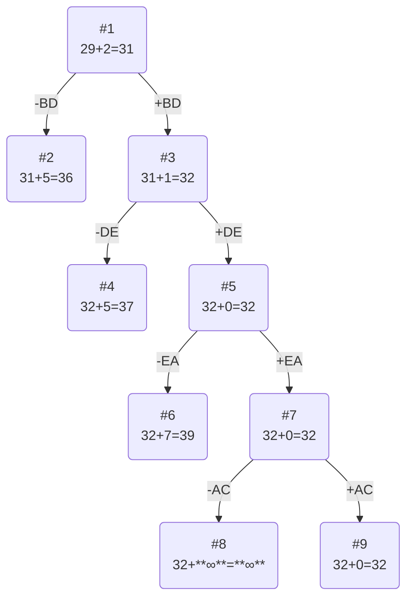

# Задание №12
# Задача коммивояжера. Метод ветвей и границ.

Имеется N городов, связанных дорогами. Расстояния между городами известны. Коммивояжер (бродячий торговец) должен выйти из первого города, посетить по одному разу в некотором порядке города 2,3..n и вернуться в первый город. В каком порядке следует посещать города, чтобы замкнутый путь коммивояжера имел кратчайшее расстояние?

Матрица расстояний:

|       | **A** | **B** | **C** | **D** | **E** |
|-------|:-----:|:-----:|:-----:|:-----:|:-----:|
| **A** | **∞** |   5   |   6   |  11   |  12   |
| **B** |   9   | **∞** |   9   |   9   |  15   |
| **C** |   8   |   5   | **∞** |  13   |  14   |
| **D** |   5   |  11   |   8   | **∞** |   7   |
| **E** |   5   |  13   |  10   |  10   | **∞** |

## Решение
### 1. Проведем редукцию строк матрицы

|       | **A** | **B** | **C** | **D** | **E** | Min |
|-------|:-----:|:-----:|:-----:|:-----:|:-----:|:-----:|
| **A** | **∞** |   5   |   6   |  11   |  12   |  5  |
| **B** |   9   | **∞** |   9   |   9   |  15   |  9  |
| **C** |   8   |   5   | **∞** |  13   |  14   |  5  |
| **D** |   5   |  11   |   8   | **∞** |   7   |  5  |
| **E** |   5   |  13   |  10   |  10   | **∞** |  5  |
| Sum   |       |       |       |       |       | **29**  |

Сумма констант редукции по строкам 29

Марица после редукции строк:

|       | **A** | **B** | **C** | **D** | **E** |
|-------|:-----:|:-----:|:-----:|:-----:|:-----:|
| **A** | **∞** |   0   |   1   |   6   |   7   |
| **B** |   0   | **∞** |   0   |   0   |   6   |
| **C** |   3   |   0   | **∞** |   8   |   9   |
| **D** |   0   |   6   |   3   | **∞** |   2   |
| **E** |   0   |   8   |   5   |   5   | **∞** |

### 2. Проведем редукцию столбцов матрицы

|       | **A** | **B** | **C** | **D** | **E** | Sum |
|-------|:-----:|:-----:|:-----:|:-----:|:-----:|:---:|
| **A** | **∞** |   0   |   1   |   6   |   7   |     |
| **B** |   0   | **∞** |   0   |   0   |   6   |     |
| **C** |   3   |   0   | **∞** |   8   |   9   |     |
| **D** |   0   |   6   |   3   | **∞** |   2   |     |
| **E** |   0   |   8   |   5   |   5   | **∞** |     |
| Min   |   0   |   0   |   0   |   0   |   2   |  **2**  |

Сумма констант редукции по столбцам 2

Марица после редукции столбцов:

|       | **A** | **B** | **C** | **D** | **E** |
|-------|:-----:|:-----:|:-----:|:-----:|:-----:|
| **A** | **∞** |   0   |   1   |   6   |   5   | 
| **B** |   0   | **∞** |   0   |   0   |   4   |
| **C** |   3   |   0   | **∞** |   8   |   7   |
| **D** |   0   |   6   |   3   | **∞** |   0   |
| **E** |   0   |   8   |   5   |   5   | **∞** | 

### 3. Оценка длины маршрута

Оценка длины маршрута снизу соответствует сумме констант редукции по строкам и по столбцам

29 + 2 = 31

  ### 4. Найдем решение задачи с использованием метода ветвей и границ

Чтобы определить ребро, по которому будет произведено ветвление из корневого узла рассчитаем штрафы для ребер с нулевой оценкой:

|        | **Штраф** |
|:-------|:---------:|
| **AB** |     1     |
| **BA** |     0     |
| **BC** |     1     |
| **BD** |     5     |
| **CB** |     3     |
| **DA** |     0     |
| **DE** |     5     |
| **EA** |     5     |

Максимальный штраф 5, выберем ребро BD, как одно из ребер с максимальным штрафом.

#### Узел №2
Узел №2 с исключением ребра BD имеет оценку 31 + 5 (штраф) = 36

#### Узел №3
Для получения оценки узла 3 необходимо рассчитать сумму констант редукции для матрицы с учетом включения ребра BD, для этого в матрице:
- удалим строку B,
- удалим столбец D,
- Заменим на бесконечность значение DB.

|       | **A** | **B** | **C** | **E** | Sum |
|-------|:-----:|:-----:|:-----:|:-----:|:---:|
| **A** | **∞** |   0   |   1   |   5   |     |
| **C** |   3   |   0   | **∞** |   7   |     |
| **D** |   0   | **∞** |   3   |   0   |     |
| **E** |   0   |   8   |   5   | **∞** |     |
|  Min  |   0   |   0   |   1   |   0   |  **1**   |

Матрица после редукции:

|       | **A** | **B** | **C** | **E** |
|-------|:-----:|:-----:|:-----:|:-----:|
| **A** | **∞** |   0   |   0   |   5   | 
| **C** |   3   |   0   | **∞** |   7   |
| **D** |   0   | **∞** |   2   |   0   |
| **E** |   0   |   8   |   4   | **∞** | 

Сумма констант редукции 1

Оценка узла 3 = 31 + 1 (редукция) = 32

Продолжим поиск из узла 3

#### Выбор ребра
Чтобы определить ребро, по которому будет произведено ветвление из узла 3 рассчитаем штрафы для ребер с нулевой оценкой:

|        | **Штраф** |
|:-------|:---------:|
| **AB** |     0    |
| **AC** |     2     |
| **CB** |     3     |
| **DA** |     0     |
| **DE** |     5     |
| **EA** |     4     |

Максимальный штраф 5, выберем ребро DE, как ребро с максимальным штрафом.

#### Узел №4
Узел №4 с исключением ребра DE имеет оценку 32 + 5 (штраф) = 37 

#### Узел №5
Для получения оценки узла 5 необходимо рассчитать сумму констант редукции для матрицы с учетом включения ребра DE, для этого в матрице:
- удалим строку D,
- удалим столбец E,
- Нужно заменить на бесконечность значение **EB**.

|       | **A** | **B** | **C** |
|-------|:-----:|:-----:|:-----:|
| **A** | **∞** |   0   |   0   |
| **C** |   3   |   0   | **∞** | 
| **E** |   0   |  **∞**  |   4   | 

Сумма констант редукции 0

Оценка узла 5 = 32 + 0 (редукция) = 32

Продолжим поиск из узла 5

#### Выбор ребра
Чтобы определить ребро, по которому будет произведено ветвление из узла 5 рассчитаем штрафы для ребер с нулевой оценкой:

|        | **Штраф** |
|:-------|:---------:|
| **AB** |     0    |
| **AC** |     4     |
| **CB** |     3     |
| **EA** |     7     |

Максимальный штраф 7, выберем ребро EA, как ребро с максимальным штрафом.

#### Узел №6
Узел №6 с исключением ребра EA имеет оценку 32 + 7 (штраф) = 39

#### Узел №7
Для получения оценки узла 7 необходимо рассчитать сумму констант редукции для матрицы с учетом включения ребра EA, для этого в матрице:
- удалим строку E,
- удалим столбец A,
- Заменим на бесконечность значение AE (столбец Е удален на предыдущем шаге).

|       | **B** | **C** |
|-------|:-----:|:-----:|
| **A** |   0   |   0   |
| **C** |   0   | **∞** | 

Сумма констант редукции 0

Оценка узла 7 = 32 + 0 (редукция) = 32

Продолжим поиск из узла 7 

#### Выбор ребра
Чтобы определить ребро, по которому будет произведено ветвление из узла 7 рассчитаем штрафы для ребер с нулевой оценкой:

|        | **Штраф** |
|:-------|:---------:|
| **AB** |     0    |
| **AC** |     ∞    |
| **CB** |     ∞     |

Максимальный штраф **∞**, выберем ребро AC, как ребро с максимальным штрафом.

#### Узел №8
Узел №8 с исключением ребра AC имеет оценку 32 + **∞** (штраф) = **∞**, значит узел №8 рассматривать дальше не будем.

#### Узел №9
Для получения оценки узла 9 необходимо рассчитать сумму констант редукции для матрицы с учетом включения ребра AC, для этого в матрице:
- удалим строку A,
- удалим столбец C,
- Заменим на бесконечность значение CE (если бы этот маршрут ещё остался в матрице).

|       | **B** |
|-------|:-----:|
| **C** |   0   |

Сумма констант редукции 0, следовательно, оценка узла 9 = 32 + 0 = 32

Ребро AC включается в маршрут, длина которого составляет 32

### Ответ
- Кратчайший маршрут BDEACB.
- Длина маршрута 32.

