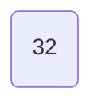
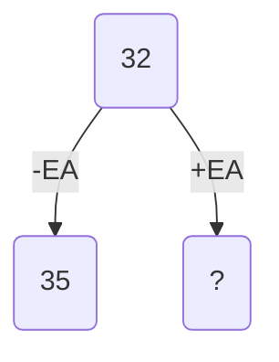
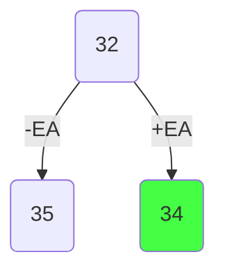
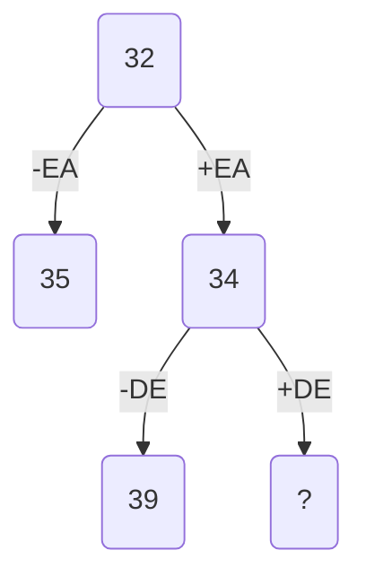
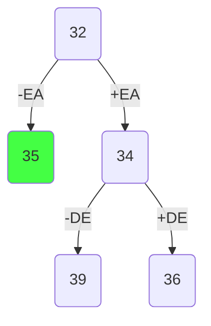
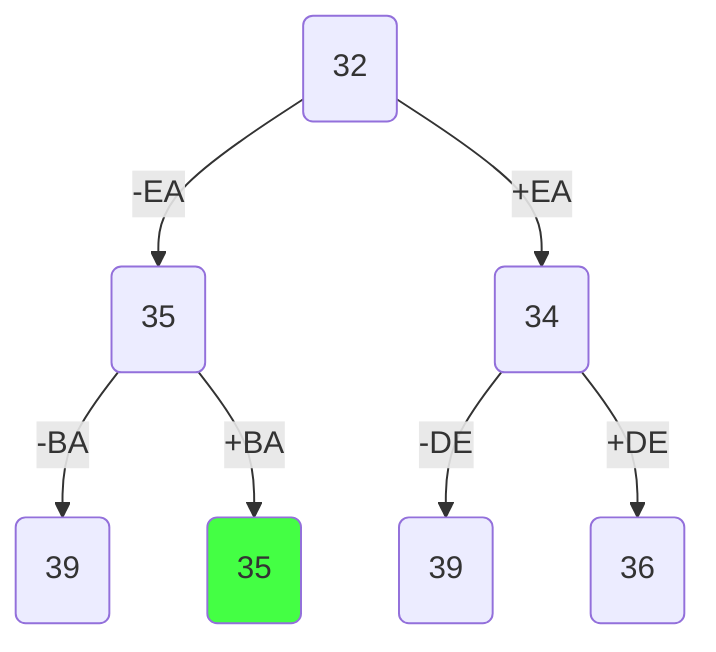
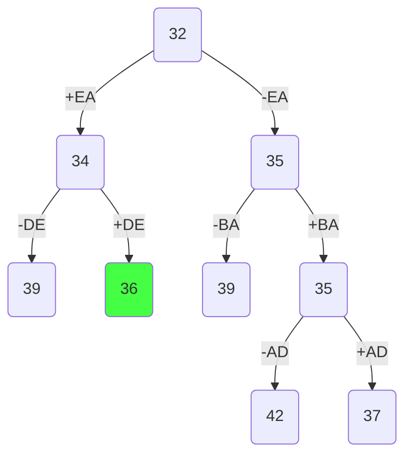
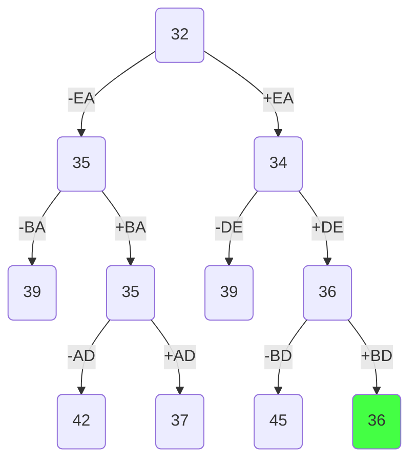
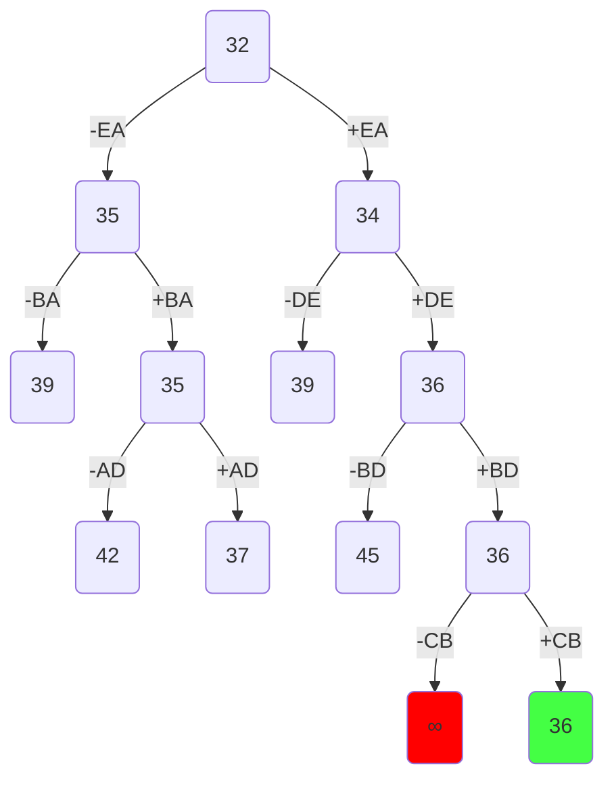

# Задача о коммивояжера. Метод ветвей и границ. Вариант 10:
Исходная матрица расстояний:

|       | **A** | **B** | **C** | **D** | **E** |
|-------|:-----:|:-----:|:-----:|:-----:|:-----:|
| **A** | **∞** |   8   |   8   |   8   |  14   |
| **B** |   6   | **∞** |   8   |   8   |  12   |
| **C** |  11   |   7   | **∞** |  14   |   5   |
| **D** |  10   |  14   |  13   | **∞** |   8   |
| **E** |   5   |   8   |  10   |  15   | **∞** |

## Шаг 1. Редукция матрицы
Редуцируем матрицу. 

|       | **A** | **B** | **C** | **D** | **E** |       |
|-------|:-----:|:-----:|:-----:|:-----:|:-----:|:-----:|
| **A** | **∞** |   8   |   8   |   8   |  14   |  -8   |
| **B** |   6   | **∞** |   8   |   8   |  12   |  -6   |
| **C** |  11   |   7   | **∞** |  14   |   5   |  -5   |
| **D** |  10   |  14   |  13   | **∞** |   8   |  -8   |
| **E** |   5   |   8   |  10   |  15   | **∞** |  -5   |
|       |  -0   |  -0   |  -0   |  -0   |   -0  |       |

|       | **A** | **B** | **C** | **D** | **E** |       |
|-------|:-----:|:-----:|:-----:|:-----:|:-----:|:-----:|
| **A** | **∞** |   0   |   0   |   0   |   6   |       |
| **B** |   0   | **∞** |   2   |   2   |   6   |       |
| **C** |   6   |   2   | **∞** |   9   |   0   |       |
| **D** |   2   |   6   |   5   | **∞** |   0   |       |
| **E** |   0   |   3   |   5   |  10   | **∞** |       |
|       |       |       |       |       |       |  -32  |

Константа редукции = 32
Записываем константу редукции в корень дерева.

## Шаг 2 Оценка левого потомка
Считаем "штраф" каждого нулевого ребра.
| **AB** | **AC** | **AD** | **BA** | **CE** | **DE** | **EA** |
|:------:|:------:|:------:|:------:|:------:|:------:|:------:|
|    2   |   2    |    2   |    2   |   2    |   2    |   3    |

Ребро EA имеет наибольший штраф, поэтому рассматриваем случай где мы включаем это ребро в наш путь и случай где мы его не включаем.

Продолжим строить наше дерево. Левым потомком будет оценка маршрута с ребром EA, справа - без него.

Оценка левого потомка = оценка родителя + штраф

$$
32+3=35
$$

## Шаг 3 Оценка правого потомка
Оценка правого потомка = оценка родителя + константа редукции новой матрицы.

Строим новую матрицу без ребра EA, поскольку мы не можем еще раз по нему пройти и без ребра AE, поскольку это образует цикл.
|       | **B** | **C** | **D** | **E** |       |
|-------|:-----:|:-----:|:-----:|:-----:|:-----:|
| **A** |   0   |   0   |   0   | **∞** |       |
| **B** | **∞** |   2   |   2   |   6   |  -2   |
| **C** |   2   | **∞** |   9   |   0   |       |
| **D** |   6   |   5   | **∞** |   0   |       |
|       |       |       |       |       |       |

|       | **B** | **C** | **D** | **E** |       |
|-------|:-----:|:-----:|:-----:|:-----:|:-----:|
| **A** |   0   |   0   |   0   | **∞** |       |
| **B** | **∞** |   0   |   0   |   4   |       |
| **C** |   2   | **∞** |   9   |   0   |       |
| **D** |   6   |   5   | **∞** |   0   |       |
|       |       |       |       |       |  -2   |

Константа редукции = 2. Правый потомок = 

$$
32 + 2 = 34
$$

Дополняем наше дерево:

Выбираем наименьшую вершину и продолжаем строить дерево от нее, повторяя шаги 2 и 3.

Таблица штрафов:
| **AB** | **AC** | **AD** | **BC** | **BD** | **CE** | **DE** |
|:------:|:------:|:------:|:------:|:------:|:------:|:------:|
|   2    |   0    |   0    |   0    |   0    |   2    |   5    |

Рассматриваем ребро DE:
Левый потомок = 

$$
34+5=39
$$

Вычеркиваем из матрицы строку D и столбец E, заменяем AD на **∞**
|       | **B** | **C** | **D** |       |
|-------|:-----:|:-----:|:-----:|:-----:|
| **A** |   0   |   0   | **∞** |       |
| **B** | **∞** |   0   |   0   |       |
| **C** |   2   | **∞** |   9   |  -2   |
|       |       |       |       |       |

|       | **B** | **C** | **D** |       |
|-------|:-----:|:-----:|:-----:|:-----:|
| **A** |   0   |   0   | **∞** |       |
| **B** | **∞** |   0   |   0   |       |
| **C** |   0   | **∞** |   9   |       |
|       |       |       |       |  -2   |

Константа редукции = 2
Оценка правого потомка = 

$$
34+2=36
$$

Продолжаем строить дерево из вершины с оценкой 35. Поскольку это вершина, где мы не включили ребро, то для построения матрицы этой вершины возьмем родительскую матрицу и заменим в ней невключенное ребро на **∞**:

|       | **A** | **B** | **C** | **D** | **E** |       |
|-------|:-----:|:-----:|:-----:|:-----:|:-----:|:-----:|
| **A** | **∞** |   0   |   0   |   0   |   6   |       |
| **B** |   0   | **∞** |   2   |   2   |   6   |       |
| **C** |   6   |   2   | **∞** |   9   |   0   |       |
| **D** |   2   |   6   |   5   | **∞** |   0   |       |
| **E** | **∞** |   3   |   5   |  10   | **∞** |  -3   |
|       |       |       |       |       |       |       |

|       | **A** | **B** | **C** | **D** | **E** |       |
|-------|:-----:|:-----:|:-----:|:-----:|:-----:|:-----:|
| **A** | **∞** |   0   |   0   |   0   |   6   |       |
| **B** |   0   | **∞** |   2   |   2   |   6   |       |
| **C** |   6   |   2   | **∞** |   9   |   0   |       |
| **D** |   2   |   6   |   5   | **∞** |   0   |       |
| **E** | **∞** |   0   |   2   |   7   | **∞** |       |
|       |       |       |       |       |       |  -3   |

Заметим, что константа редукции должна быть равна штрафу невключенного ребра.

Таблица штрафов:
| **AB** | **AC** | **AD** | **BA** | **CE** | **DE** |
|:------:|:------:|:------:|:------:|:------:|:------:|
|    0   |   2    |    2   |    4   |   2    |   2    |

Рассматриваем ребро BA:
Левый потомок = 
$$
35+4=39
$$

Правый потомок.
Вычеркиваем строку B и столбец A, заменяем BA на **∞**:

|       | **B** | **C** | **D** | **E** |       |
|-------|:-----:|:-----:|:-----:|:-----:|:-----:|
| **A** | **∞** |   0   |   0   |   6   |       |
| **C** |   2   | **∞** |   9   |   0   |       |
| **D** |   6   |   5   | **∞** |   0   |       |
| **E** |   0   |   2   |   7   | **∞** |       |
|       |       |       |       |       |   0   |

Правый потомок = 

$$
35+0=35
$$

Продолжаем строить дерево из вершины 35.
Таблица штрафов:
| **AC** | **AD** | **CE** | **DE** | **EB** |
|:------:|:------:|:------:|:------:|:------:|
|    2   |   7    |    2   |    5   |   4    |

Рассматриваем ребро AD:
Левый потомок = 
$$
35+7=42
$$

Правый потомок.
Вычеркиваем строку A и столбец D, заменяем DB на **∞**:

|       | **B** | **C** | **E** |       |
|-------|:-----:|:-----:|:-----:|:-----:|
| **C** |   2   | **∞** |   0   |       |
| **D** | **∞** |   5   |   0   |       |
| **E** |   0   |   2   | **∞** |       |
|       |       |  -2   |       |       |

|       | **B** | **C** | **E** |       |
|-------|:-----:|:-----:|:-----:|:-----:|
| **C** |   2   | **∞** |   0   |       |
| **D** | **∞** |   3   |   0   |       |
| **E** |   0   |   0   | **∞** |       |
|       |       |       |       |  -2   |

Правый потомок = 

$$
35+2=37
$$

Продолжаем строить дерево из вершины 36.
P.S. Я не знаю почему в графе вершины на 1 уровне поменялись местами. Надеюсь на Github они останутся на своих местах.

|       | **B** | **C** | **D** |       |
|-------|:-----:|:-----:|:-----:|:-----:|
| **A** |   0   |   0   | **∞** |       |
| **B** | **∞** |   0   |   0   |       |
| **C** |   0   | **∞** |   9   |       |
|       |       |       |       |       |

Таблица штрафов:
| **AB** | **AC** | **BC** | **BD** | **CB** |
|:------:|:------:|:------:|:------:|:------:|
|    0   |   0    |    0   |    9   |   9    |

Поскольку ребра BD и CB имеют одинаковые штрафы, то выберем любое. Пусть это будет ребро BD.
Левый потомок = 

$$
36+9=45
$$

Правый потомок.
Вычеркиваем строку B и столбец D, заменяем AB на **∞**:

|       | **B** | **C** |       |
|-------|:-----:|:-----:|:-----:|
| **A** | **∞** |   0   |       |
| **C** |   0   | **∞** |       |
|       |       |       |   0   |

Правый потомок = 

$$
36+0=36
$$

Продолжаем строить дерево из вершины 36.

Таблица штрафов:
| **AC** | **CB** |
|:------:|:------:|
|  **∞** |  **∞** |

Рассматриваем ребро CB:

Левый потомок =

$$
36 + ∞ = ∞
$$

Получили ∞, значит не рассматриваем этот маршрут, поскольку он не сможет дать нам полный цикл.

Правый потомок.
Вычеркиваем строку C и столбец B:

|       | **C** |       |
|-------|:-----:|:-----:|
| **A** |   0   |       |
|       |       |   0   |

Правый потомок = 

$$
36+0=36
$$

Вершина с наименьшей оценкой оказалась на самом нижнем уровне, значит алгоритм закончил свою работу.
Чтобы получить итоговый маршрут нужно из этой вершины дойти до корня.

## Ответ
Маршрут: C -> B -> D -> E -> A -> C
Длина маршрута = 36