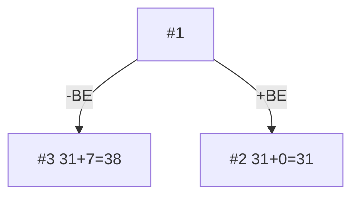
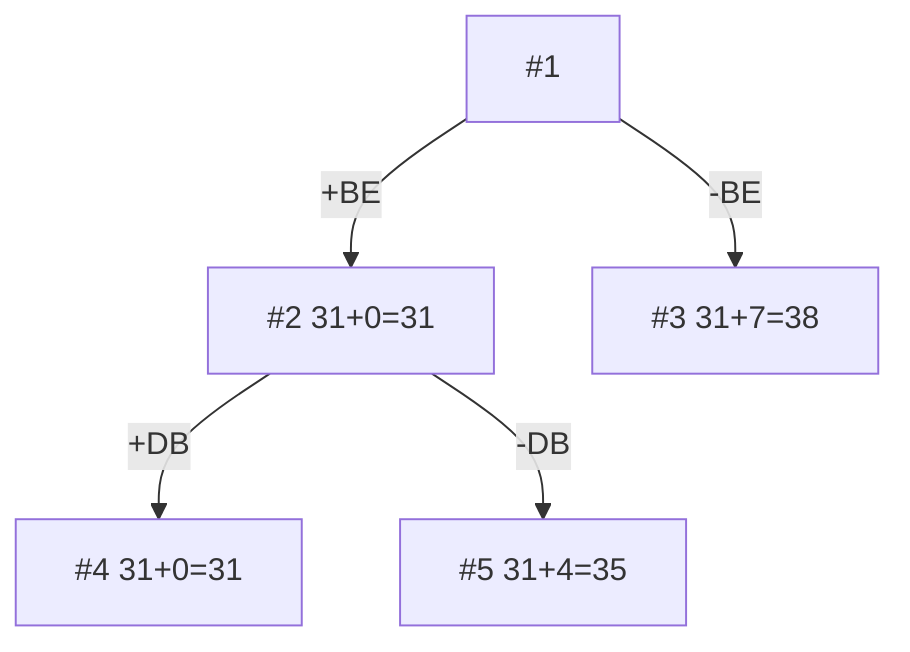
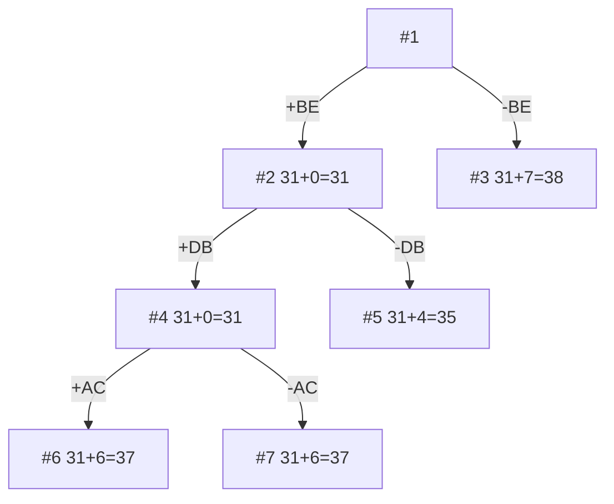
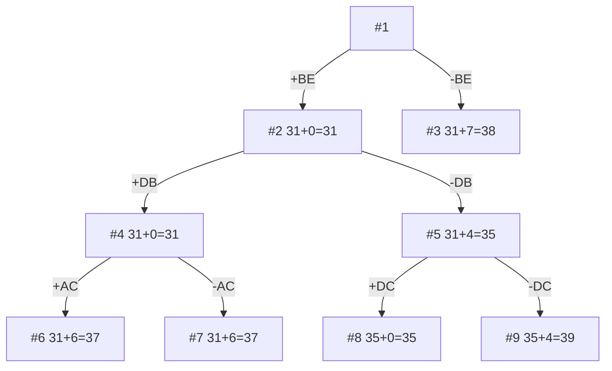
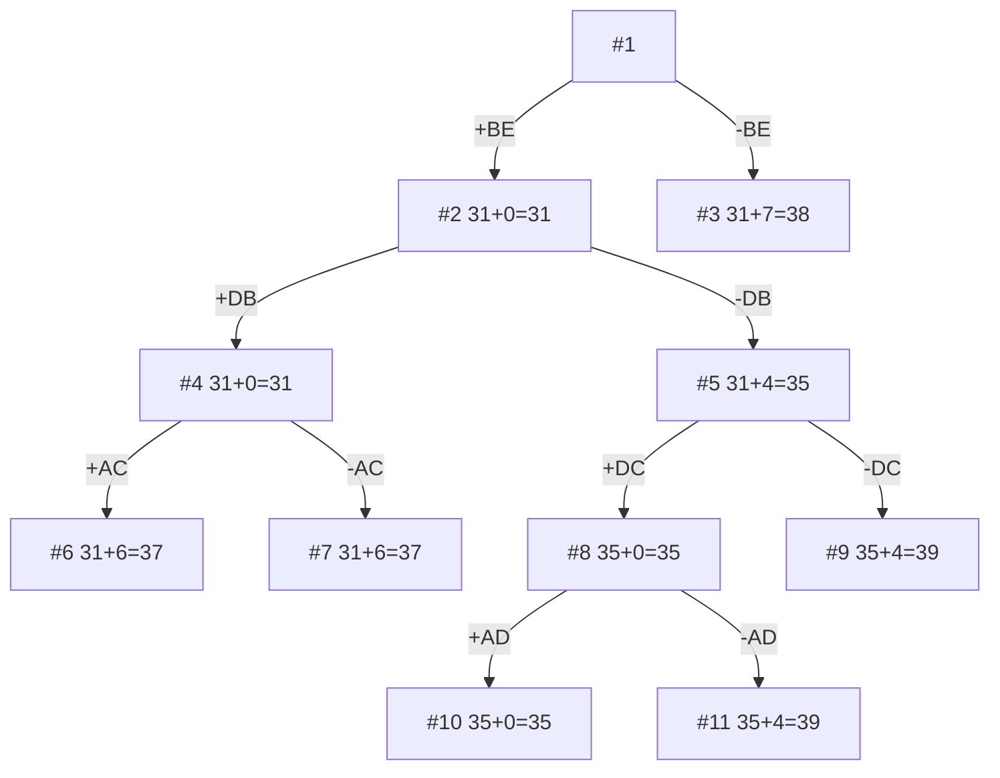
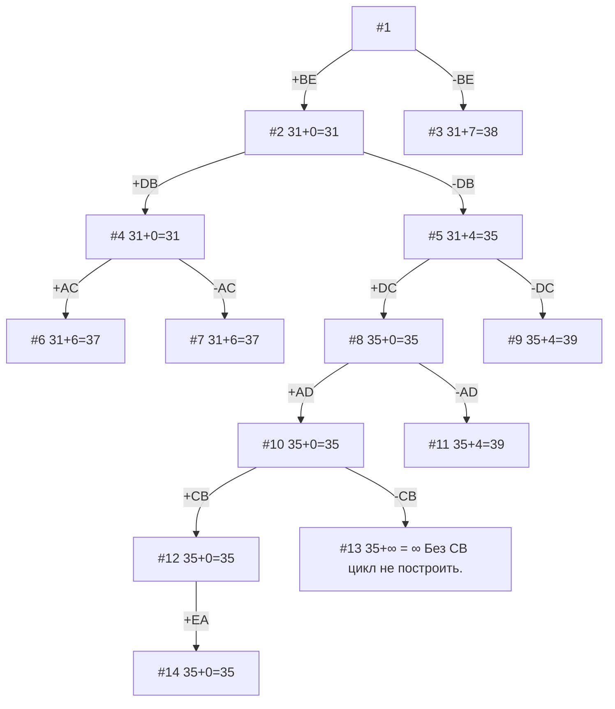

## Задание №12 (Вариант 5)
### no-name
Долгих Юлия
Осока Варвара
Шперкин Савва

## Задача коммивояжера. Метод ветвей и границ.

Матрица расстояний:

|       | **A** | **B** | **C** | **D** | **E** |
|-------|:-----:|:-----:|:-----:|:-----:|:-----:|
| **A** | **∞** |  11   |   8   |   7   |  10   |
| **B** |  15   | **∞** |  11   |   9   |   5   |
| **C** |   7   |   8   | **∞** |  13   |  15   |
| **D** |  12   |   5   |   9   | **∞** |  14   |
| **E** |   6   |   9   |  13   |   7   | **∞** |

### 1. Провести редукцию по строкам и столбцам

Матрица №1.

|       | **A** | **B** | **C** | **D** | **E** |**Константы редукции**|
|-------|:-----:|:-----:|:-----:|:-----:|:-----:|:-----:|
| **A** |**∞**|4|0|0|3|-7|
| **B** |10|**∞**|5|4|0|-5
| **C** |0|1|**∞**|6|8|-7
| **D** |7|0|3|**∞**|9|-5
| **E** |0|3|6|1|**∞**|-6
| **Константы редукции** |||-1|||31|

### 2. Выделим кандидатов и посчитаем штрафы

AC = 0 + 3 = 3
AD = 0 + 1 = 1
BE = 4 + 3 = 7
CA = 0 + 1 = 1
DB = 3 + 1 = 4
EA = 1 + 0 = 1

BE - ребро с максимальным штрафом и будем двигаться по нему.

Матрица №2.

|       | **A** | **B** | **C** | **D** |**Константы редукции**|
|-------|:-----:|:-----:|:-----:|:-----:|:-----:|
| **A** |**∞**|4|0|0|
| **C** |0|1|**∞**|6|
| **D** |7|0|3|**∞**|
| **E** |0|**∞**|6|1|
| **Константы редукции** |||||0|

Сумма констант редукции 0, поэтому оценка сохраняется.

Идём в ветку с наименьшей стоимостью (#2).
### 3. Выделим кандидатов и посчитаем штрафы

Матрица №2.

|       | **A** | **B** | **C** | **D** |**Константы редукции**|
|-------|:-----:|:-----:|:-----:|:-----:|:-----:|
| **A** |**∞**|4|0|0|
| **C** |0|1|**∞**|6|
| **D** |7|0|3|**∞**|
| **E** |0|**∞**|6|1|
| **Константы редукции** |||||0|

AC = 0 + 3 = 3
AD = 0 + 1 = 1
CA = 1 + 0 = 1
DB = 3 + 1 = 4
EA = 1 + 0 = 1

DB - ребро с максимальным штрафом, будем двигаться по нему.

Матрица №4.

|       | **A** | **C** | **D** |**Константы редукции**|
|-------|:-----:|:-----:|:-----:|:-----:|
| **A** |**∞**|0|0|
| **C** |0|**∞**|6|
| **E** |0|6|**∞**|
| **Константы редукции** ||||0|

Идём в ветку с наименьшей стоимостью (#4).

### 4. Выделим кандидатов и посчитаем штрафы
Матрица №4.

|       | **A** | **C** | **D** |**Константы редукции**|
|-------|:-----:|:-----:|:-----:|:-----:|
| **A** |**∞**|0|0|
| **C** |0|**∞**|6|
| **E** |0|6|**∞**|
| **Константы редукции** ||||0|0

AC = 0 + 6 = 6
AD = 0 + 6 = 6
CA = 0 + 6 = 6
EA = 6 + 0 = 6

Все одинаковые, берём любое. AC.

Матрица №6.

|       | **A** | **D** |**Константы редукции**|
|-------|:-----:|:-----:|:-----:|
| **C** |**∞**|0|
| **E** |0|**∞**|
| **Константы редукции** ||-6|-6|

Идём в ветку с наименьшей стоимостью (#5).

### 5. Выделяем кандидатов и считаем штрафы.

Матрица №5.

|       | **A** | **B** | **C** | **D** |**Константы редукции**|
|-------|:-----:|:-----:|:-----:|:-----:|:-----:|
| **A** |**∞**|3|0|0|
| **C** |0|0|**∞**|6|
| **D** |4|**∞**|0|**∞**|-3
| **E** |0|**∞**|6|1|
| **Константы редукции** ||-1|||-4|

AC = 0 + 0 = 0
AD = 0 + 1 = 1
CA = 0 + 0 = 0
CB = 0 + 3 = 3
DC = 4 + 0 = 4
EA = 1 + 0 = 1

DC - ребро с максимальным штрафом.
-DC=4
+DC = 0

Матрица №8.

|       | **A** | **B**  | **D** |**Константы редукции**|
|-------|:-----:|:-----:|:-----:|:-----:|
| **A** |**∞**|3|0|
| **C** |0|0|**∞**|
| **E** |0|**∞**|1|
| **Константы редукции** |||||

Идём в ветку с наименьшей стоимостью (#8).

### 6. Выделяем кандидатов и считаем штрафы.
Матрица №8.

|       | **A** | **B**  | **D** |**Константы редукции**|
|-------|:-----:|:-----:|:-----:|:-----:|
| **A** |**∞**|3|0|
| **C** |0|0|**∞**|
| **E** |0|**∞**|1|
| **Константы редукции** |||||

AD = 3 + 1 = 4
CA = 0 + 0 = 0
CB = 0 + 3 = 0
EA = 1 + 0 = 1

AD - ребро с максимальным штрафом.

Матрица №10.

|       | **A** | **B**  |**Константы редукции**|
|-------|:-----:|:-----:|:-----:|
| **C** |**∞**|0|
| **E** |0|**∞**|
| **Константы редукции** ||||

Идём в ветку с наименьшей стоимостью (#10).

### 7. Выделяем кандидатов и считаем штрафы.
Матрица №10.

|       | **A** | **B**  |**Константы редукции**|
|-------|:-----:|:-----:|:-----:|
| **C** |****|0|
| **E** |0|**∞**|
| **Константы редукции** ||||

CB = ∞
EA = ∞

Одинаковые. Берём любое (CB).
Без CB мы не соберём цикл.

Матрица №12.

|       | **A** |**Константы редукции**|
|-------|:-----:|:-----:|
| **E** |0|
| **Константы редукции** ||0|

Остаётся только ребро EA.

## Итоговый цикл

$$C --> B --> E --> A --> D --> C $$

## Стоимость:
8 + 5 + 6 + 7 + 9 = 35
Ура.

