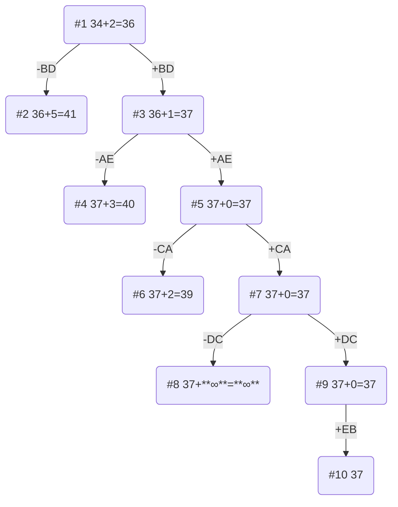

# Задание №12.
### Постановка задачи:
Имеется N городов, связанных дорогами. Расстояния между городами известны. Коммивояжер (бродячий торговец) должен выйти из первого города, посетить по одному разу в некотором порядке города 2,3..n и вернуться в первый город. В каком порядке следует посещать города, чтобы замкнутый путь коммивояжера имел кратчайшее расстояние?

### Вариант 8:

Матрица расстояний:

|       | **A** | **B** | **C** | **D** | **E** |
|-------|:-----:|:-----:|:-----:|:-----:|:-----:|
| **A** | **∞** |   10  |  14   |   6   |  9    |
| **B** |    12 | **∞** |  11   |   6   |   13  |
| **C** |  7    |  9    | **∞** |   12  |  9    |
| **D** |   14  |   10  |   9   | **∞** |  13   |
| **E** |   8   |   6   |  13   |  13   | **∞** |

## Этап 1: Проведем редукцию строк матрицы

|       | **A** | **B** | **C** | **D** | **E** | Min |
|-------|:-----:|:-----:|:-----:|:-----:|:-----:|:---:|
| **A** |  **∞** |   10  |  14   |   6   |  9   |  6  |
| **B** |    12 | **∞** |  11   |   6   |   13  |  6  |
| **C** |  7    |  9    | **∞** |   12  |  9    |  7  |
| **D** |   14  |   10  |   9   | **∞** |  13   |  9  |
| **E** |   8   |   6   |  13   |  13   | **∞** | 6   |
| Sum   |       |       |       |       |       | 34  |

Сумма констант редукции по строкам 34.

Марица после редукции строк:

|       | **A** | **B** | **C** | **D** | **E** |
|-------|:-----:|:-----:|:-----:|:-----:|:-----:|
| **A** | **∞** |   4   |   8   |   0   |   3   |
| **B** |   6   | **∞** |   5   |   0   |   7   |
| **C** |   0   |   2   | **∞** |   5   |   2   |
| **D** |   5   |   1   |   0   | **∞** |   4   |
| **E** |   2   |   0   |   7   |   7   | **∞** |

## Этап 2: Проведем редукцию столбцов матрицы

|       | **A** | **B** | **C** | **D** | **E** | Sum |  
|-------|:-----:|:-----:|:-----:|:-----:|:-----:|:---:|
| **A** | **∞** |   4   |   8   |   0   |   3   |     |
| **B** |   6   | **∞** |   5   |   0   |   7   |     |
| **C** |   0   |   2   | **∞** |   5   |   2   |     |
| **D** |   5   |   1   |   0   | **∞** |   4   |     |
| **E** |   2   |   0   |   7   |   7   | **∞** |     |
| min   |   0   |   0   |   0   |   0   |   2   |  2  |

Сумма констант редукции по столбцам 2.

Марица после редукции столбцов:

|       | **A** | **B** | **C** | **D** | **E** |
|-------|:-----:|:-----:|:-----:|:-----:|:-----:|
| **A** | **∞** |   4   |   8   |   0   |   1   |
| **B** |   6   | **∞** |   5   |   0   |   5   |
| **C** |   0   |   2   | **∞** |   5   |   0   |
| **D** |   5   |   1   |   0   | **∞** |   2   |
| **E** |   2   |   0   |   7   |   7   | **∞** |

## Этап 3: Оценка длины маршрута

Оценка длины маршрута снизу соответствует сумме констант редукции по строкам и по столбцам: 34 + 2 = 36.

## Этап 4: Найдем решение задачи с использованием метода ветвей и границ

Чтобы определить ребро, по которому будет произведено ветвление из корневого узла рассчитаем штрафы для ребер с нулевой оценкой:

|        | **Штраф** |
|:-------|:---------:|
| **AD** |     1     |
| **BD** |     5     |
| **CA** |     2     |
| **CE** |     1     |
| **DC** |     1     |
| **EB** |     2     |

Максимальный штраф 5, выберем ребро BD, как одно из ребер с максимальным штрафом.

#### Узел №2
Узел №2 с исключением ребра BD имеет оценку 36 + 5 (штраф) = 41.

#### Узел №3
Для получения оценки узла №3 необходимо рассчитать сумму констант редукции для матрицы с учетом включения ребра BD, для этого в матрице:
- удалим строку B,
- удалим столбец D,
- Заменим на бесконечность значение DB.

Проведем редукцию матрицы по строкам:

|       | **A** | **B** | **C** | **E** | Min |
|-------|:-----:|:-----:|:-----:|:-----:|-----|
| **A** | **∞** |   4   |   8   |   1   |  1  |
| **C** |   0   |   2   | **∞** |   0   |     |
| **D** |   5   | **∞** |   0   |   2   |     |
| **E** |   2   |   0   |   7   | **∞** |     |
| Sum   |       |       |       |       |  1  |

Матрица после редукции:

|       | **A** | **B** | **C** | **E** | 
|-------|:-----:|:-----:|:-----:|:-----:|
| **A** | **∞** |   3   |   7   |   0   |
| **C** |   0   |   2   | **∞** |   0   |
| **D** |   5   | **∞** |   0   |   2   |
| **E** |   2   |   0   |   7   | **∞** |

Проведем редукцию матрицы по столбцам:

|       | **A** | **B** | **C** | **E** | Sum |
|-------|:-----:|:-----:|:-----:|:-----:|-----|
| **A** | **∞** |   3   |   7   |   0   |     |
| **C** |   0   |   2   | **∞** |   0   |     |
| **D** |   5   | **∞** |   0   |   2   |     |
| **E** |   2   |   0   |   7   | **∞** |     |
| min   |       |       |       |       |  0  |

Матрица после редукции:

|       | **A** | **B** | **C** | **E** | 
|-------|:-----:|:-----:|:-----:|:-----:|
| **A** | **∞** |   3   |   7   |   0   |
| **C** |   0   |   2   | **∞** |   0   |
| **D** |   5   | **∞** |   0   |   2   |
| **E** |   2   |   0   |   7   | **∞** |

Сумма констант редукции 1.

Оценка узла №3 = 36 + 1 (редукция) = 37.

Продолжим поиск из узла №3.

#### Выбор ребра
Чтобы определить ребро, по которому будет произведено ветвление из узла №3 рассчитаем штрафы для ребер с нулевой оценкой:

|        | **Штраф** |
|:-------|:---------:|
| **AE** |     3     |
| **CA** |     2     |
| **CE** |     0     |
| **DC** |     2     |
| **EB** |     2     |

Максимальный штраф 3, выберем ребро AE, как ребро с максимальным штрафом.

#### Узел №4
Узел №4 с исключением ребра CE имеет оценку 37 + 3 (штраф) = 40.

#### Узел №5
Для получения оценки узла №5 необходимо рассчитать сумму констант редукции для матрицы с учетом включения ребра AE, для этого в матрице:
- удалим строку A,
- удалим столбец E,
- Заменим на бесконечность значение EA, чтобы цикл не замкнулся, не обойдя все вершины. 

|       | **A** | **B** | **C** |
|-------|:-----:|:-----:|:-----:|
| **C** |   0   |   2   | **∞** |
| **D** |   5   | **∞** |   0   |
| **E** | **∞** |   0   |   7   |

Редукция матрицы не требуется, так как в каждом столбце и каждой строке есть хотя бы один ноль.

Сумма констант редукции 0.

Оценка узла №5 = 37 + 0 (редукция) = 37.

Продолжим поиск из узла №5.

#### Выбор ребра
Чтобы определить ребро, по которому будет произведено ветвление из узла №5 рассчитаем штрафы для ребер с нулевой оценкой:

|        | **Штраф** |
|:-------|:---------:|
| **CA** |     2     |
| **DC** |     1     |
| **EB** |     1     |

Максимальный штраф 2, выберем ребро CA, как ребро с максимальным штрафом.

#### Узел №6
Узел №6 с исключением ребра CA имеет оценку 37 + 2 (штраф) = 39.

#### Узел №7
Для получения оценки узла №7 необходимо рассчитать сумму констант редукции для матрицы с учетом включения ребра CA, для этого в матрице:
- удалим строку C,
- удалим столбец A,
- Заменим на бесконечность значение EC, чтобы цикл не замкнулся, не обойдя все вершины. 

Редукция матрицы не требуется, так как в каждом столбце и каждой строке есть хотя бы один ноль.

|       | **B** | **C** |
|-------|:-----:|:-----:|
| **D** | **∞** |   0   |
| **E** |   0   | **∞** |       

Сумма констант редукции = 0.

Оценка узла №7 = 37 + 0 (редукция) = 37.

Продолжим поиск из узла №7.

#### Выбор ребра
Чтобы определить ребро, по которому будет произведено ветвление из узла №7 рассчитаем штрафы для ребер с нулевой оценкой:

|        | **Штраф** |
|:-------|:---------:|
| **DC** |   **∞**   |
| **EB** |   **∞**   |

Максимальный штраф **∞**, выберем ребро DC, как ребро с максимальным штрафом.

#### Узел №8
Узел №8 с исключением ребра DC имеет оценку 37 + **∞** (штраф) = **∞**.

#### Узел №9
Для получения оценки узла №9 необходимо рассчитать сумму констант редукции для матрицы с учетом включения ребра DC, для этого в матрице:
- удалим строку D,
- удалим столбец C.

|       | **B** |
|-------|:-----:|
| **E** |   0   |  

Редукция матрицы не требуется, так как в каждом столбце и каждой строке есть хотя бы один ноль.

Сумма констант редукции 0.

Оценка узла №9 = 37 + 0 (редукция) = 37.

Продолжим поиск из узла №9.

#### Выбор ребра
Альтернатив у ребра EB нет.

#### Узел №10
Ребро EB включается в маршрут, длина которого составляет 37.

### Ответ
- Кратчайший маршрут BDEACB.
- Длина маршрута 37.