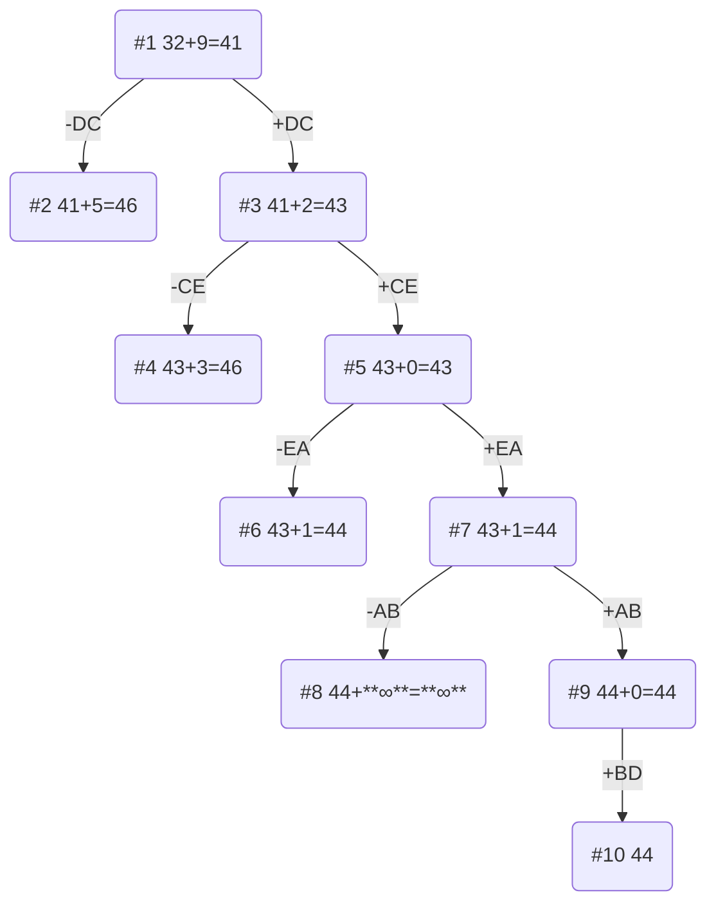

# Задание №12. Команда Second.
### Постановка задачи:
Имеется N городов, связанных дорогами. Расстояния между городами известны. Коммивояжер (бродячий торговец) должен выйти из первого города, посетить по одному разу в некотором порядке города 2,3..n и вернуться в первый город. В каком порядке следует посещать города, чтобы замкнутый путь коммивояжера имел кратчайшее расстояние?

### Вариант 9:

Матрица расстояний:

|       | **A** | **B** | **C** | **D** | **E** |
|-------|:-----:|:-----:|:-----:|:-----:|:-----:|
| **A** | **∞** |   9   |  14   |   6   |  14   |
| **B** |   8   | **∞** |  12   |   5   |  13   |
| **C** |  10   |  13   | **∞** |   8   |  13   |
| **D** |   6   |   8   |   8   | **∞** |  11   |
| **E** |   9   |   9   |  14   |   7   | **∞** |

## Этап 1: Проведем редукцию строк матрицы

|       | **A** | **B** | **C** | **D** | **E** | Min |
|-------|:-----:|:-----:|:-----:|:-----:|:-----:|:---:|
| **A** | **∞** |   9   |  14   |   6   |  14   | 6   |
| **B** |   8   | **∞** |  12   |   5   |  13   | 5   |
| **C** |  10   |  13   | **∞** |   8   |  13   | 8   |
| **D** |   6   |   8   |   8   | **∞** |  11   | 6   |
| **E** |   9   |   9   |  14   |   7   | **∞** | 7   |
| Sum   |       |       |       |       |       | 32  |

Сумма констант редукции по строкам 32.

Марица после редукции строк:

|       | **A** | **B** | **C** | **D** | **E** |
|-------|:-----:|:-----:|:-----:|:-----:|:-----:|
| **A** | **∞** |   3   |   8   |   0   |   8   |
| **B** |   3   | **∞** |   7   |   0   |   8   |
| **C** |   2   |   5   | **∞** |   0   |   5   |
| **D** |   0   |   2   |   2   | **∞** |   5   |
| **E** |   2   |   2   |   7   |   0   | **∞** |

## Этап 2: Проведем редукцию столбцов матрицы

|       | **A** | **B** | **C** | **D** | **E** | Sum |  
|-------|:-----:|:-----:|:-----:|:-----:|:-----:|:---:|
| **A** | **∞** |   3   |   8   |   0   |   8   |     |
| **B** |   3   | **∞** |   7   |   0   |   8   |     |
| **C** |   2   |   5   | **∞** |   0   |   5   |     |
| **D** |   0   |   2   |   2   | **∞** |   5   |     |
| **E** |   2   |   2   |   7   |   0   | **∞** |     |
| Min   |   0   |   2   |   2   |   0   |   5   |  9  |

Сумма констант редукции по столбцам 9.

Марица после редукции столбцов:

|       | **A** | **B** | **C** | **D** | **E** |  
|-------|:-----:|:-----:|:-----:|:-----:|:-----:|
| **A** | **∞** |   1   |   6   |   0   |   3   |
| **B** |   3   | **∞** |   5   |   0   |   3   |
| **C** |   2   |   3   | **∞** |   0   |   0   |
| **D** |   0   |   0   |   0   | **∞** |   0   |
| **E** |   2   |   0   |   5   |   0   | **∞** |

## Этап 3: Оценка длины маршрута

Оценка длины маршрута снизу соответствует сумме констант редукции по строкам и по столбцам: 32 + 9 = 41.

## Этап 4: Найдем решение задачи с использованием метода ветвей и границ

Чтобы определить ребро, по которому будет произведено ветвление из корневого узла рассчитаем штрафы для ребер с нулевой оценкой:

|        | **Штраф** |
|:-------|:---------:|
| **AD** |     1     |
| **BD** |     3     |
| **CD** |     0     |
| **CE** |     0     |
| **DA** |     2     |
| **DB** |     0     |
| **DC** |     5     |
| **DE** |     0     |
| **EB** |     0     |
| **ED** |     0     |

Максимальный штраф 5, выберем ребро DC, как одно из ребер с максимальным штрафом.

#### Узел №2
Узел №2 с исключением ребра DC имеет оценку 41 + 5 (штраф) = 46.

#### Узел №3
Для получения оценки узла №3 необходимо рассчитать сумму констант редукции для матрицы с учетом включения ребра DC, для этого в матрице:
- удалим строку D,
- удалим столбец C,
- Заменим на бесконечность значение CD.

Проведем редукцию матрицы по строкам:

|       | **A** | **B** | **D** | **E** | Min |  
|-------|:-----:|:-----:|:-----:|:-----:|-----|
| **A** | **∞** |   1   |   0   |   3   |  0  |
| **B** |   3   | **∞** |   0   |   3   |  0  |
| **C** |   2   |   3   | **∞** |   0   |  0  |
| **E** |   2   |   0   |   0   | **∞** |  0  |
| Sum   |       |       |       |       |  0  |

Матрица после редукции:

|       | **A** | **B** | **D** | **E** |  
|-------|:-----:|:-----:|:-----:|:-----:|
| **A** | **∞** |   1   |   0   |   3   |
| **B** |   3   | **∞** |   0   |   3   |
| **C** |   2   |   3   | **∞** |   0   |
| **E** |   2   |   0   |   0   | **∞** |

Проведем редукцию матрицы по столбцам:

|       | **A** | **B** | **D** | **E** | Sum |  
|-------|:-----:|:-----:|:-----:|:-----:|-----|
| **A** | **∞** |   1   |   0   |   3   |     |
| **B** |   3   | **∞** |   0   |   3   |     |
| **C** |   2   |   3   | **∞** |   0   |     |
| **E** |   2   |   0   |   0   | **∞** |     |
| Min   |   2   |   0   |   0   |   0   |  2  |

Матрица после редукции:

|       | **A** | **B** | **D** | **E** |  
|-------|:-----:|:-----:|:-----:|:-----:|
| **A** | **∞** |   1   |   0   |   3   |
| **B** |   1   | **∞** |   0   |   3   |
| **C** |   0   |   3   | **∞** |   0   |
| **E** |   0   |   0   |   0   | **∞** |

Сумма констант редукции 2.

Оценка узла №3 = 41 + 2 (редукция) = 43.

Продолжим поиск из узла №3.

#### Выбор ребра
Чтобы определить ребро, по которому будет произведено ветвление из узла №3 рассчитаем штрафы для ребер с нулевой оценкой:

|        | **Штраф** |
|:-------|:---------:|
| **AD** |     1     |
| **BD** |     1     |
| **CA** |     0     |
| **CE** |     3     |
| **EA** |     0     |
| **EB** |     1     |
| **ED** |     0     |

Максимальный штраф 3, выберем ребро CE, как ребро с максимальным штрафом.

#### Узел №4
Узел №4 с исключением ребра CE имеет оценку 43 + 3 (штраф) = 46.

#### Узел №5
Для получения оценки узла №5 необходимо рассчитать сумму констант редукции для матрицы с учетом включения ребра CE, для этого в матрице:
- удалим строку C,
- удалим столбец E,
- Заменим на бесконечность значение ED, чтобы цикл не замкнулся, не обойдя все вершины. 

|       | **A** | **B** | **D** |
|-------|:-----:|:-----:|:-----:|
| **A** | **∞** |   1   |   0   |
| **B** |   1   | **∞** |   0   |
| **E** |   0   |   0   | **∞** |

Редукция матрицы не требуется, так как в каждом столбце и каждой строке есть хотя бы один ноль.

Сумма констант редукции 0.

Оценка узла №5 = 43 + 0 (редукция) = 43.

Продолжим поиск из узла №5.

#### Выбор ребра
Чтобы определить ребро, по которому будет произведено ветвление из узла №5 рассчитаем штрафы для ребер с нулевой оценкой:

|        | **Штраф** |
|:-------|:---------:|
| **AD** |     1     |
| **BD** |     1     |
| **EA** |     1     |
| **EB** |     1     |

Максимальный штраф 1, выберем ребро EA, как ребро с максимальным штрафом.

#### Узел №6
Узел №6 с исключением ребра EA имеет оценку 43 + 1 (штраф) = 44.

#### Узел №7
Для получения оценки узла №7 необходимо рассчитать сумму констант редукции для матрицы с учетом включения ребра EA, для этого в матрице:
- удалим строку E,
- удалим столбец A,
- Заменим на бесконечность значение AD, чтобы цикл не замкнулся, не обойдя все вершины. 

Проведем редукцию матрицы по строкам:

|       | **B** | **D** | Min |
|-------|:-----:|:-----:|-----|
| **A** |   1   | **∞** |  1  |
| **B** | **∞** |   0   |  0  |
| Sum   |       |       |  1  |       

Матрица после редукции:

|       | **B** | **D** |
|-------|:-----:|:-----:|
| **A** |   0   | **∞** |
| **B** | **∞** |   0   |

Проведем редукцию матрицы по столбцам:

|       | **B** | **D** | Sum |
|-------|:-----:|:-----:|-----|
| **A** |   0   | **∞** |     |
| **B** | **∞** |   0   |     |
|  Min  |   0   |   0   |  0  | 

Матрица после редукции:

|       | **B** | **D** |
|-------|:-----:|:-----:|
| **A** |   0   | **∞** |
| **B** | **∞** |   0   |

Сумма констант редукции 1.

Оценка узла №7 = 43 + 1 (редукция) = 44.

Продолжим поиск из узла №7.

#### Выбор ребра
Чтобы определить ребро, по которому будет произведено ветвление из узла №7 рассчитаем штрафы для ребер с нулевой оценкой:

|        | **Штраф** |
|:-------|:---------:|
| **AB** |   **∞**   |
| **BD** |   **∞**   |

Максимальный штраф **∞**, выберем ребро AB, как ребро с максимальным штрафом.

#### Узел №8
Узел №8 с исключением ребра AB имеет оценку 44 + **∞** (штраф) = **∞**.

#### Узел №9
Для получения оценки узла №9 необходимо рассчитать сумму констант редукции для матрицы с учетом включения ребра AB, для этого в матрице:
- удалим строку A,
- удалим столбец B.

|       | **D** |
|-------|:-----:| 
| **B** |   0   | 

Редукция матрицы не требуется, так как в каждом столбце и каждой строке есть хотя бы один ноль.

Сумма констант редукции 0.

Оценка узла №9 = 44 + 0 (редукция) = 44.

Продолжим поиск из узла №9.

#### Выбор ребра
Альтернатив у ребра BD нет.

#### Узел №10
Ребро BD включается в маршрут, длина которого составляет 44.

### Ответ
- Кратчайший маршрут DCEABD.
- Длина маршрута 44.