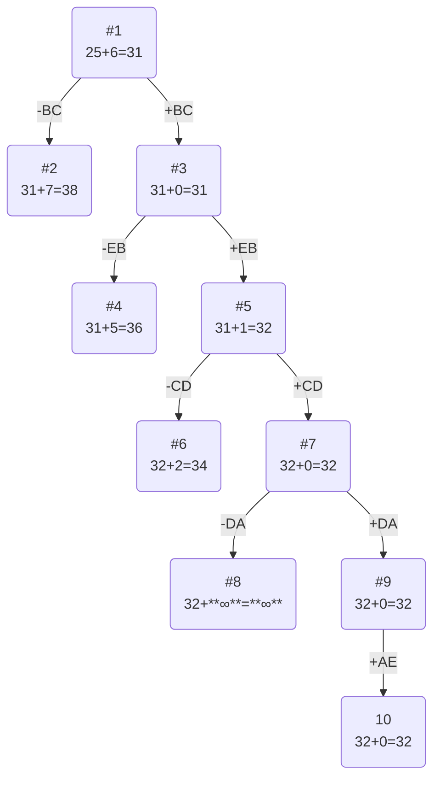

# Задание №12
# Задача о коммивояжера. Метод ветвей и границ. Вариант 1.
## Условия задачи
Матрица расстояний:

|       | **A** | **B** | **C** | **D** | **E** |
|:------|:-----:|:-----:|:-----:|:-----:|:-----:|
| **A** | **∞** |  15   |   10  |   6   |   5   |
| **B** |  13   | **∞** |   5   |  15   |   14  |
| **C** |  13   |   6   | **∞** |   5   |   15  |
| **D** |  12   |   10  |   12  | **∞** |   5   |
| **E** |  11   |   5   |  11   |  15   | **∞** |

## Решение
### 1. Проведем редукцию строк матрицы

|       | **A** | **B** | **C** | **D** | **E** | Min   |
|:------|:-----:|:-----:|:-----:|:-----:|:-----:|:-----:|
| **A** | **∞** |  15   |   10  |   6   |   5   |   5   |
| **B** |  13   | **∞** |   5   |  15   |   14  |   5   |
| **C** |  13   |   6   | **∞** |   5   |   15  |   5   |
| **D** |  12   |   10  |   12  | **∞** |   5   |   5   |
| **E** |  11   |   5   |  11   |  15   | **∞** |   5   |

Сумма констант редукции по строкам: 5+5+5+5+5=25

Матрица после редукции строк:
|       | **A** | **B** | **C** | **D** | **E** |
|:------|:-----:|:-----:|:-----:|:-----:|:-----:|
| **A** | **∞** |  10   |   5   |   1   |   0   |
| **B** |  8    | **∞** |   0   |  10   |   9   |
| **C** |  8    |   1   | **∞** |   0   |   10  |
| **D** |  7    |   5   |   7   | **∞** |   0   |
| **E** |  6    |   0   |  6    |  10   | **∞** |

### 2. Проведем редукцию столбцов матрицы
|       | **A** | **B** | **C** | **D** | **E** |
|:------|:-----:|:-----:|:-----:|:-----:|:-----:|
| **A** | **∞** |  10   |   5   |   1   |   0   |
| **B** |  8    | **∞** |   0   |  10   |   9   |
| **C** |  8    |   1   | **∞** |   0   |   10  |
| **D** |  7    |   5   |   7   | **∞** |   0   |
| **E** |  6    |   0   |  6    |  10   | **∞** |
|Min    |  6    |       |       |       |       |

Сумма констант редукции по столбцам: 6

Матрица после редукции столбцов:
|       | **A** | **B** | **C** | **D** | **E** |
|:------|:-----:|:-----:|:-----:|:-----:|:-----:|
| **A** | **∞** |  10   |   5   |   1   |   0   |
| **B** |  2    | **∞** |   0   |  10   |   9   |
| **C** |  2    |   1   | **∞** |   0   |   10  |
| **D** |  1    |   5   |   7   | **∞** |   0   |
| **E** |  0    |   0   |   6   |  10   | **∞** |

### 3. Оценка длины маршрута

Оценка длины маршрута снизу соответствует сумме констант редукции по строкам и по столбцам

25 + 6 = 31

### 4. Найдем решение задачи с использованием метода ветвей и границ

Чтобы определить ребро, по которому будет произведено ветвление из корневого узла рассчитаем штрафы для ребер с нулевой оценкой:

|        | **Штраф** |
|:-------|:---------:|
| **AE** |  1+0=1    |
| **BC** |  2+5=7    |
| **CD** |  1+1=2    |
| **DE** |  1+0=1    |
| **EA** |  0+1=1    |
| **EB** |  0+1=1    |

Максимальный штраф 7, выберем ребро BС, как ребро с максимальным штрафом.

#### Узел №2
Узел №2 с исключением ребра BC имеет оценку 31 + 7 (штраф) = 38

#### Узел №3
Для получения оценки узла 3 необходимо рассчитать сумму констант редукции для матрицы с учетом включения ребра CB, для этого в матрице:
- удалим строку B,
- удалим столбец C,
- Заменим на бесконечность значение CB.

|       | **A** | **B** | **D** | **E** |
|:------|:-----:|:-----:|:-----:|:-----:|
| **A** | **∞** |  10   |   1   |   0   |
| **C** |  2    | **∞** |   0   |   10  |
| **D** |  1    |   5   | **∞** |   0   |
| **E** |  0    |   0   |  10   | **∞** |

Сумма констант редукции 0

Оценка узла №3 = 31 + 0 (редукция) = 31

#### Выбор ребра
Чтобы определить ребро, по которому будет произведено ветвление из узла 3 рассчитаем штрафы для ребер с нулевой оценкой:

|        | **Штраф** |
|:-------|:---------:|
| **AE** |  1+0=1    |
| **CD** |  2+1=3    |
| **DE** |  1+0=1    |
| **EA** |  0+1=1    |
| **EB** |  0+5=5    |

Максимальный штраф 5, выберем ребро EB, как ребро с максимальным штрафом.

#### Узел №4
Узел №4 с исключением ребра EB имеет оценку 31 + 5 (штраф) = 36

#### Узел №5
Для получения оценки узла 5 необходимо рассчитать сумму констант редукции для матрицы с учетом включения ребра BE, для этого в матрице:
- удалим строку E,
- удалим столбец B,
- Заменим на бесконечность значение CE.

|       | **A** | **D** | **E** |
|:------|:-----:|:-----:|:-----:|
| **A** | **∞** |   1   |   0   |
| **C** |  2    |   0   | **∞** |
| **D** |  1    | **∞** |   0   |

Редукция

|       | **A** | **D** | **E** |
|:------|:-----:|:-----:|:-----:|
| **A** | **∞** |   1   |   0   |
| **C** |  2    |   0   | **∞** |
| **D** |  1    | **∞** |   0   |
|Min    |  1    |       |       |

|       | **A** | **D** | **E** |
|:------|:-----:|:-----:|:-----:|
| **A** | **∞** |   1   |   0   |
| **C** |  1    |   0   | **∞** |
| **D** |  0    | **∞** |   0   |

Сумма констант редукции 1

Оценка узла №5 = 31 + 1 (редукция) = 32

#### Выбор ребра
Чтобы определить ребро, по которому будет произведено ветвление из узла 3 рассчитаем штрафы для ребер с нулевой оценкой:

|        | **Штраф** |
|:-------|:---------:|
| **AE** |  1+0=1    |
| **CD** |  1+1=2    |
| **DE** |  1+0=1    |
| **EA** |  0+0=0    |

Максимальный штраф 2, выберем ребро CD, как ребро с максимальным штрафом.

#### Узел №6
Узел №6 с исключением ребра CD имеет оценку 32 + 2 (штраф) = 34

#### Узел №7
Для получения оценки узла 7 необходимо рассчитать сумму констант редукции для матрицы с учетом включения ребра EA, для этого в матрице:
- удалим строку C,
- удалим столбец D,
- Заменим на бесконечность значение DE.

|       | **A** | **E** |
|:------|:-----:|:-----:|
| **A** | **∞** |   0   |
| **D** |  0    | **∞** |

Сумма констант редукции 0

Оценка узла №7 = 32 + 0 (редукция) = 32

#### Выбор ребра
Чтобы определить ребро, по которому будет произведено ветвление из узла 3 рассчитаем штрафы для ребер с нулевой оценкой:

|        | **Штраф** |
|:-------|:---------:|
| **AE** |   **∞**   |
| **EA** |   **∞**   |

#### Узел №8
Узел №8 с исключением ребра DA имеет оценку 32 + **∞** (штраф) = **∞**

#### Узел №9
Для получения оценки узла 9 необходимо рассчитать сумму констант редукции для матрицы с учетом включения ребра AD, для этого в матрице:
- удалим строку D,
- удалим столбец A

|       | **E** |
|:------|:-----:|
| **A** |   0   |

Сумма констант редукции 0

Оценка узла №9 = 32 + 0 (редукция) = 32

Продолжим поиск из узла 9

#### Выбор ребра
Альтернатив у ребра AE нет

#### Узел №10
Ребро AE включается в маршрут, длина которого составляет 32

### Ответ
- Кратчайший маршрут EBCDAE.
- Длина маршрута 32.
