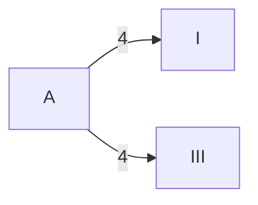
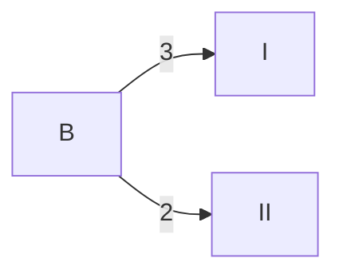
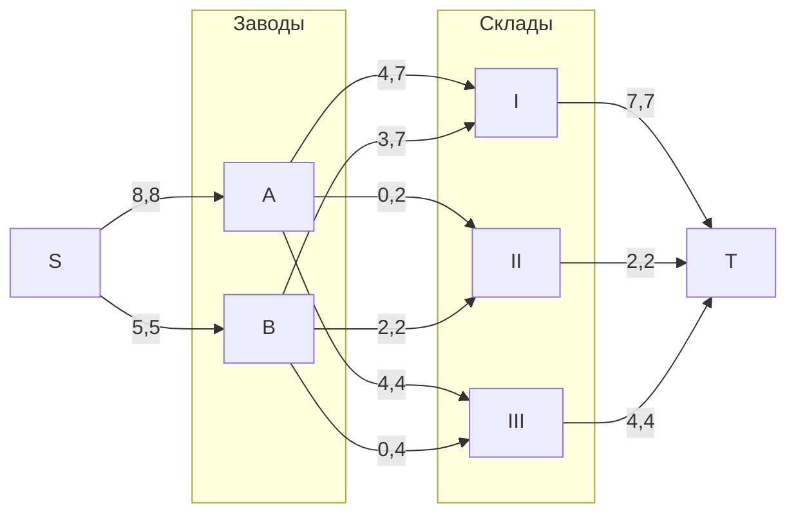
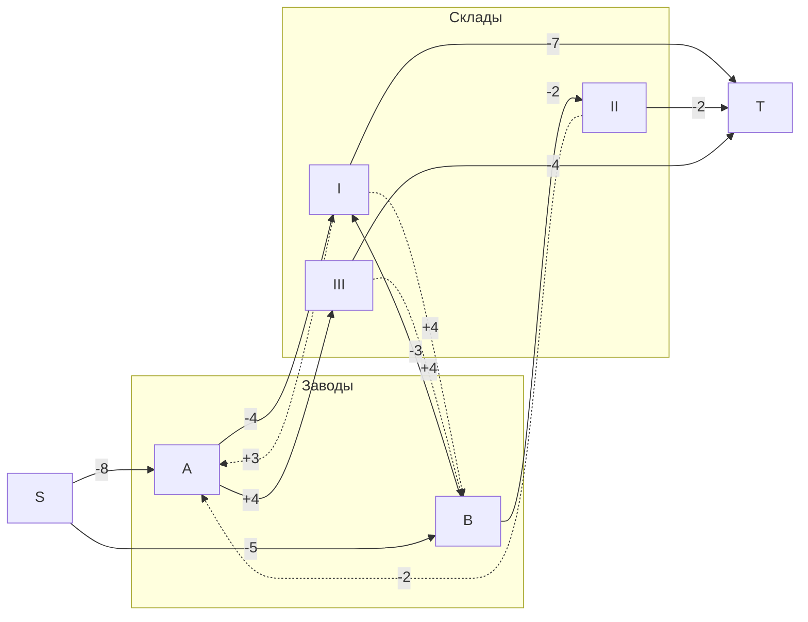
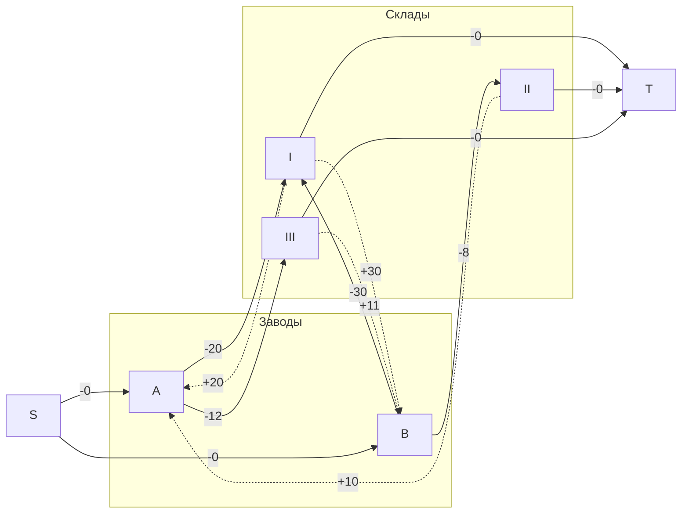
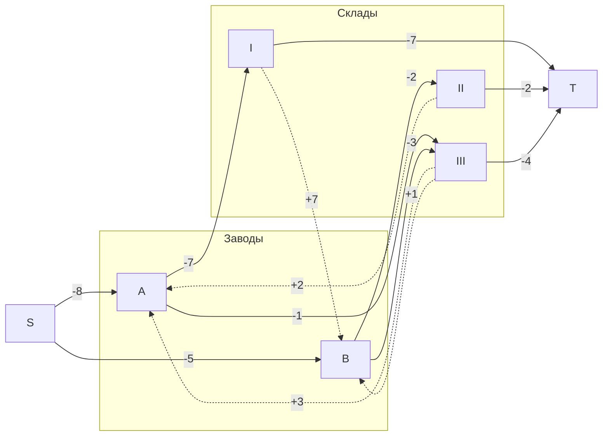
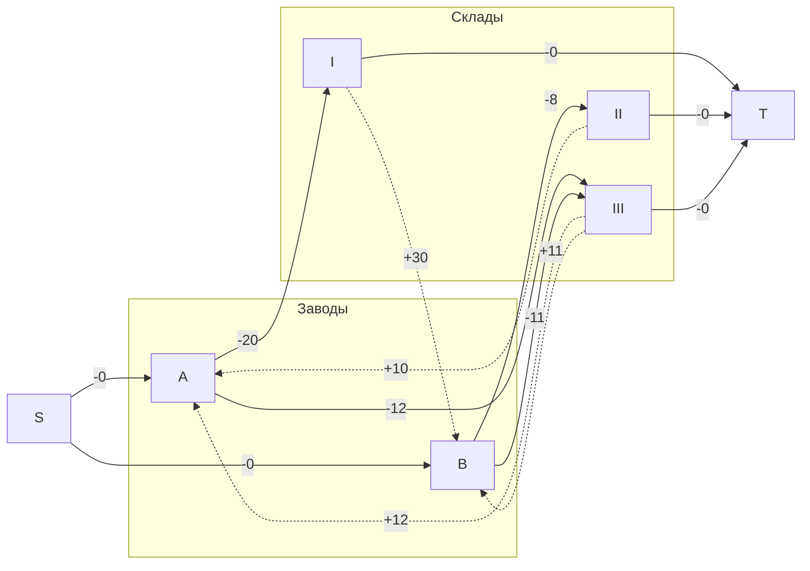

# Задание 14
## Вариант 9:
Транспортная задача

Два завода имеют производительность 8 и 5, а три складских помещения имеют вместимость 7, 2 и 4. Матрица затрат на перевозку одной единицы товара (строки – это заводы, столбцы – это склады) имеет вид:

$$
 \begin{pmatrix}    
  20 & 10 & 12 \\ 
  30 & 8 & 11 \\ 
 \end{pmatrix}    
$$

Требуется:
1. Найти стоимость перевозки с первого завода на первый склад 4 единиц товара на третий склад 4 единицы, со второго завода на первый склад 3 единицы товара, на второй склад 2 единиц товара;
2. Используя алгоритм поиска максимального потока минимальной стоимости, скорректировать указанный выше вариант перевозки товаров, так чтобы объём перевозимых товаров не изменился, а стоимость их перевозки стала минимальной.

## Решение:
Затраты на доставку:
|     |**1**|**2**|**3**|
|:---:|:---:|:---:|:---:|
|**A**|  20 |  10 |  12 |
|**B**|  30 |  8  |  11 |

### Шаг 1
Допустим, что с завода A на 1 и 3 склад отправим по 4 единицы товара, а со завода B на 1 склад 3 единицы товара, на 2 - 2:

Стоимость перевозки будет 4 * 20 + 4 * 12 + 3 * 30 + 2 * 8 = 234

### Шаг 2
#### Нарисуем полный двудольный граф (в левой доле заводы, в правой - склады):
На ребрах графа два числа: первое число - величина потока, второе - пропускная способность.

Максимальная величина потока - 13.

#### Построим остатончную сеть:
Ребра остаточной сети подписаны либо величиной потока (сплошная линия), либо оставшейся пропускной способностью (пунктир).

#### Построим остаточную сеть с стоимостями:
Теперь на ребрах напишем стоимость транспортировки между заводами и складами (ребра из завода в склад подпишем отрицательными числами, из склада в завод - положительными).
В остаточной сети попробуем найти цикл отрицательной стоимости.

В остаточной сети найден цикл отрицательной стоимости:
B -> I -> A -> III -> B (стоимость - -11)
Минимальный вес ребра в цикле - 3.

#### Скорректируем остаточную сеть путем уменьшения весов ребер цикла на 3.

#### Построим новую остаточную сеть со стоимостями:
В остаточной сети попробуем найти цикл отрицательной стоимости.

В остаточной сети не найдено циклов с отрицательной стоимостью.

#### Отразим изменения на исходном графе:

### Вывод
Новая стратегия: с завода А отправляется 7 ед. на 1 склад и 1 ед. на 3, с завода В отправляется 2 ед. на 2 склад и 3 ед. на 3 склад. Величина потока - 13. Минимальная пропускная способность на путях - 2.
Стоимость перевозки, согласно новой стратегии вычисляется, как:  7 * 20 + 1 * 12 + 2 * 8 + 3 * 11 = 201