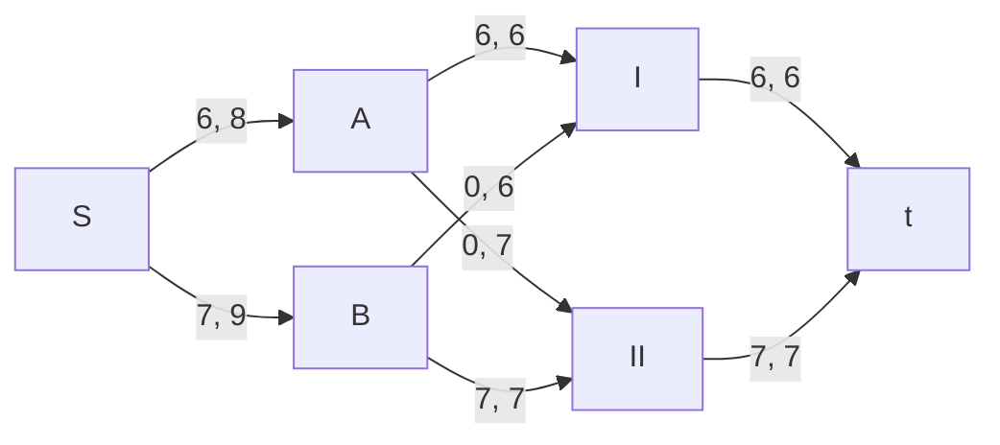
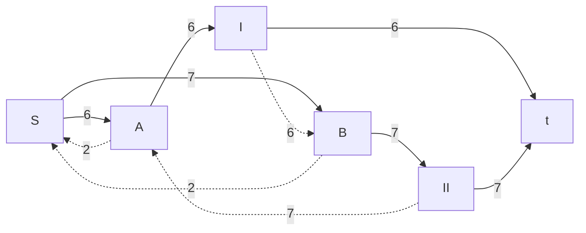
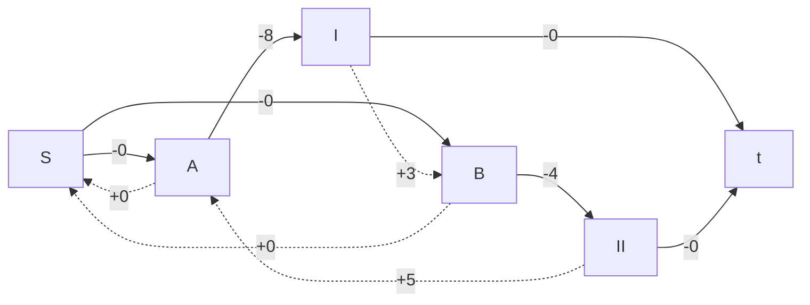
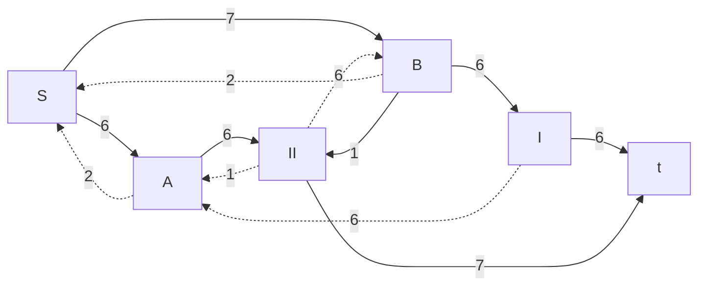
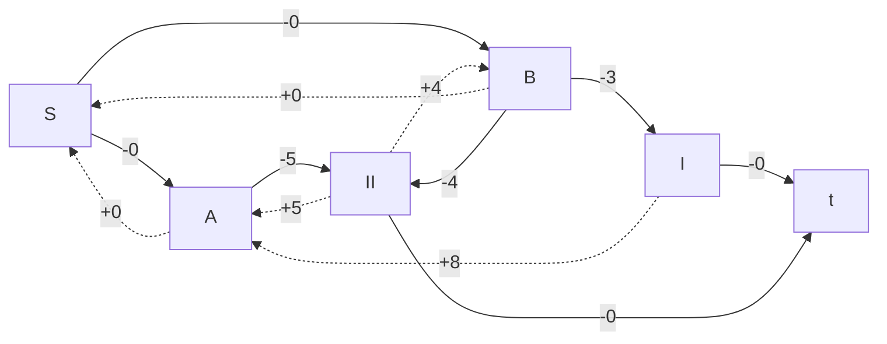
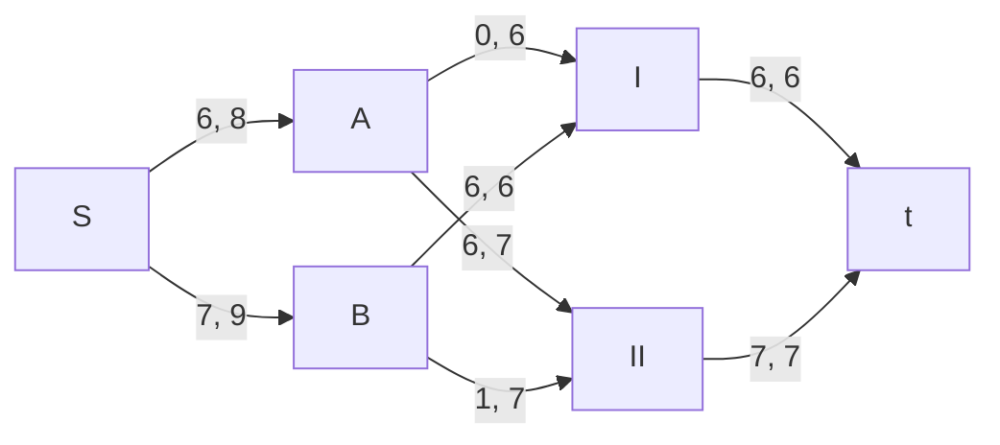

# Задание №14
# Транспортная задача (Максимальный поток минимальной стоимости). Вариант 5.
## Условиe задачи
Два завода имеют производительность 8 и 9, а два складских помещения имеют вместимость 6 и 7. Матрица затрат на перевозку одной единицы товара (строки – это заводы, столбцы – это склады) имеет вид:

$$
 \begin{pmatrix}    
  8 & 5 \\ 
  3 & 4 \\ 
 \end{pmatrix}    
$$

Требуется:
1. Найти стоимость перевозки с первого завода на первый склад 6 единиц товара, а со второго завода на второй склад 7 единиц товара;
2. Используя алгоритм поиска максимального потока минимальной стоимости, скорректировать указанный выше вариант перевозки товаров, так чтобы объём перевозимых товаров не изменился, а стоимость их перевозки стала минимальной.
## Решение
### Задача 1.
Затраты на перевозку одного товара с первого завода на первый склад – **8**. Затраты на перевозку одного товара со второго завода на второй склад – **4**.

Перемножаем затраты на количество (согласно номеру завода) товаров:

$$8 × 6 + 7 × 4 = 76$$

**64** – ответ на первую задачу.
### Задача 2.
Построим транспортную сеть. Добавим исток S и сток t, где оба стока будут вспосогательными, для того, чтобы транспортная сеть просто существовала.

Обозначим завод 1 – буквой A, завод 2 – буквой B; склад 1 – I, склад 2 – II. Воспользуяюсь условием задания и задачей №1, построим транспортную сеть и укажем локальные потоки и пропускнуе способности дуг.

Завод A имеет производительность **8**, завод B имеет производительность **9**, склад I имеет вместимость **6**, склад II имеет вместимость **7**.

#### Строим остаточную сеть

Для каждого ребра остаточной сети укажем стоимость транспортировки единицы потока.

В остаточной сети найден ориентированный цикл отрицательной стоимости A -> I -> B -> II -> A (-8 +3 -4 + 5 = -4)

Найдем минимальный вес ребра в указанном цикле, изображенном **в остаточной сети с указанием величины потока**.

Минимальный вес ребра в цикле – 6 – это неиспользованный резерв ребра I -> B и задействованный поток A -> I.

Удалим найденный цикл - уменьшим на 6 вес всех ребер, входящих в цикл.

Скорректируем остаточную сеть с указанием стоимости транспортировки единицы потока.

В остаточной сети отсутствуют циклы отрицательной стоимости, следовательно, стоимость потока минимальна.

Посчитаем текущую стоимость:
A -> II: идет 6 ед. товара, по стоимости 6 * 5 = 30.
B -> I: идет 6 ед. товара, по стоимости 6 * 3 = 18.
B -> II: идет 1 ед. товара, по стоимости 1 * 4 = 4.

Сумма: 30 + 18 + 4 = 52.

**52** – ответ на задачу №2.

## Ответ
1. Стоимость без корректировки – 76
2. Стоимость после корректирвоки – 52. Отправиляем 6 ед. товара A -> II; 6 ед. товара B -> I; 1 ед. товара B -> II.