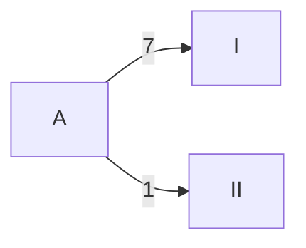
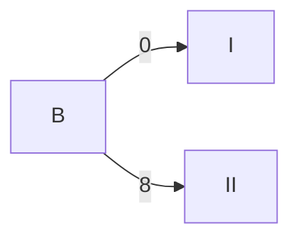
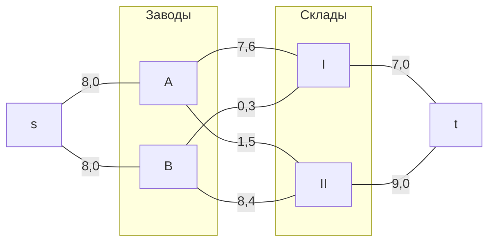
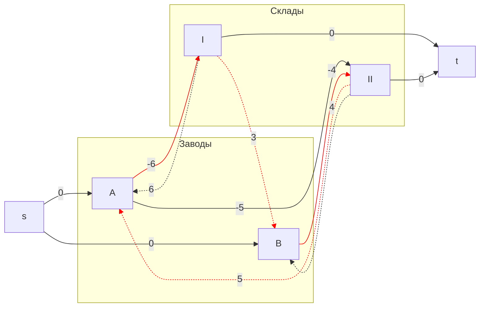
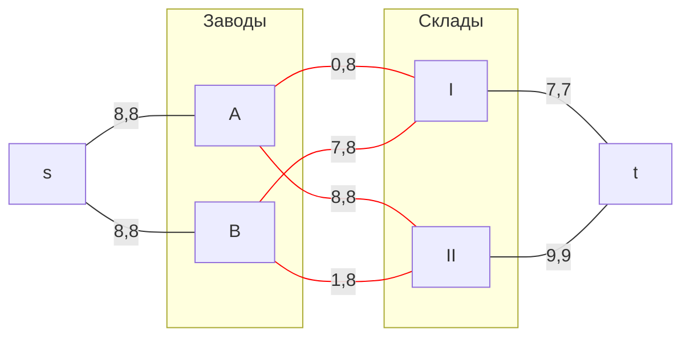
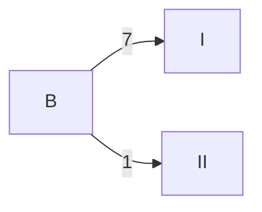

## Транспортная задача. Решение с использованием алгоритма поиска максимального потока минимальной стоимости.
### Вариант 10:

Два завода имеют производительность 8 и 8, а два складских помещения имеют вместимость 7 и 9. Матрица затрат на перевозку одной единицы товара (строки – это заводы, столбцы – это склады) имеет вид:

$$
 \begin{pmatrix}    
  6 & 5 \\ 
  3 & 4 \\ 
 \end{pmatrix}    
$$

Требуется:
1. Найти стоимость перевозки с первого завода на первый склад 7 единиц товара, на второй склад 1 единицы, а со второго завода на второй склад 8 единиц товара;
2. Используя алгоритм поиска максимального потока минимальной стоимости, скорректировать указанный выше вариант перевозки товаров, так чтобы объём перевозимых товаров не изменился, а стоимость их перевозки стала минимальной.
   
| Заводы/Cклады    |  I  |  II  | 
|:-------------|:---:|:---:|
| **A** |  6 |  5 |
| **B** |  3 |  4 |

### Шаг 1. 
Допустим, что с первого завода на первый склад 7 единиц товара и 1 на второй, а со второго завода на второй склад 8 единиц товара:

Стоимость перевозки при данном распределении равна **S**= (7 * 6) + (1 * 5) + (8 * 4) = **79** 

### Шаг 2.
Используем алгоритм поиска максимального потока минимальной стоимости.
1) Нарисуем полный двудольный граф, в левой доле которого 2 вершины (заводы A и B), а в правой - 2 вершины (слады I и II).

Добавим локальные потоки и стоимости за единицу товара по этому потоку.

Добавим источник **s**, сток **t**, а также по дуге из s к каждому заводу и по дуге от каждого склада до t. Стоимость этих дуг равна 0.

Максимальная величина потоков в сети **F=16**.

2) Построим остаточную сеть

Для каждого ребра остаточной сети укажем стоимость транспортировки единицы потока. Они отрицательны у всех дуг, направленных из левой доли в правую, и положительные для всех обратных дуг.

В построенной остаточной сети найден цикл отрицательной стоимости:

Также обозначим веса ребер:

Минимальный вес в цикле равен **7**. 

3) Удалим найденный цикл, уменьшив на **7** вес всех ребер, входящих в цикл.

После снижения на 7 всех весов в цикле, удалим ребро A -> II, добавим дугу B -> I

Стоимость нового потока равна:
**S** = (7 * 3) + (1 * 4) + (8 * 5) = **65** 

### Ответ: 
Оптимальный вариант доставки продукции:

Затраты при таком способе распределения минимальны и составляют **65** (у.е.).
