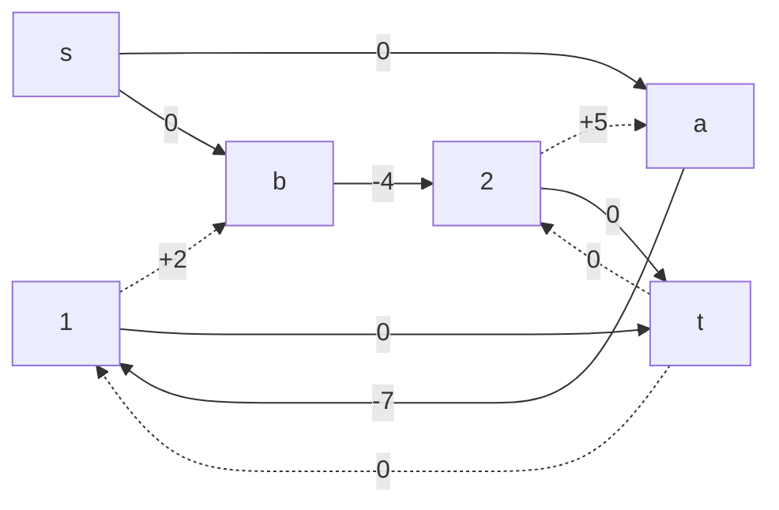
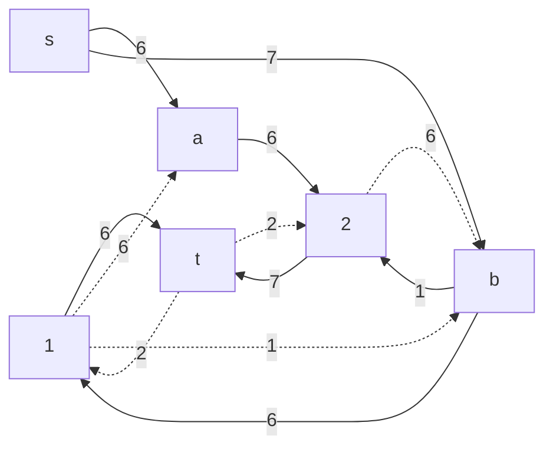
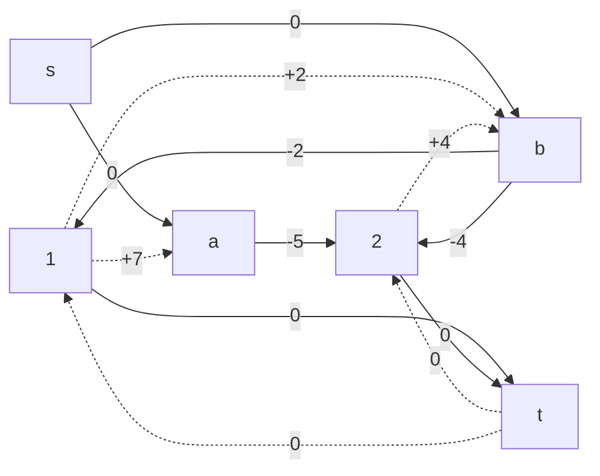
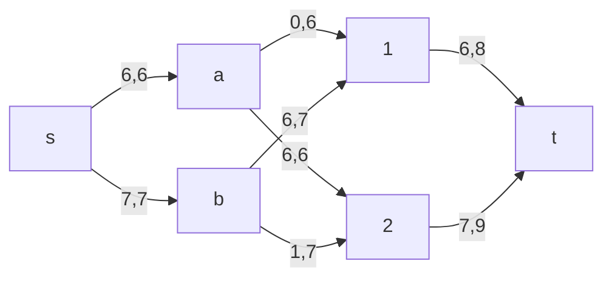

# Задание №14. Вариант №8
# Транспортная задача

Условие:

Два завода имеют производительность 6 и 7, а два складских помещения имеют вместимость 8 и 9. Матрица затрат на перевозку одной единицы товара (строки – это заводы, столбцы – это склады) имеет вид:

$$
 \begin{pmatrix}    
  7 & 5 \\ 
  2 & 4 \\ 
 \end{pmatrix}    
$$

Требуется:

1. Найти стоимость перевозки с первого завода на первый склад 6 единиц товара, а со второго завода на второй склад 7 единиц товара;
2. Используя алгоритм поиска максимального потока минимальной стоимости, скорректировать указанный выше вариант перевозки товаров, так чтобы объём перевозимых товаров не изменился, а стоимость их перевозки стала минимальной

Завод 1 (А): производительность 6 единиц

Завод 2 (В): производительность 7 единиц

Склад 1: вместимость 8 едини

Склад 2: вместимость 9 единиц

| Завод/ Склад     | 1  | 2  | 
|:-----------------|:--:|:--:|
| А                | 7  | 5  | 
| В                | 2  | 4  |

### 1. Посчитаем исходную стоимость перевозки и объем: 

A -> 1   => 6*7 = 42

B -> 2   => 7*4 = 28

Исходная стоимость перевозки: 42 + 28 = 70

Объем: 6 + 7 = 13

Алгоритм поиска максимального потока минимальной стоимости можно использовать для решения транспортной задачи. Для этого необходимо провести следующие преобразования:

1. Представление поставщиков и потребителей в виде вершин графа.

2. Добавление вспомогательного источника и стока для моделирования поставок и спроса.

3. Определение пропускных способностей рёбер как ограничений на перевозки.

4. Использование стоимости перевозки $C_{ij}$ как весов рёбер для поиска отрицательных циклов, чтобы найти максимальный поток с минимальной стоимостью.

### 2. Построим сеть с источником **s**, стоком **t** и указанными пропускными способностями дуг для поиска максимального потока.

Скорректируем соответствующим образом локальные потоки. 

Первым числом укажем локальный поток, вторым - пропускную способность дуги.

Из истока S: Завод A может отправить максимум 6, завод B может отправить максимум 7. 

В сток t: склад 1 может принять 8, склад 2 принимает только 9.

Стоимость перевозки с первого завода на первый склад 6 единиц товара, а со второго завода на второй склад 7 единиц товара.

Теперь построим граф с ребрами стоимостью перевозки товара:

Ребра SA, SB, 1t, 2t имеют стоимость = 0, так как это вспомогательные ребра.

В графе найдем цикл отрицательной стоимости, чтобы найти максимальный поток с минимальной стоимостью.
Найден цикл: B -> 2 -> A -> 1 (-4 +5 -7 +2 = -4). Минимальный вес на этом пути = 6.
Вычтем минимальный вес из ребер.

Получаем остаточную сеть:

Построим граф с стоимостью ребер:

Продолжим поиск отрицательного цикла.

Цикл отрицательной стоимости не найден => план перевозки товара для минимализации стоимости скорректирован.

Остаточная сеть:

Завод А - склад 2 (6 ед.)

Завод В - склад 1 (6 ед.)

Завод В - склад 2 (1 ед.)

### 3. Посчитаем новую стоимость транспортировки товара

6*5 = 30 (А -> 2)

6*2 = 12 (B -> 1)

1*4 = 4 (B -> 2)

30 + 12 + 4 = 46

### Ответ:

Исходная стоимость перевозки товара = 70

Исходный объем = 13

Минимальная стоимость перевозки после корректировки = 46

Объем = 13
