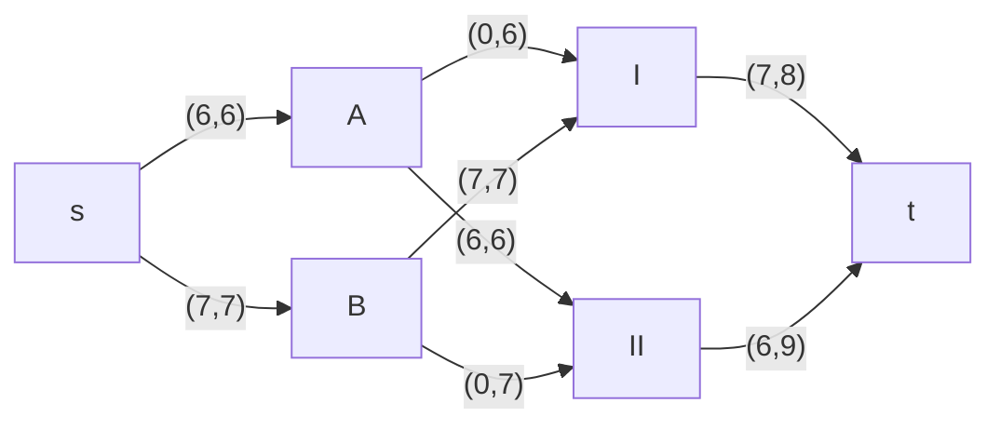
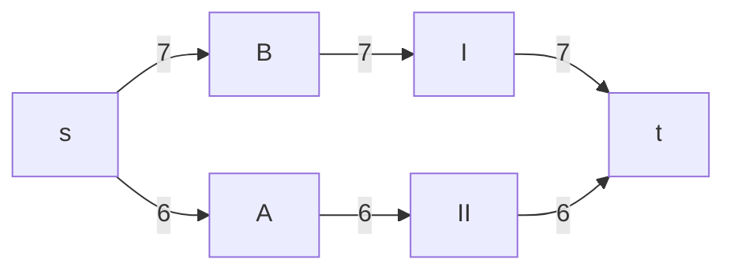
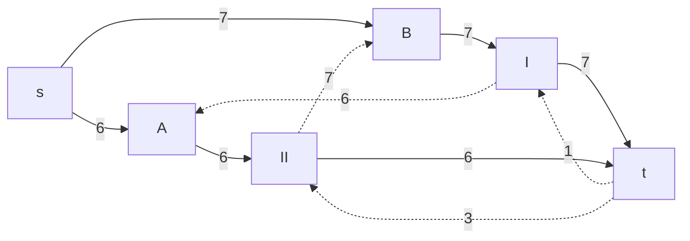
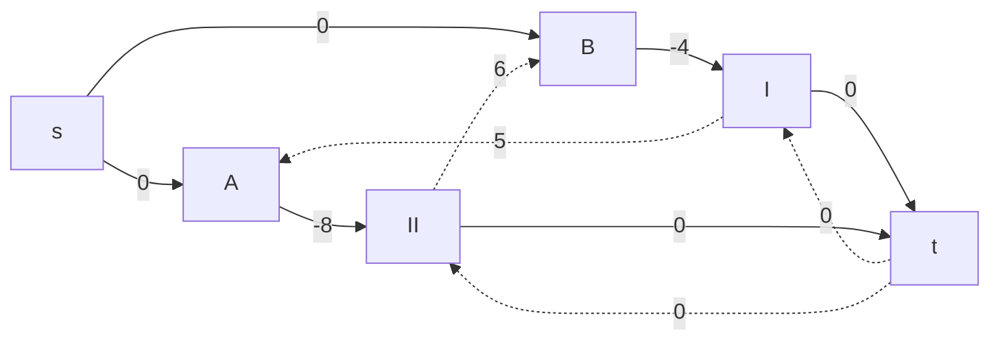
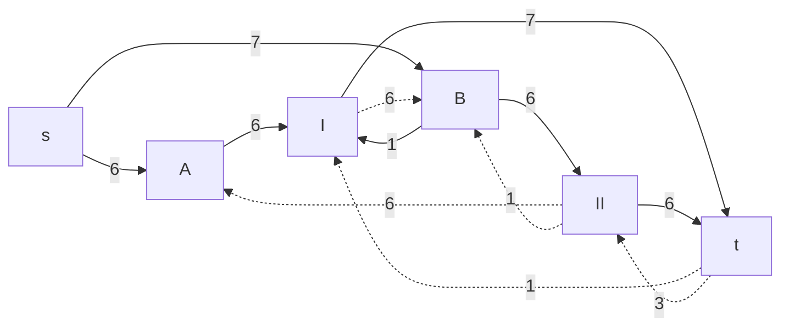
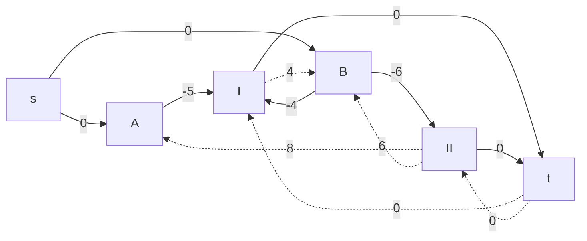
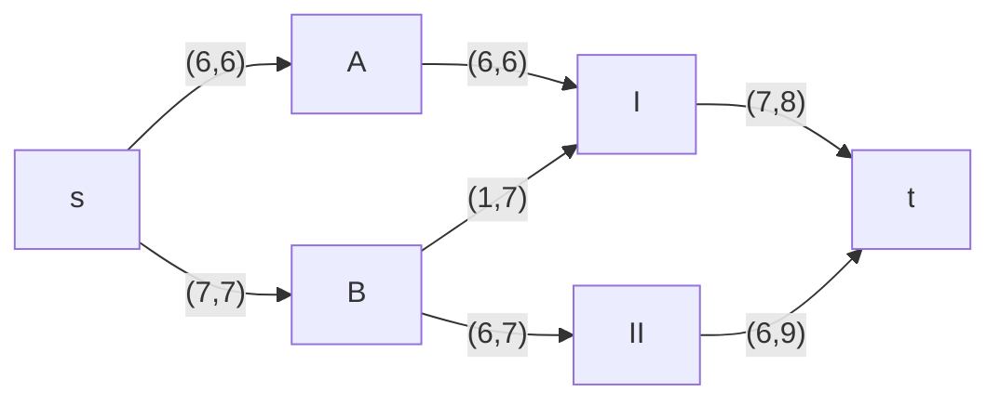

# Задание №14. Команда Second.
### Постановка задачи:
Задача о рюкзаке (англ. Knapsack problem) — дано N предметов, ni предмет имеет массу wi > 0 и стоимость pi > 0. Необходимо выбрать из этих предметов такой набор, чтобы суммарная масса не превосходила заданной величины W (вместимость рюкзака), а суммарная стоимость была максимальна. 

### Вариант 4: 
Транспортная задача

Два завода имеют производительность 6 и 7, а два складских помещения имеют вместимость 8 и 9. Матрица затрат на перевозку одной единицы товара (строки – это заводы, столбцы – это склады) имеет вид:

$$
 \begin{pmatrix}    
  5 & 8 \\ 
  4 & 6 \\ 
 \end{pmatrix}    
$$

Требуется:
1. Найти стоимость перевозки с первого завода на второй склад 6 единиц товара, а со второго завода на первый склад 7 единиц товара;
2. Используя алгоритм поиска максимального потока минимальной стоимости, скорректировать указанный выше вариант перевозки товаров, так чтобы объём перевозимых товаров не изменился, а стоимость их перевозки стала минимальной.

## Этап 1: Построим сеть с источником s, стоком t и указанными пропускными способностями дуг для поиска максимального потока.

Получаем сеть при отправке 6 у.е. с завода А на 2 склад, 7 у.е. с завода B на 1 склад:

Стоимость транспортировки: 6 * 8 + 7 * 4 = 76.

## Этап 2: Построим остаточные сети для пропускной способности и стоимости транспортировки. В случае со стоимостями прямые дуги будут со знаком "-", а обратные со знаком "+".

Выполним поиск цикла отрицательной стоимости. Найден следующий цикл:
B --> I --> A --> II --> B (- 4 + 5 - 8 + 6 = - 1). Минимальное значение = 6. Уменьшим вес дуг на найденном пути на величину равную минимуму.

## Этап 3: Выполним поиск цикла отрицательной стоимости. 

Нет отрицательного цикла. Тогда итоговый граф будет иметь следующий вид:

Выполним расчёты итоговой стоимости перевозки:
A --> I ==> 6 * 5 = 30. 
B --> I и B --> II ==> 1 * 4 + 6 * 6 = 4 + 36 = 40. В сумме 70.

## Ответ:
Итоговая стоимость транспортировки выходит 70 за 13 единиц товара.