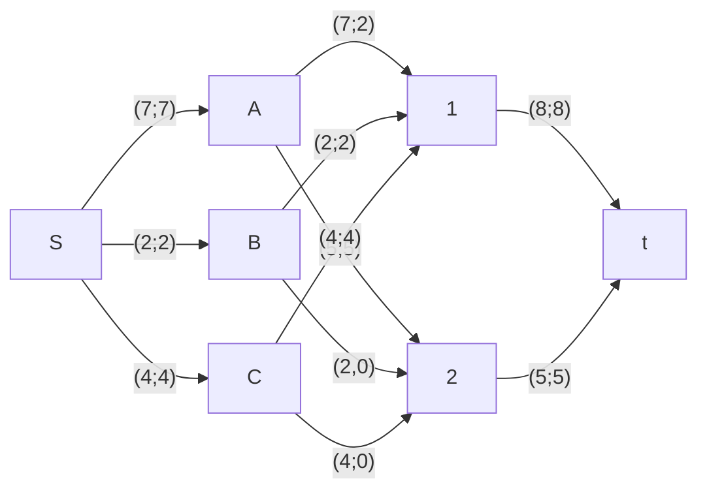
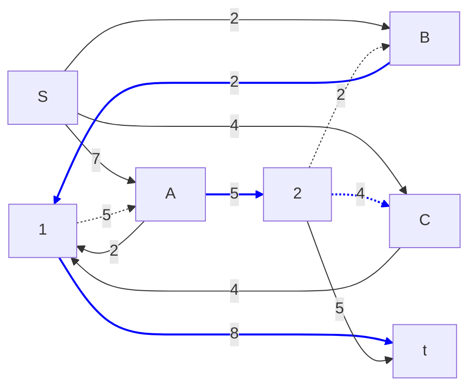
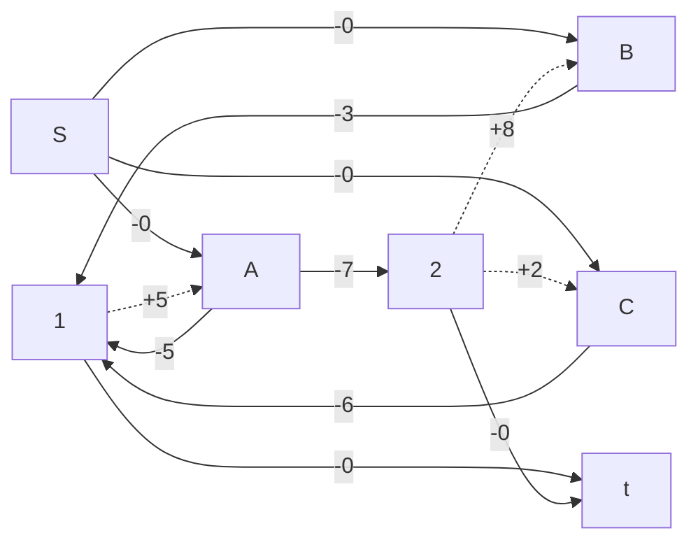
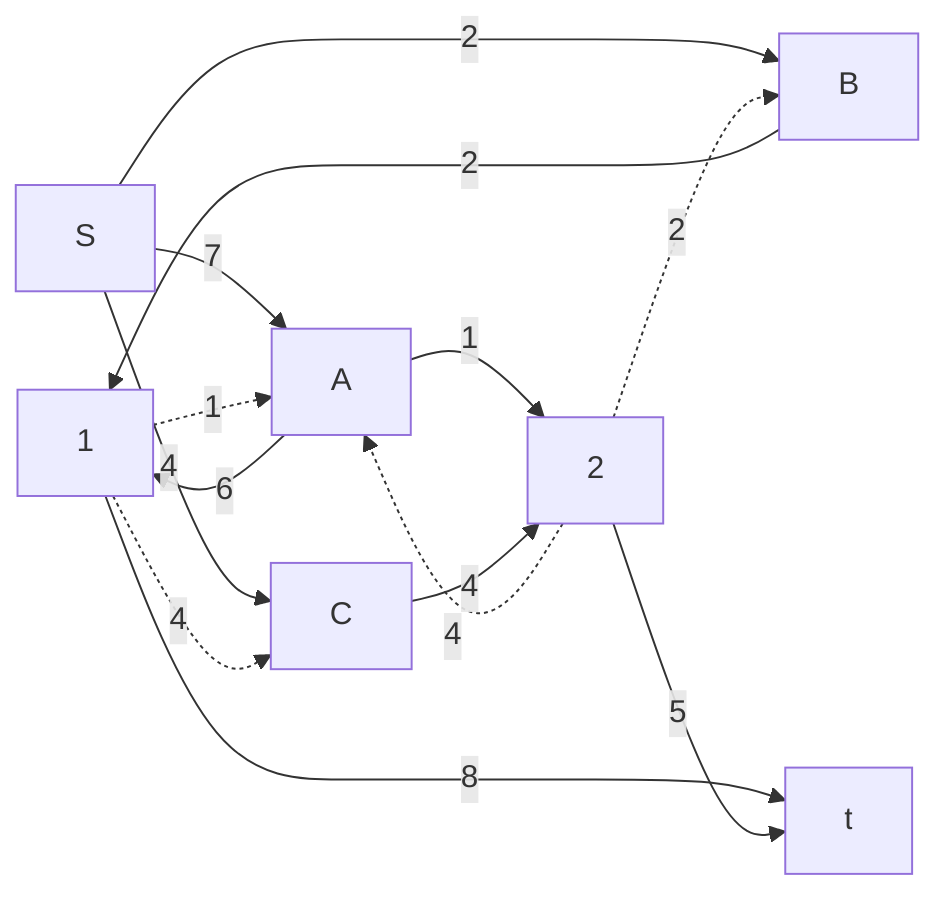
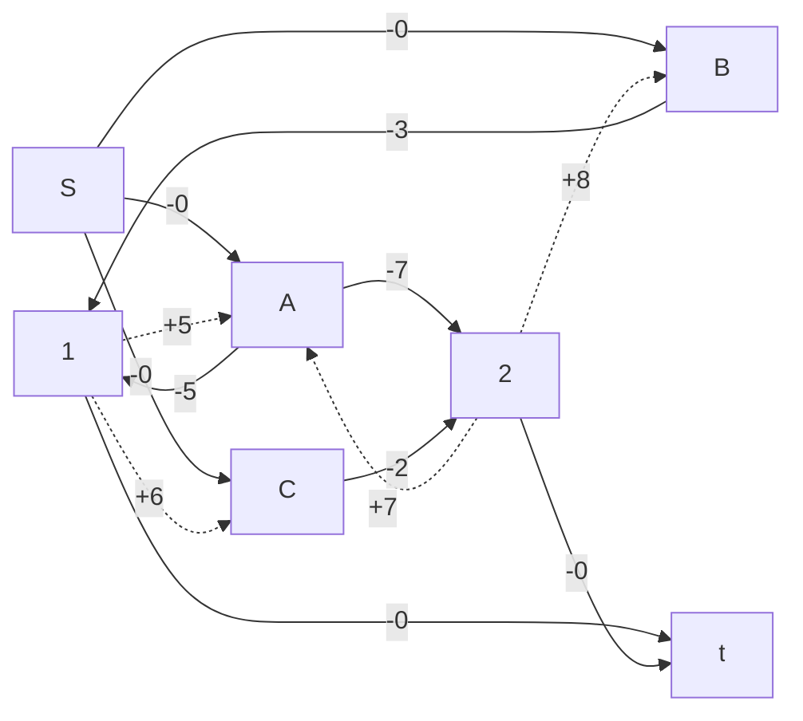
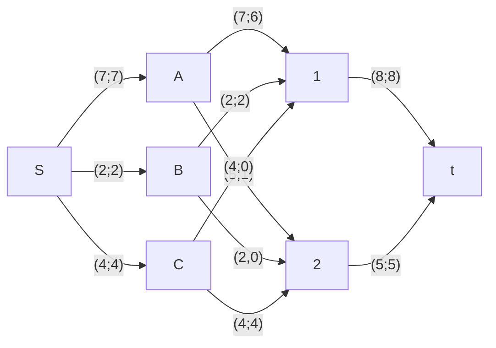

# Задание №14. Вариант 2. Команда Synergy
### Постановка задачи:
Задача о рюкзаке (англ. Knapsack problem) — дано N предметов, ni предмет имеет массу wi > 0 и стоимость pi > 0. Необходимо выбрать из этих предметов такой набор, чтобы суммарная масса не превосходила заданной величины W (вместимость рюкзака), а суммарная стоимость была максимальна. 

## Условия задачи
Транспортная задача

Три завода имеют производительность 7, 2 и 4, а два складских помещения имеют вместимость 8 и 5. Матрица затрат на перевозку одной единицы товара (строки – это заводы, столбцы – это склады) имеет вид:

$$
 \begin{pmatrix}    
  5 & 7 \\ 
  3 & 8 \\ 
  6 & 2 \\ 
 \end{pmatrix}    
$$

Требуется:
1. Найти стоимость перевозки с первого завода на первый склад 2 единицы товара, на второй склад 5 единиц, со второго завода на первый склад 2 единиц товара, с третьего завода на первый склад 4 единиц товара;
2. Используя алгоритм поиска максимального потока минимальной стоимости, скорректировать указанный выше вариант перевозки товаров, так чтобы объём перевозимых товаров не изменился, а стоимость их перевозки стала минимальной.

## Решение
3 завода: A = 7; B = 2; C = 4

2 склада: 1 = 8; 2 = 5

Матрица затрат
|     |  1  |  2  |
|:---:|:---:|:---:|
|**A**|  5  |  7  |
|**B**|  3  |  8  |
|**C**|  6  |  2  |

A ->1  2 ед.
A ->2  5 ед.
B ->1  2 ед.
C ->1  4 ед.

S = 5 * 2 + 7 * 5 + 3 * 2 + 6 * 4 = 75

Остаточная сеть

Сеть со стоимостью

Цикл с отрицательной стоимостью
A->2->C->1->A
S = -6, min = 4

Остаточная сеть

Сеть со стоимостью

Цикл с отрицательной стоимостью не найден

a->1 6 ед. S = 30

a->2 1 ед. S = 7

b->1 2 ед. S = 6

b->2 0 ед. S = 0

c->1 0 ед. S = 0

c->2 4 ед. S = 8

S = 51 проверка = 75 - 6*4 = 51

Ответ: A->1 (6 ед); A->2 (1 ед); B->1 (2 ед); C->2 (4 ед). Стоимость = 51
