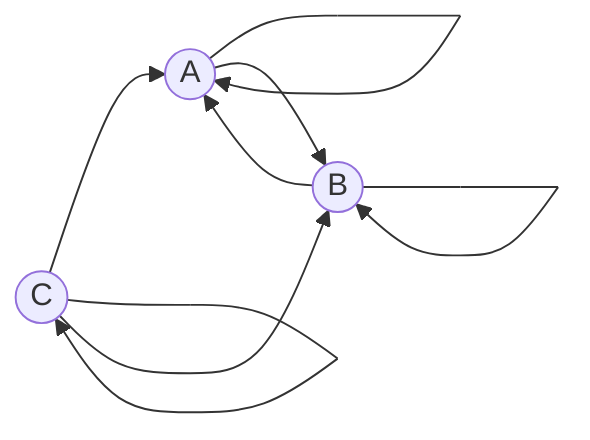

## Решение задачи (Вариант 6):

---
### Условия задачи
Допустимые маршруты:
- A → A
- A → B
- B → A
- B → B
- C → A
- C → C
- C → B

Найти формулу расчета количества маршрутов, начинающихся в вершине A и заканчивающихся в вершине B.

---

### Постановка задачи

Обозначим:
- $a_n$: количество маршрутов длины $n$, начинающихся и заканчивающихся в вершине $A$;
- $b_n$: количество маршрутов длины $n$, начинающихся в вершине $A$ и заканчивающихся в вершине $B$;
- $c_n$: количество маршрутов длины $n$, начинающихся в вершине $A$ и заканчивающихся в вершине $C$.

Составим рекуррентные соотношения:

1. $a_n = a_{n-1} + b_{n-1} + c_{n-1}$, так как из *A* можно вернуться в *A*, либо пройти через *B*, либо через *C*.
2. $b_n = a_{n-1} + b_{n-1} + c_{n-1}$, так как из *A* или *C* можно попасть в *B*.
3. $c_n = c_{n-1}$, так как из *C* можно попасть в *C*.
Система:

$$\begin{cases}
a_n = a_{n-1} + b_{n-1} + c_{n-1} \\
b_n = a_{n-1} + b_{n-1} + c_{n-1} \\
c_n = c_{n-1}
\end{cases} $$

---

Поскольку в вершину C можно прийти только из нее же, а начинаем мы в вершине A, то вершину C можно исключить из нашей системы, поскольку в нее невозможно попасть.

Система:

$$\begin{cases}
a_n = a_{n-1} + b_{n-1} \\
b_n = a_{n-1} + b_{n-1}
\end{cases} $$

---

### Сведение системы уравнений к одному

Рассмотрим уравнение для $b_n$:

$$
b_n = a_{n-1} + b_{n-1}.
$$

Заметим, что a_n и b_n равны, поэтому уравнение можно упростить до:

$$
b_n = 2b_{n-1}.
$$

Для n = 1:

$$
b_{1} = 1
$$

---

### Ответ

Количество маршрутов длины $n$, начинающихся в вершине $A$ и заканчивающихся в вершине $B$, равно:

$$
b_n = 2b_{n-1}.
$$
