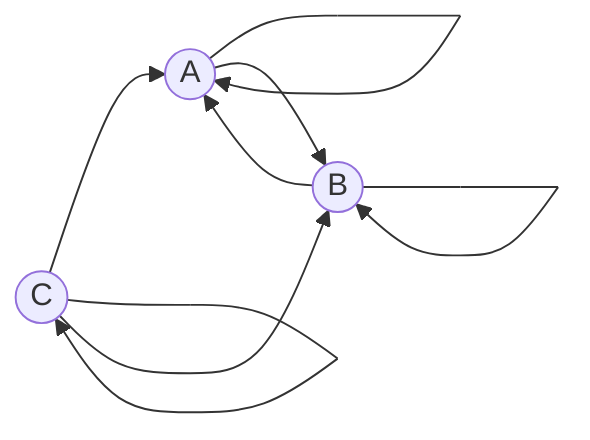

## Решение задачи (Вариант 6):

---
### Условия задачи
Допустимые маршруты:
- A → A
- A → B
- B → A
- B → B
- C → A
- C → C
- C → B

Найти формулу расчета количества маршрутов, начинающихся в вершине A и заканчивающихся в вершине B.

---

### Постановка задачи

Обозначим:
- $a_n$: количество маршрутов длины $n$, начинающихся и заканчивающихся в вершине $A$;
- $b_n$: количество маршрутов длины $n$, начинающихся в вершине $A$ и заканчивающихся в вершине $B$;
- $c_n$: количество маршрутов длины $n$, начинающихся в вершине $A$ и заканчивающихся в вершине $C$.

Составим рекуррентные соотношения:

1. $a_n = a_{n-1} + b_{n-1} + c_{n-1}$, так как из *A* можно вернуться в *A*, либо пройти через *B*, либо через *C*.
2. $b_n = a_{n-1} + b_{n-1} + c_{n-1}$, так как из *A*, *B*, или *C* можно попасть в *B*.
3. $c_n = a_{n-1} + c_{n-1}$, так как из *A* и *C* можно попасть в *C*.
Система:
$$
\begin{cases}
a_n = b_{n-1} + c_{n-1}
\\
b_n = a_{n-1} + c_{n-1}
\\
c_n = a_{n-1} + b_{n-1}
\end{cases}
$$
---

### Сведение системы уравнений к одному

Рассмотрим уравнение для $b_n$:
$$
b_n = a_{n-1} + b_{n-1} + c_{n-1}.
$$

Из первого уравнения выразим $c_{n-1}$:
$$
c_{n-1} = a_{n-2} + c_{n-2}.
$$

Подставим в уравнение для $a_{n-1}$:
$$
a_{n-1} = a_{n-2} + b_{n-2} + c_{n-2}.
$$

Теперь подставим $a_{n-1}$ и $c_{n-1}$ в уравнение для $b_n$:
$$
b_n = (a_{n-2} + b_{n-2} + c_{n-2}) + b_{n-1} + (a_{n-2} + c_{n-2}).
$$

Соберем все подобные:
$$
b_n = 2a_{n-2} + 2c_{n-2} + b_{n-2} + b_{n-1}.
$$

Заменим $c_{n-2} = a_{n-3} + c_{n-3}$:
$$
b_n = 2a_{n-2} + 2(a_{n-3} + c_{n-3}) + b_{n-2} + b_{n-1}.
$$

Можно упростить до:
$$
b_n = 2b_{n-2} + b_{n-1}.
$$

---

### Характеристическое уравнение

Для рекуррентного уравнения:
$$
b_n = 2b_{n-2} + b_{n-1},
$$
характеристическое уравнение имеет вид:
$$
t^2 - t - 2 = 0.
$$

Решим его:
$$
t = \frac{1 \pm \sqrt{1 + 8}}{2} = \frac{1 \pm 3}{2}.
$$

Корни:
$$
t_1 = 2, \quad t_2 = -1.
$$

---

### Общее решение

Общее решение имеет вид:
$$
b_n = C_1 \cdot 2^n + C_2 \cdot (-1)^n,
$$
где $C_1$ и $C_2$ определяются из начальных условий.

---

### Найдем коэффициенты

Начальные условия:
- Для $n = 1$: $b_1 = 1$ (маршрут $A \to B$).
- Для $n = 2$: $b_2 = 2$ (маршруты $A \to B \to A \to B$ и $A \to B \to B \to B$).

Подставим:
1. $b_1 = C_1 \cdot 2^1 + C_2 \cdot (-1)^1 = 2C_1 - C_2 = 1$.
2. $b_2 = C_1 \cdot 2^2 + C_2 \cdot (-1)^2 = 4C_1 + C_2 = 2$.

Решим систему:
$$
\begin{cases}
2C_1 - C_2 = 1, \\
4C_1 + C_2 = 2.
\end{cases}
$$

Сложим уравнения:
$$
6C_1 = 3 \implies C_1 = \frac{1}{2}.
$$

Найдем $C_2$:
$$
2C_1 - C_2 = 1 \implies 2 \cdot \frac{1}{2} - C_2 = 1 \implies C_2 = 0.
$$

---

### Итоговая формула

$$
b_n = \frac{1}{2} \cdot 2^n = 2^{n-1}.
$$

---

### Ответ

Количество маршрутов длины $n$, начинающихся в вершине $A$ и заканчивающихся в вершине $B$, равно:
$$
b_n = 2^{n-1}.
$$
