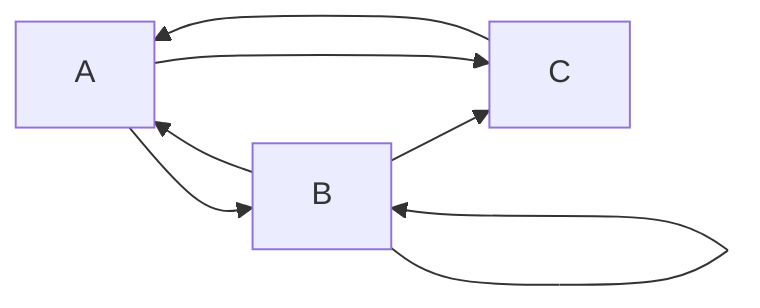

### Задание №3
#### Вариант 3 Команда: noname
**Состав команды:**
1. Долгих Юлия
2. Осока Варвара
3. Шперкин Савва

Найти формулу расчета количества маршрутов, начинающихся в вершине A и заканчивающихся в вершине B. Ниже представлен граф.

Обозначим
$a_n$ - количество маршрутов, начинающихся в  и заканчивающихся в
$b_n$ - количество маршрутов, начинающихся в  и заканчивающихся в
$c_n$ - количество маршрутов, начинающихся в  и заканчивающихся в 

Нам нужно найти $b_{n}$ - количество маршрутов, начинающихся в A и заканчивающихся в B.
#### 1 Шаг
Составить систему уравнений
$$
\begin{cases}
a_n = b_{n - 1} + c_{n - 1}
\\
b_n = b_{n - 1} + a_{n - 1}
\\
c_n = b_{n - 1} + a_{n - 1}
\end{cases}
$$
#### 2 Шаг
Из системы уравнений видно, что $b_n = c_n$, из этого следует
$$b_n = b_{n-1}+ b_{n-2} + c_{n-2}$$
#### 3 Шаг
Свести систему уравнений к рекуррентному соотношению.
$$b_n = b_{n-1} + 2b_{n-2}$$
#### 4 Шаг
Составить и решить характеристическое уравнение
$$\lambda^2-\lambda-2=0$$
$$\lambda_{1} = 2$$
$$\lambda_{2} = -1$$
$$\lambda_{1}\neq\lambda_{2}$$
#### 5 Шаг
Корни НЕ равны
$$b_n = c_1*2^n+c_2(-1)^n$$
Находим $b$ при $n = 1$ и $n = 2$
$$b_1 = 1$$
$$b_2 = 1$$
$$
\begin{cases}
1 = 2c_1 - c_2
\\
1 = 4c_1 +c_2
\end{cases}
$$
Выражаем $c_1$ и $c_2$
$$c_1 = \frac{1}{3}$$
$$c_2 = -\frac{1}{3}$$
#### 6 Шаг
Подставляем
$$b_n = \frac{1}{3}*2^n-\frac{1}{3}*(-1)^n$$
#### 7 Шаг
Проверка
Мы проверили на $b = 3$ и $b = 4$ и результат сошелся.