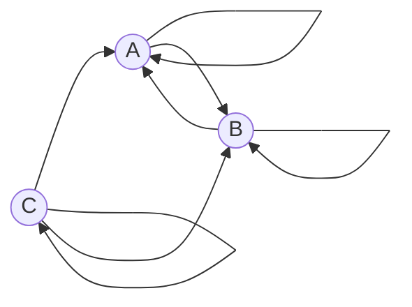

#### Задача на взаимную рекурсию (маршруты в треугольнике)
#####Вариант 5

1.	Составить систему из 3 рекуррентных соотношений 
a.	Количество маршрутов длины n, которые начинаются в A и заканчиваются в A
b.	Количество маршрутов длины n, которые начинаются в B и заканчиваются в A
c.	Количество маршрутов длины n, которые начинаются в A и заканчиваются в C

	
2.Методом исключения свести систему к одному рекуррентному соотношению
$$
\begin{cases}
a_n = a_{n - 1} + b_{n - 1} + c_{n - 1}
\\
b_n = b_{n - 1} + c_{n - 1}
\\
c_n = a_{n - 1} + b_{n - 1} + c_{n - 1}
\end{cases}
$$

Так как у нас два уравнения одинаковые сократим переменные, потому что C_n = A_n, тогда 
$$
\begin{cases}
a_n = 2b_{n - 1}
\\
a_{n - 1} = 2b_{n - 2}
\end{cases}
$$

В итоге получаем:

$$b_n = 2b_{n-1} + 2b_{n-2}$$

3.	Составить и решить характеристическое уравнение

$$b_n = 2b_{n-1} + 2b_{n-2}$$

$$\lambda^n = 3\lambda^{n-1} - 2\lambda^{n-2}$$

Делим на $$\lambda^{n-2}$$:

$$\lambda^2 = 3\lambda - 2$$

Переносим все в одну сторону:

$$\lambda^2 - 3\lambda + 2 = 0$$

$$\lambda = 1$$
$$\lambda = 2$$

	
4. Вывести формулу общего решения

Корни не равны, значит 

$$b_n = C_1 * 1^n + C_2 * 2^n$$  
Находим при $n - 1$, $n - 2$ 
$$b_1 = 1$$
$$b_2 = 3$$

$$
\begin{cases}
1 = 1C_1 + 2C_2
\\
3 = 1C_1 + 4C_2
\end{cases}
$$

$$
\begin{cases}
C_1 = -1
\\
C_2 = 1
\end{cases}
$$

А теперь подставляем в $b_n$

$$b_n = (- 1) * 1^n + 1 * 2^n$$

$$a_n = 2b_{n - 1}$$

$$a_n = 2 * (- 1) * 1^{n-1} + 2* 1 * 2^{n - 1} $$

$$a_n = (- 2) * 1^{n - 1} + 2 * 2^{n - 1} $$

