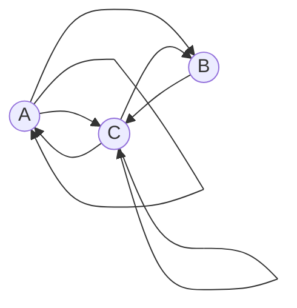

### Задача на взаимную рекурсию (маршруты в треугольнике)
####Вариант 5

1.	Составить систему из 3 рекуррентных соотношений 
a.	Количество маршрутов длины n, которые заканчиваются в A
b.	Количество маршрутов длины n, которые заканчиваются в B
c.	Количество маршрутов длины n, которые заканчиваются в C

	
2.Методом исключения свести систему к одному рекуррентному соотношению

$$
\begin{cases}
a_n = a_{n - 1} + c_{n - 1}
\\
b_n = a_{n - 1} + c_{n - 1}
\\
c_n = a_{n - 1} + b_{n - 1} + c_{n - 1}
\end{cases}
$$

Так как у нас два уравнения одинаковые сократим переменные, потому что A_n = B_n, тогда 

$$c_n = a_{n - 1} + a_{n - 1} + c_{n - 1}$$

$$
\begin{cases}
c_{n - 1} = b_n - a_{n - 1} = a_n - a_{n - 1}
\\
c_n = a_{n + 1} - a_n 
\end{cases}
$$

подставим в данное уравнение

$$c_n = a_{n - 1} + a_{n - 1} + c_{n - 1}$$

В итоге получаем:

$$a_n = 2a_{n-1} + a_{n-2}$$

3.	Составить и решить характеристическое уравнение

$$a_n = 2a_{n-1} + a_{n-2}$$

$$\lambda^n = 2\lambda^{n-1} + \lambda^{n-2}$$

Делим на $$\lambda^{n-2}$$:

$$\lambda^2 = 2\lambda + 1$$

Переносим все в одну сторону:

$$\lambda^2 - 2\lambda - 2 = 0$$

$$\lambda = 1 - \sqrt{2}$$

$$\lambda = 1 + \sqrt{2}$$

4. Вывести формулу общего решения

Корни не равны, значит 

$$b_n = C_1 * (1 - \sqrt{2})^n + C_2 * (1 + \sqrt{2})^n$$  

Находим при $n - 1$, $n - 2$ 

$$a_1 = 1$$

$$a_2 = 2$$

Тогда получаем вот такую общую формулу 

$$a_n = \frac{\sqrt{2}}{4} * (1 + \sqrt{2})^n - \frac{\sqrt{2}}{4} * (1 - \sqrt{2})^n $$

