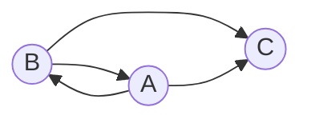

## Маршруты в треугольнике

Путешественник перемещается между тремя городами A, B и C по трем дорогам и каждый день переходит из одного города в другой. Сколько различных маршрутов, начинающихся в городе A и заканчивающихся в городе С может проделать путешественник за *n* дней.

Расчет количества маршрутов.

| *n* | Маршруты                   | Количество |
|-----|----------------------------|------------|
| 1   | (A->С)                     | 1          |
| 2   | (A->B->С)                  | 1          |
| 3   | (A->B->A->С)               | 1          |

Можно обозначить
* an - количество маршрутов длины *n* начинающихся и заканчивающихся 
в A,
* bn - количество маршрутов длины *n* начинающихся в A и 
заканчивающихся в B,
* cn - количество маршрутов длины *n* начинающихся в A и 
заканчивающихся в C.

Тогда справедливы равенства:

$$
\begin{cases}
a_n = b_{n-1}
\\
b_n = a_{n-1}
\\
c_n = a_{n-1} + b_{n-1}
\end{cases}
$$

Указанную систему уравнений можно методом исключения свести к одному рекуррентному соотношению:

$$
a_n = b_{n-1};\ b_n = a_{n-1} =>
\\
b_{n-1} = a_{n-2} =>
\\
a_n = a_{n-2}
\\
a_n = 0 \cdot a_{n-1} + a_{n-2}
$$

Вывести и решить характеристическое уравнение:

$t^2 - 1 = 0 $

$t_{1} = 1; \ t_{2} = -1$

$t_{1} \neq t_{2} $

Вывести формулу общего решения:

$a_n = C_{1} \cdot t_{1}^n + C_{2} \cdot t_{2}^n$

$a_n = C_{1} \cdot 1^n + C_{2} \cdot (-1)^n$

$a_{1} = 1$

$a_{2} = 1$

$a_{3} = 1$

$$
\begin{cases}
1 = C_{1} \cdot 1^1 + C_{2} \cdot (-1)^1
\\
1 = C_{1} \cdot 1^2 + C_{2} \cdot (-1)^2
\\
1 = C_{1} \cdot 1^3 + C_{2} \cdot (-1)^3
\end{cases}
$$

$$
\begin{cases}
1 = C_{1} - C_{2}
\\
1 = C_{1} + C_{2}
\end{cases}
$$

$$
\begin{cases}
C_{1} = 1
\\
C_{2} = 0
\end{cases}
$$

$a_n = 1 \cdot 1^n + 0 \cdot (-1)^n$

$c_n = a_{n-1} + a_n$

$c_n = 1 \cdot 1^{n-1} + 1 \cdot 1^{n}$