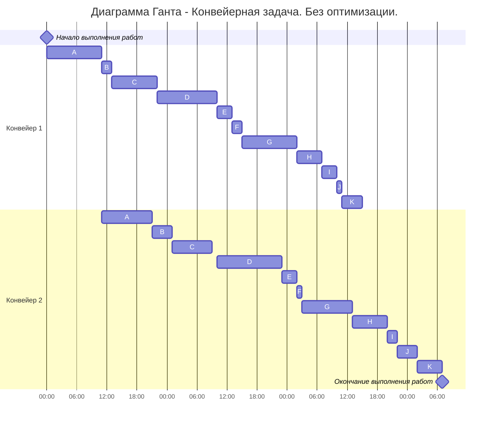
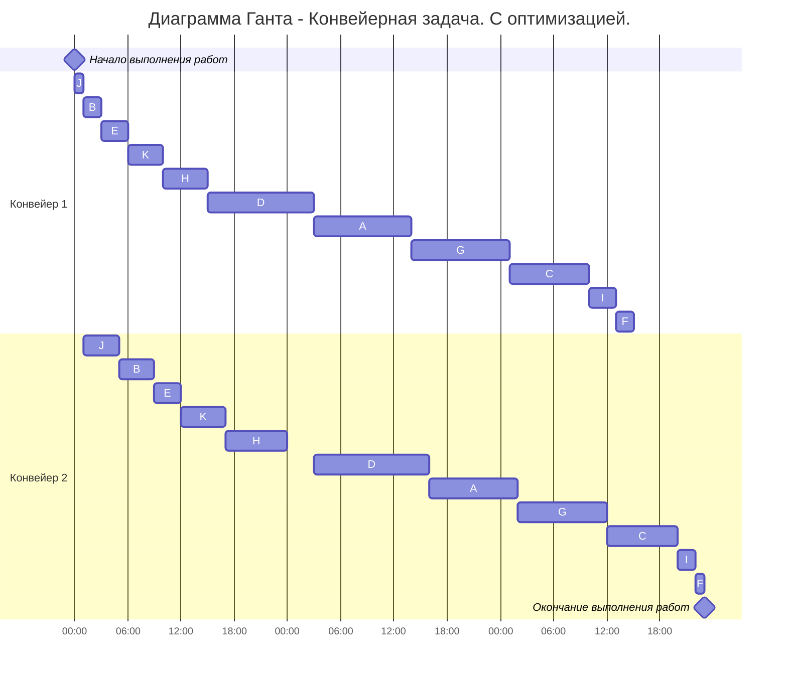

# Задание №5. Команда budapest.
# Постановка задачи
> Имеется 11 независимых заданий, каждое из которых состоит из двух последовательных этапов, и 2 исполнителя, исполнитель 1 выполняет только первый этап задания, исполнитель 2 - только второй. Длительность заданий (по этапам): (11, 10), (2, 4), (9, 8), (12, 13), (3, 3), (2, 1), (11, 10), (5, 7), (3, 2), (1, 4), (4, 5).

# Ход решения

## 1 Часть. Выбор алгоритма решения и обоснование выбора. 
Начнём с того, что данная задача является конвейерной. Решение будет производиться по алгоритму Джонсона И вот почему:  
1. Каждое задание состоит из двух последовательных этапов, длительность которых произвольна.
2. Количество работников строго 2.
3. Первый работник выполняет только первый этап каждого задания, второй работник — только второй этап каждого задания.

## 2 Часть. Визуальное представление исходных данных.
Для начала перенесём данные в более удобную табличную форму.

| Задания | A | B | C | D | E | F | G | H | I | J | K |
|---------|---|---|---|---|---|---|---|---|---|---|---|
| 1 этап  | 11| 2 | 9 |12 | 3 | 2 |11 | 5 | 3 | 1 | 4 |
| 2 этап  | 10| 4 | 8 |13 | 3 | 1 |10 | 7 | 2 | 4 | 5 |

  
 

А теперь не применяя вышеупомянутый алгоритм составим диаграмму Ганта.  

| Время 1 исполнителя |0-11|11-13|13-22|22-34|34-37|37-39|39-50|50-55|55-58|58-59|59-63|-|-|
| :---: | :---: | :---: | :---: | :---: | :---: | :---: | :---: | :---: | :---: | :---: | :---: | :---: | :---: |
| 1 исполнитель|A|B|C|D|E|F|G|H|I|J|K|-|-|
| 2 исполнитель|-|A|B|С|-|D|E|F|G|H|I|J|K|
| Время 2 исполнителя|0-11|11-21|21-25|25-33|33-34|34-47|47-50|50-51|51-61|61-68|68-70|70-74|74-79|

Видно, что первый конвейер простаивает на 16 условных единиц(далее *у.е.*). Общее время выполнения заданий = 79 *у.е.*  
## 3 Часть. Применение алгоритма Джонсона.
### 1 Этап.
Разобьём список всех заданий на две группы по следующему принципу:
+ В первую группу попадают задания у которых 1 этап <= 2 этапу
+ Во вторую группу попадают задания у которых 1 этап > 2 этапу

Получаем следующее распределение:

| 1 Группа | B | D | E | H | J | K |
|----------|---|---|---|---|---|---|
| 2 Группа | A | C | F | G | I |

### 2 Этап.
Отсортируем полученные группы по следующему принципу:
+ Первую группу отсортируем в порядке возрастания 1 этапа
+ Вторую группу отсортируем в порядке убывания 2 этапа

Получаем следующее распределение:

### 1 Группа
||1 этап|2 этап|
| :---: | :---: | :---: | 
|**J**|1|4|
|**B**|2|4|
|**E**|3|3|
|**K**|4|5|
|**H**|5|7|
|**D**|12|13|

### 2 Группа
||1 этап|2 этап|
| :---: | :---: | :---: | 
|**A**|11|10|
|**G**|11|10|
|**C**|9|8|
|**I**|3|2|
|**F**|2|1|

### 3 Этап.
Теперь, на основе всех этих данных мы можем составить диаграмму Ганта. Соединить в 1 таблицу в полученном порядке(сначала 1 группа, потом 2 группа).

| Время 1 исполнителя |0-1|1-3|3-6|6-10|10-15|15-27|27-38|38-49|49-58|58-61|61-63|-|-|
| :---: | :---: | :---: | :---: | :---: | :---: | :---: | :---: | :---: | :---: | :---: | :---: | :---: | :---: |
| 1 исполнитель|J|B|E|K|H|D|A|G|C|I|F|-|-|
| 2 исполнитель|-|J|B|E|K|H|-|D|A|G|C|I|F|
| Время 2 исполнителя|0-1|1-5|5-9|9-12|12-17|17-24|24-27|27-40|40-50|50-60|60-68|68-70|70-71|
  
  После выполнения алгоритма Джонсона первый конвейер стал простаивать на 8 *у.е.* меньше, а общее время выполнения заданий сократилось на 8 *у.е.*

**Ответ: общее время выполнения 71 *у.е.***