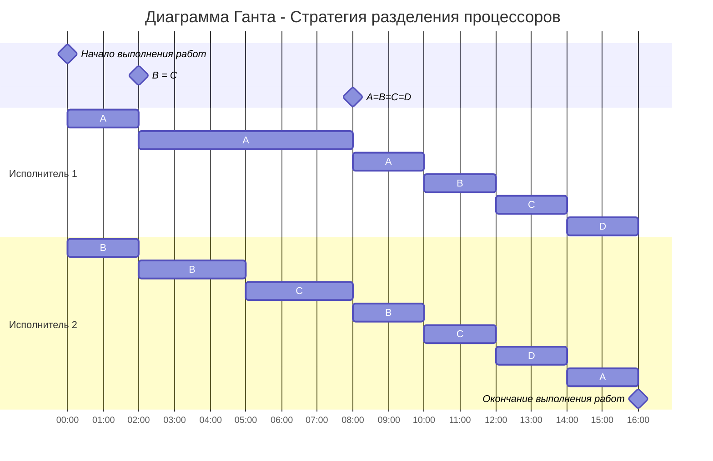

## Задание 5
### Задача о разделении процессоров - вариант 3.
Имеется 4 независимых задания и 2 исполнителя, исполнитель 1 с производительностью 2 и исполнитель 2 производительностью 1. Длительность заданий составляет 22, 11, 9, 6.

| Задания      |  A  |  B  |  C  |  D  |      
|:-------------|:---:|:---:|:---:|:---:|
| Длительность |  22 |  11 |  9 |   6 |

| Исполнители         |  1  |  2  |
|:-------------------|:---:|:---:|
| Производительность(p)  |  2  |  1  |

Рассчитаем длительность оптимального расписания:

$$  
t_{min} = \frac {22+11+9+6}{2+1}  = 16
$$  

Расставим приоритеты для каждой из задачи: 
|  A  |  B  |  C  |  D  |
|:---:|:---:|:---:|:---:|
|  22 |  11 |  9 |   6 |
|  I  |  II  |  III  |  IV  |

На данном этапе можно заметить, что именно задания **A** и **B** являются для нас приоритетными, поэтому на выполнение данных задач мы будем отправлять наших исполнителей. На задачу **A** отправим исполнителя $p_1 = 2$, На задачу **B** отправим исполнителя $p_2 = 1$

Исполнители выполняют задания до тех пор, пока не наступит одно из событий:
- какое-либо задание будет завершено и освободится исполнитель,
- сравняются приоритеты у каких-то заданий, если до того эти приоритеты были разные, то есть с изменением приоритетов необходимо переназначить работников на задания согласно шагу 1.

Чтобы проверить наступление событий: 

**A = B**:

$$
22 - 2t = 11 - t
$$

$$
t = 11
$$

**B = C**:

$$
11 - t = 9
$$

$$
t = 2
$$

Значит, приоритеты задача B и C сравняются через 2 промежутка времени.

После этого останется сделать пунктов в задачах: 

$$
A = 22 - 2 * 2 = 18
$$

$$
B = 11 - 2 * 1 = 9
$$

Снова определяем приоритеты задач: 
|  A  |  B  |  C  |  D  |
|:---:|:---:|:---:|:---:|
|  18 |  9 |  9 |   6 |
|  I  |  II  |  II |  IV  |

Задача **A** все также имеет приоритет I, поэтому первый исполнитель все также будет делать задачу **A**. У задач **B** и **C** одинаковые значения, поэтому назначим второго исполнителя на обе эти задачи, но его производительность будет $\frac {p_2}{2}$ = $\frac {1}{2}$.

Проверяем наступление следующих событий:

**A = BС**:

$$
18 - 2t = 9 - 0,5t
$$

$$
1,5t = 9
$$

$$
t = 6
$$

**BС = D**:

$$
9 - 0,5t = 6
$$

$$
0,5t = 3
$$

$$
t = 6
$$

Как можно заметить после проверки наступления событий **t** в обоих случаях равняется 6. 

Посмотрим сколько останется сделать пунктов в каждой задаче:

$$
A = 18 - 6 * 2 = 6
$$

$$
B = 9 - 6 * 0,5 = 6
$$

$$
C = 9 - 6 * 0,5 = 6
$$

|  A  |  B  |  C  |  D  |
|:---:|:---:|:---:|:---:|
|  6 |  6 |  6 |   6 |
|  I  |  I|  I |  I  |

Приоритеты равны, поэтому отправляем на все задачи обоих исполнителей, но они распределяются на 4 задачи, поэтому будет $\frac {p_1 + p_2}{4}$, что будет равняться $\frac {3}{4}$. Значит останется потратить 8 единиц времени для решения оставшихся задач. 

Построим д. Ганта, она выглядит следующим образом: 

