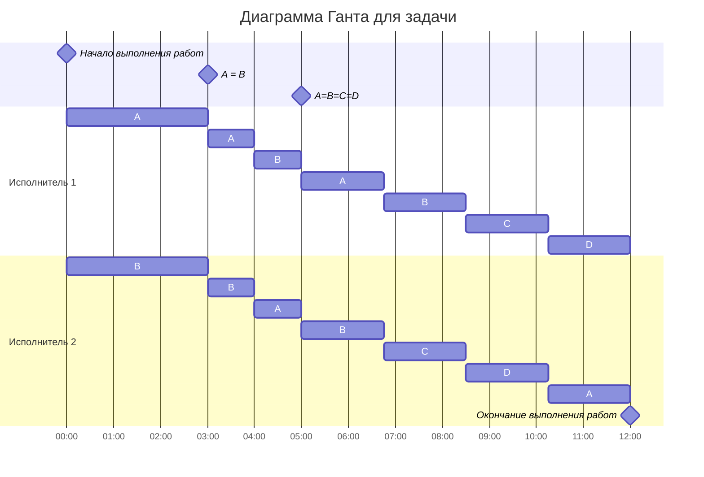

## Задание 5
### Задача о разделении процессоров - вариант 10

    
</style>

Имеется 4 независимых задания: 

|  A  |  B  |  C  |  D  |
|:---:|:---:|:---:|:---:|
|  20 |  14 |  7 |   7 |

И 2 исполнителя:

| Исполнители         |  1  |  2  |
|:-------------------|:---:|:---:|
| Производительность (p)  |  3  |  1  |

Требуется составить минимально возмножное раписание и предоставить в виде диаграммы Ганта.

Для начала посчитаем минимальное время, за которое можно выполнить все задания:

$$  
t_{min} = \frac {20+14+7+7}{3+1}  =  12
$$  

Требуемое расписание должно занимать 12 у.е. времени.

Будем пользоваться сдледующим алгоритмом: будем определять приоритеты заданий, и будем назначать исполнителей на задания в соответсвии с приоритетами. Далее будем составлять уравнения и искать мимнимальное время, когда какие-либо задания сравняются. Приведя все задания к равному состоянию, распределим их равномерно среди исполнителей на оставшееся время.

Момент времени

$$
t = 0:
$$

 

Расставим приоритеты для каждой из задачи: 

|  A  |  B  |  C  |  D  |
|:---:|:---:|:---:|:---:|
|  20 |  14 |  7 |   7 |
|  I  |  II  |  III  |  III  |
|  
 $$ p_{1} $$  
  |  
  $$ p_{2} $$  
|  

Составим уравнения.

$$ A = B: $$

$$ 
20 - 3t = 14 - t
\\
2t = 6
\\
t = 3 
$$

$$ B = C: $$

$$ 
14 - t = 7
\\
t = 7
$$

Можно заметить, что минимальное время, через которое произойдёт выравнивание работ – 3. Поэтому отправиляем исполнителей 1 и 2 на задачи A и B соответственно на 3 у. е. времени.

Момент времени

$$
t = 3:
$$

 

Расставим приоритеты для каждой из задачи: 

|  A  |  B  |  C  |  D  |
|:---:|:---:|:---:|:---:|
|  11 |  11 |  7 |   7 |
|  I  |  I  |  II  |  II  |

 

$$ (p_{1}p_{2})'/2 $$  

Оба исполниеля будут работать на первом приоритете, выполняя задачи A и B.
 
Составим уравнениe.

$$ AB = CD: $$

$$
11 - ((3 + 1)/2)t = 7
\\
11 - 2t = 7
\\
2t = 4
\\
t = 2
$$

Минимальное время, через которое произойдёт выравнивание работ – 2. Поэтому отправиляем исполнителей 1 и 2 на задачи A и B на 2 у. е. времени.

Момент времени

$$
t = 5:
$$

 

Расставим приоритеты для каждой из задачи: 

|  A  |  B  |  C  |  D  |
|:---:|:---:|:---:|:---:|
|  7 |  7 |  7 |   7 |
|  I  |  I  |  I  |  I  |

Можно заметить, что все задачи сравнялись. Поэтому далее просто распределяем все задачи равномерно на оставшееся время – 7 у. е. времени.

Диаграмма Ганта:

