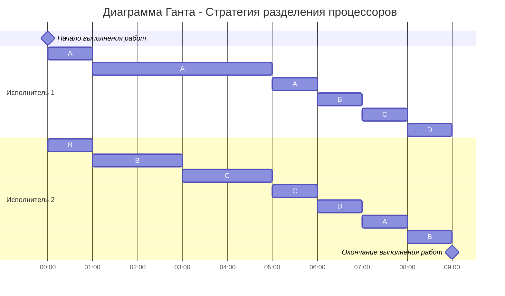

# Задание 5
## Задача о разделении процессоров
### Вариант 2

| Задания      |  A  |  B  |  C  |  D  |
|:-------------|:---:|:---:|:---:|:---:|
| Длительность |  45 |  19 |  16 |   10 |

| Исполнители         |  1  |  2  |
|:-------------------|:---:|:---:|
| Производительность(p)  |  7  |  3  |

Рассчитаем длительность оптимального расписания:

$$  
t_{min} = \frac {45+19+16+10}{7+3}  = 9
$$  

Определим приоритеты задач: 
|  A  |  B  |  C  |  D  |
|:---:|:---:|:---:|:---:|
|  45 |  19 |  16 |   10 |
|  I  |  II  |  III  |  IV  |

Основная идея алгоритма: задания с высоким приоритетом выполняет работник с высокой производительностью, поэтому исполнителя c $p_1 = 7$ отправляем на задачу **A**, а второго исполнителя, у которого $p_2 = 3$, на задачу **B**.

Так они работают до тех пор, пока не наступит одно из событий:
- какое-либо задание будет завершено и освободится исполнитель,
- сравняются приоритеты у каких-то заданий, если до того эти приоритеты были разные, то есть с изменением приоритетов необходимо переназначить работников на задания

Проверим, когда наступят следующие моменты:

$A=B, когда:$

$$
45 - 7t = 19 -3t
$$

$$
4t = 26
$$

$$
t = 6,5
$$

$B = C, когда:$

$$
19 -3t = 16
$$

$$
t = 1
$$

Значит, приоритеты задача B и C сравняются через 1 промежуток времени.

Снова определяем приоритеты задач: 
|  A  |  B  |  C  |  D  |
|:---:|:---:|:---:|:---:|
|  38 |  16 |  16 |   10 |
|  I  |  **II**  |  **II** |  IV  |

Задача остается приоритетной, поэтому туда снова отправит первого исполнителя, а воторой исполнитель одновременно возьмет задачи **B** и **С**, и производитльность у него будет **$\frac {p_2}{2}$**.

Проверим, когда наступят следующие моменты:

$A=BС, когда:$

$$
38 - 7t = 16 - 1,5t
$$

$$
5,5t = 22
$$

$$
t = 4
$$

$BС=D, когда:$

$$
16 - 1,5t = 10
$$

$$
1,5t = 6
$$

$$
t = 4
$$

В обоих случая $t=4$, значит спустя еще 4 промежутка времени длительность и приорететы всех задач сравняются.

|  A  |  B  |  C  |  D  |
|:---:|:---:|:---:|:---:|
|  10 |  10 |  10 |   10 |
|  I  |  I|  I |  I  |

В такой ситуации мы отпрявляем всех исполнителей на решение всех задач на оставшиеся 4 промежутка времени и получим следующую диаграмму:

