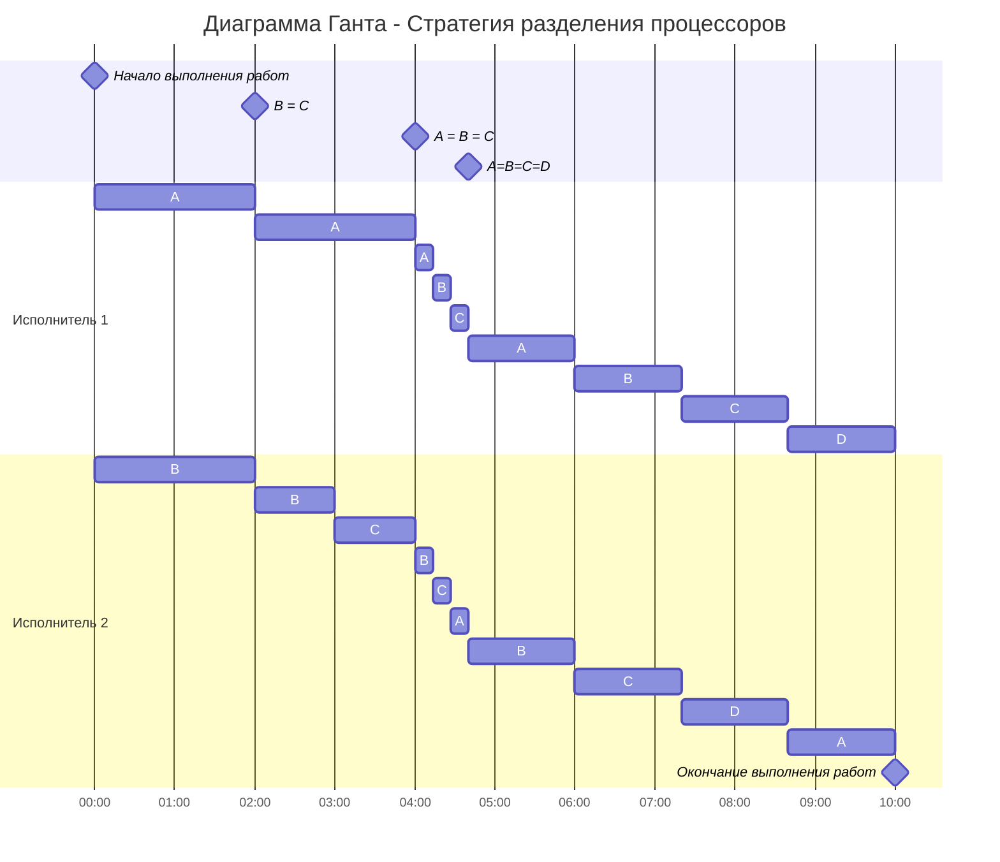

## Задание 5
### Задача о разделении процессоров - вариант 1

| Задания      |  A  |  B  |  C  |  D  |
|:-------------|:---:|:---:|:---:|:---:|
| Длительность |  34 |  26 |  18 |   12 |

| Исполнители         |  1  |  2  |
|:-------------------|:---:|:---:|
| Производительность(p)  |  5  |  4  |

Рассчитаем длительность оптимального расписания:

$$  
t_{min} = \frac {34+26+18+12}{5+4}  = 10
$$  

Определим приоритеты задач: 
|  A  |  B  |  C  |  D  |
|:---:|:---:|:---:|:---:|
|  34 |  26 |  18 |   12 |
|  I  |  II  |  III  |  IV  |

Задания с высоким приоритетом выполняет работник с высокой производительностью, поэтому исполнителя c $p_1 = 5$ отправляем на задачу **A**, а второго исполнителя, у которого $p_2 = 4$, на задачу **B**.

Проверим, когда наступят следующие моменты для $t = 0$:

**A = B**

$$
34 - 5t = 26 - 4t
$$

$$
t = 8
$$

**B = C**

$$
26 - 4t = 18
$$

$$
t = 2
$$

Значит, **B** и **С** сравняются раньше, чем **А** и **B**.

Снова определяем приоритеты задач для $t = 2$:

**A** = $34 - 5t = 34 - 5*2 = 24$

**B** = 26 - 4t = 18

**С** - без изменений равна 18

|  A  |  B  |  C  |  D  |
|:---:|:---:|:---:|:---:|
|  24 |  18 |  18 |   12 |
|  **I**  |  **II**  |  **II** |  **III**  |

Задача **A** остается приоритетной, поэтому туда снова отправляем первого исполнителя, а второй исполнитель одновременно возьмет задачи **B** и **С**, и производительность у него будет $\frac {p_2}{2}$.

Проверим, когда наступят следующие моменты:

**A = BС**

$$
24 - 5t = 18 - 2t
$$

$$
t = 2
$$

**BС = D**

$$
18 - 2t = 12
$$

$$
t = 3
$$
Итак, $2 < 3$ следовательно добавляем время 2 и приоритеты всех задач сравняются.

Считаем новые значения для задач:

**A** = $24 - 5t$ = 14

**B** = $18 - 2t$ = 14

**C** = $18 - 2t$ = 14

**D** без изменений равна 12.

|  A  |  B  |  C  |  D  |
|:---:|:---:|:---:|:---:|
|  14 |  14 |  14 |   12 |
|  I  |  I|  I |  II  |

Отправим **АВС** к $p_1$ и $p_2$

Проверим, когда наступят следующие моменты:

**ABC = D**

$$
14 - (5 + 4)/3t = 12
$$

$$
t = 2/3
$$

В такой ситуации мы отправляем всех исполнителей на решение всех задач на оставшиеся промежутки времени и получим следующую диаграмму:

