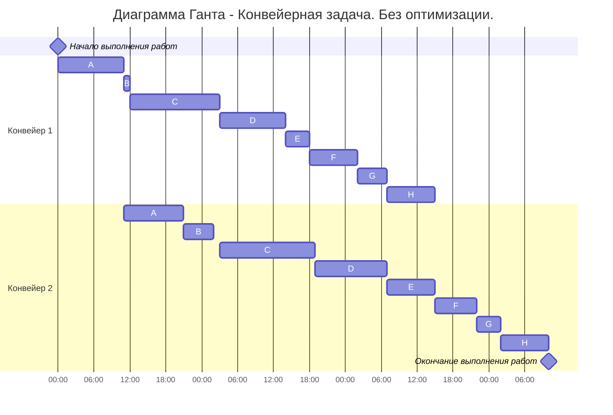
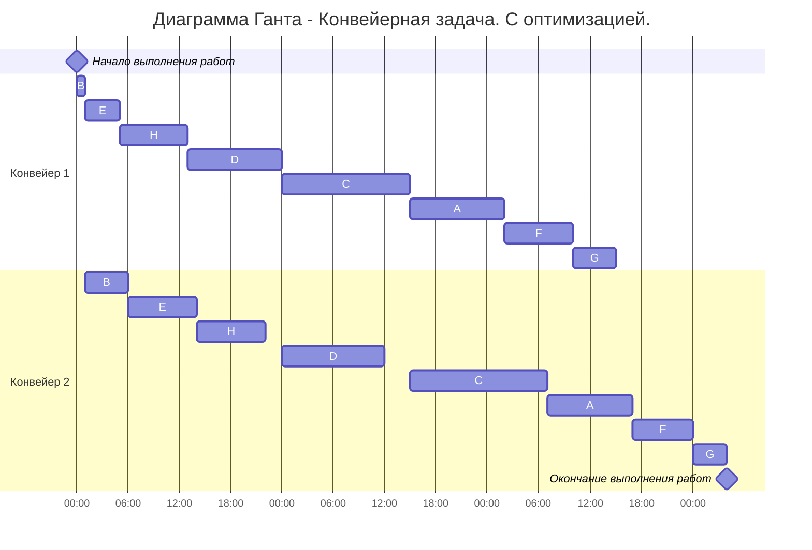

# Задание №5. Команда second.
# Постановка задачи
> Имеется 8 независимых заданий, каждое из которых состоит из двух последовательных этапов, и 2 исполнителя, исполнитель 1 выполняет только первый этап задания, исполнитель 2 - только второй. Длительность заданий (по этапам): (11, 10), (1, 5), (15, 16), (11, 12), (4, 8), (8, 7), (5, 4), (8, 8)

# Ход решения

## 1 Часть. Выбор алгоритма решения и обоснование выбора. 
Начнём с того, что данная задача является конвейерной. И вот почему:  
1. Каждое задание состоит из двух последовательных этапов, длительность которых произвольна.
2. Количество работников строго 2.
3. Первый работник выполняет только первый этап каждого задания, второй работник — только второй этап каждого задания.

А следовательно мы будем решать её при помощи алгоритма Джонсона.

## 2 Часть. Визуальное представление исходных данных.
Для начала перенесём данные в более удобную табличную форму.

| Задания | A | B | C | D | E | F | G | H |
|---------|---|---|---|---|---|---|---|---|
| 1 этап  | 11| 1 |15 |11 | 4 | 8 | 5 | 8 |
| 2 этап  | 10| 5 |16 |12 | 8 | 7 | 4 | 8 |

  
 

А теперь не применяя вышеупомянутый алгоритм составим диаграмму Ганта.  

| Время 1 исполнителя |0-11|11-12|12-27|27-38|38-42|42-50|50-55|55-63|-|-|
| :---: | :---: | :---: | :---: | :---: | :---: | :---: | :---: | :---: | :---: | :---: |
| 1 исполнитель|A|B|C|D|E|F|G|H|-|-|
| 2 исполнитель|-|A|B|-|C|D|E|F|G|H|
| Время 2 исполнителя|0-11|11-21|21-26|26-27|27-43|43-55|55-63|63-70|70-74|74-82|

Видно, что первый конвейер простаивает на 19 условных единиц(далее *у.е.*). Общее время выполнения заданий = 82 *у.е.*  
## 3 Часть. Применение алгоритма Джонсона.
### 1 Этап.
Разобьём список всех заданий на две группы по следующему принципу:
+ В первую группу попадают задания у которых 1 этап <= 2 этапу
+ Во вторую группу попадают задания у которых 1 этап > 2 этапу

Получаем следующее распределение:

| 1 Группа | B | C | D | E | H |
|----------|---|---|---|---|---|
| 2 Группа | A | F | G | - | - |

### 2 Этап.
Отсортируем полученные группы по следующему принципу:
+ Первую группу отсортируем в порядке возрастания 1 этапа
+ Вторую группу отсортируем в порядке убывания 2 этапа

Получаем следующее распределение:

### 1 Группа
||1 этап|2 этап|
| :---: | :---: | :---: | 
|**B**|1|5|
|**E**|4|8|
|**H**|8|8|
|**D**|11|12|
|**C**|15|16|

### 2 Группа
||1 этап|2 этап|
| :---: | :---: | :---: | 
|**A**|11|10|
|**F**|8|7|
|**G**|5|4|

### 3 Этап.
Теперь, на основе всех этих данных мы можем составить диаграмму Ганта. Соединить в 1 таблицу в полученном порядке(сначала 1 группа, потом 2 группа).

| Время 1 исполнителя |0-1|1-5|5-13|13-24|24-39|39-50|50-58|58-63|-|-|-|
| :---: | :---: | :---: | :---: | :---: | :---: | :---: | :---: | :---: | :---: | :---: | :---: |
| 1 исполнитель|B|E|H|D|C|A|F|G|-|-|-|
| 2 исполнитель|-|B|E|H|-|D|-|C|A|F|G|
| Время 2 исполнителя|0-1|1-6|6-14|14-22|22-24|24-36|36-39|39-55|55-65|65-72|72-76|
  
  После выполнения алгоритма Джонсона первый конвейер стал простаивать на 6 *у.е.* меньше, а общее время выполнения заданий сократилось на 6 *у.е.*

**Ответ: общее время выполнения 76 *у.е.***