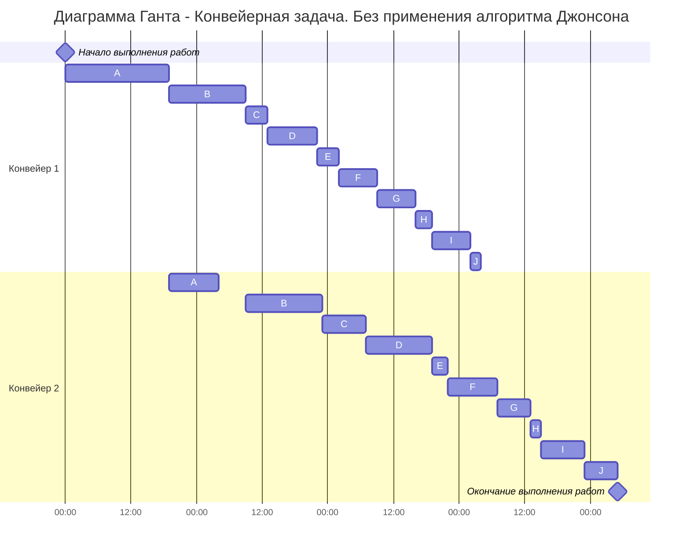
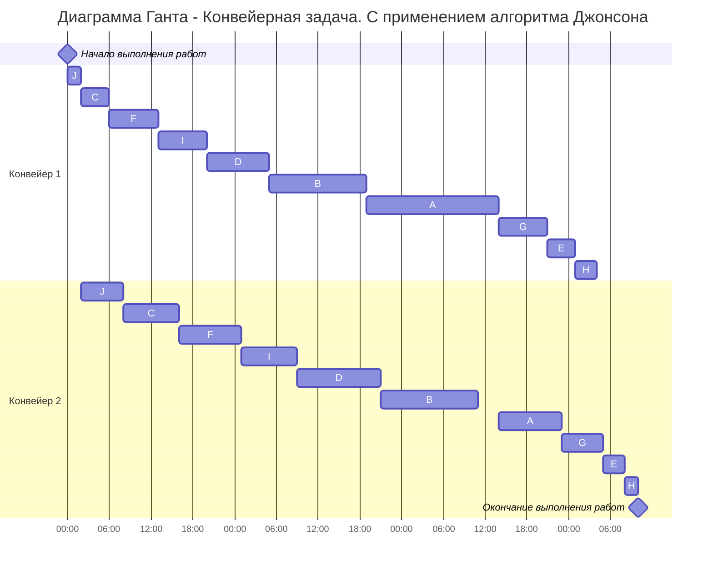

## Вариант 6
## Постановка задачи
Имеется 10 независимых заданий, каждое из которых состоит из двух последовательных этапов, и 2 исполнителя, исполнитель 1 выполняет только первый этап задания, исполнитель 2 - только второй. Длительность заданий (по этапам): (19, 9), (14, 14), (4, 8), (9, 12), (4, 3), (7, 9), (7, 6), (3, 2), (7, 8), (2, 6).

## Ход решения
### Таблица исходных данных
| Задания | A  | B  | C  | D  | E  | F  | G  | H  | I  | J  |
| :---: | :---: | :---: | :---: | :---: | :---: | :---: | :---: | :---: | :---: | :---: | 
| этап I  | 19 | 14 | 4  | 9  | 4  | 7 | 7  | 3  | 7  | 2 |
| этап II | 9 | 14 | 8  | 12 | 3  | 9  | 6  | 2  | 8  | 6  |

### Обоснование выбора алгоритма
Задача - конвейерная, так как работников 2, каждое задание состоит из 2 этапов и первый работник выполняет только первый этап каждого задания, второй работник — только второй этап каждого задания.
Поэтому для решения этой задачи существует эффективный алгоритм Джонсона.

### Диаграмма Ганта без использования алгоритма
Составим диагрмму Ганта без использования алгоритма, чтобы в итоге продемонстрировать оптимизацию 

| Время 1 |0-19|19-33|33-37|37-46|46-50|50-57|57-64|64-67|67-74|74-76|-|-|
| :---: | :---: | :---: | :---: | :---: | :---: | :---: | :---: | :---: | :---: | :---: | :---: | :---: |
| 1 исполнитель|A|B|C|D|E|F|G|H|I|J|-|-|
| 2 исполнитель|-|A|-|B|C|D|E|F|G|H|I|J|
| Время 2 |0-19|19-28|28-33|33-47|47-55|55-67|67-70|70-79|79-85|85-87|87-95|95-101|

Можно сделать вывод, что 1 конвейер простаивает 101 - 76 = 25 условные единицы. Общее время выполнения заданий равно 101 у.е. 
## Шаги алгоритма Джонсона

### Шаг 1: Разбить работы на 2 группы

Работы разбиваются на две группы:
1. Первая группа - работы, где  I этап <= II этап
2. Вторая группа - работы, где I этап > II этап

|1 группа|B|C|D|F|I|J|
| :---: | :---: | :---: | :---: | :---: | :---: | :---: |
|**2 группа**|**A**|**E**|**G**|**H**|-|-|

### Шаг 2: Отсортировать работы из 1 группы по возрастанию длительности 1 этапа 

||1 этап|2 этап|
| :---: | :---: | :---: | 
|**J**|2|6|
|**C**|4|8|
|**F**|7|9|
|**I**|7|8|
|**D**|9|12|
|**B**|14|14|

### Шаг 3: Отсортировать работы из 2 группы по убыванию длительности 2 этапа 

||1 этап|2 этап|
| :---: | :---: | :---: | 
|**A**|19|9|
|**G**|7|6|
|**E**|4|3|
|**H**|3|2|

### Шаг 4: Искомое расписание (сначала 1 группа, потом 2)

$$ J \rightarrow C \rightarrow F \rightarrow I \rightarrow D \rightarrow B \rightarrow A \rightarrow G \rightarrow E \rightarrow H $$

### Диаграмма Ганта с использованием алгоритма

Для наглядности приведем диаграмму Ганта:

| Время 1 |0-2|2-6|6-13|13-20|20-29|29-43|43-62|62-69|69-73|73-76|-|-|
| :---: | :---: | :---: | :---: | :---: | :---: | :---: | :---: | :---: | :---: | :---: | :---: | :---: |
| 1 исполнитель|J|C|F|I|D|B|A|G|E|H|-|-|
| 2 исполнитель|-|J|C|F|I|D|B|-|A|G|E|H|
| Время 2 |0-2|2-8|8-16|16-25|25-33|33-45|45-59|59-62|62-71|71-77|77-80|80-82|

Можно сделать вывод, что 1 конвейер простаивает 82 - 76 = 6 условных единицы.
Значит, после выполнения алгоритма Джонсона 1 конвейер стал простаивать на 25 - 6 = 19 *у.е.* меньше, а общее время выполнения заданий сократилось на 19 *у.е.*

Ответ: общее время выполнения 82 *у.е.*
